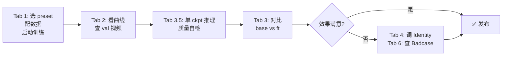
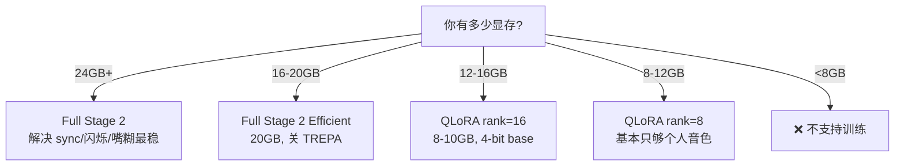
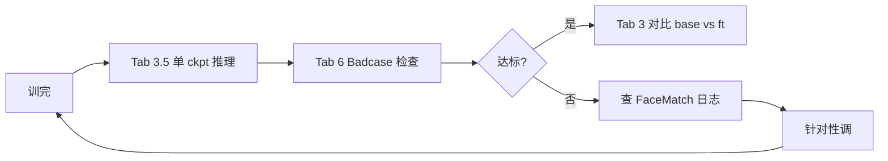
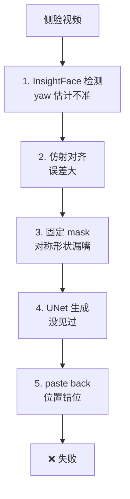
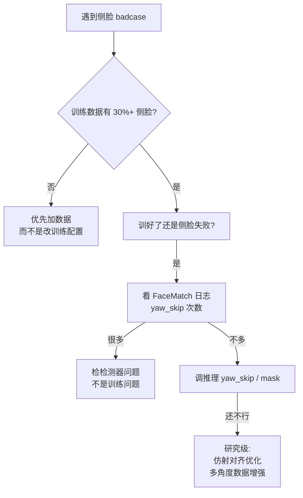

# LatentSync Fine-tune Studio 用户指南

> 配套代码：`gradio_finetune.py`
> 配套文档：[training_pipeline.md](training_pipeline.md)
> 目标读者：第一次使用 LatentSync 微调 UI 的工程师 / 研究员

---

## 0. 这是什么？

> **配套文档**：
> - 本指南（**用户视角**）：怎么启动、怎么用 UI 各个 Tab、怎么用 CLI
> - [training_pipeline.md](training_pipeline.md)（**技术深度**）：架构、损失函数、训练 pipeline、badcase 根因

**LatentSync Fine-tune Studio** = `gradio_finetune.py` 启动的 **Gradio Web 界面**，把 LatentSync 的"微调 UNet"全流程包成 6 个 Tab，**让你不用手写命令行**就能：

```
配数据集 → 选 preset → 启动训练 → 看曲线 → 验证效果 → 调推理参数
```

支持：
- 6 个 UNet 训练 preset（Stage 1 / Stage 2 / Stage 2 Efficient / Stage 2 512 / **LoRA** / **QLoRA**）
- 1 个 SyncNet 训练 preset
- LoRA / QLoRA 微调（显存省 30-40%）
- 实时 loss 监控、validation 视频预览、日志
- 单 ckpt 推理 + 自动质量自检
- 4 层 Identity 保护参数调节
- HyperIQA / SyncNet 数据集质量分布

**注意**：本 UI 只为**微调 UNet** 服务（也支持单独训 SyncNet）。

---

## 1. 安装与依赖

### 1.1 系统要求

| 组件 | 最低 | 推荐 |
|---|---|---|
| Python | 3.9+ | 3.10 |
| PyTorch | 2.0+ | 2.1+ |
| CUDA | 11.7+ | 12.x |
| GPU 显存 | **12 GB**（QLoRA 256）| 24 GB（Stage 2 Efficient）|
| 磁盘 | 20 GB（cache + checkpoint）| 50 GB+ |

### 1.2 安装 LatentSync 本身

按 `README.md` 标准流程：

```bash
cd LatentSync
python -m venv .venv
source .venv/bin/activate
pip install -r requirements.txt
source setup_env.sh   # 下载 whisper / VAE / SD ckpt
```

**微调中间产物默认写到大盘**：生成配置、训练日志、run 输出、audio embeds cache 等默认落在 `/root/autodl-tmp/latentsync_finetune/`（AutoDL 常见大数据盘）。如需改位置：

```bash
export LATENTSYNC_FINETUNE_DIR=/path/to/large_disk/latentsync_finetune
python gradio_finetune.py
```

### 1.3 安装微调 / 验证额外依赖

```bash
# 基础（默认就要装）
pip install gradio omegaconf pyyaml

# LoRA / QLoRA 微调（必须）
pip install peft bitsandbytes accelerate

# 实验追踪（可选，二选一）
pip install wandb             # 优先用 wandb
# 或
pip install tensorboard       # 备选

# 评估（离线评测 / 质量自检需要）
pip install lpips scikit-image matplotlib
```

### 1.4 下载额外 checkpoint

```bash
# 主模型 + Whisper（训练/推理必需）
huggingface-cli download ByteDance/LatentSync-1.6 whisper/tiny.pt --local-dir checkpoints
huggingface-cli download ByteDance/LatentSync-1.6 latentsync_unet.pt --local-dir checkpoints

# 如果 huggingface-cli 下到一半就提示完成（文件损坏），用带断点续传的脚本
python tools/download_checkpoints.py --verify-size

# SyncNet 相关（训练 Stage 2 / 评估需要）
huggingface-cli download ByteDance/LatentSync-1.6 stable_syncnet.pt --local-dir checkpoints

# SyncNet 评估
huggingface-cli download ByteDance/LatentSync-1.5 syncnet_v2.model --local-dir checkpoints/auxiliary
huggingface-cli download ByteDance/LatentSync-1.5 koniq_pretrained.pkl --local-dir checkpoints/auxiliary
```

最终目录：
```
checkpoints/
├── latentsync_unet.pt
├── stable_syncnet.pt
├── whisper/
│   └── tiny.pt
└── auxiliary/
    ├── syncnet_v2.model
    └── koniq_pretrained.pkl
```

---

## 2. 启动 UI

### 2.1 标准启动

```bash
python gradio_finetune.py
```

默认监听 `http://0.0.0.0:6006`。

### 2.2 自定义端口 / 共享

```bash
# 改端口
python gradio_finetune.py --port 8080

# 远程访问（生成 72h 临时公网 URL）
python gradio_finetune.py --share

# 指定 host
python gradio_finetune.py --host 127.0.0.1 --port 6006
```

### 2.3 在远程 GPU 机器上启动

```bash
# 1. ssh 到 GPU 机器
ssh user@gpu-box

# 2. 启动（绑定所有接口）
python gradio_finetune.py --host 0.0.0.0 --port 6006 --share

# 3. 浏览器访问
# https://gpu-box:6006
# 或临时公网 URL
```

### 2.4 启动后看到什么

打开浏览器后：

```
🎛 LatentSync Fine-tune Studio

[6 个 Tab]  1. 配置 & 启动 | 2. 训练监控 | 3. 推理对比
            3.5 验证 | 4. Identity 保护 | 5. 数据集质量评估 | 6. Badcase 检查
```

---

## 3. 完整工作流（推荐路径）



---

## 4. 6 个 Tab 详解

### Tab 1：配置 & 启动（训练入口）

**作用**：选 preset、填数据集、点"启动训练"。

#### 4.1.1 选 Preset

| Preset | 显存 | 用途 |
|---|---|---|
| **Stage 1 (256, 全量训练)** | 23 GB | 从零训视觉特征（少用） |
| **Stage 2 (256, 推荐)** | 30 GB | 完整 Stage 2（默认） |
| **Stage 2 Efficient (256, 20GB)** | 20 GB | 显存不够时的妥协（关 TREPA） |
| **Stage 2 512 (高分辨率)** | 55 GB | 高分辨率（需要大卡） |
| **Stage 2 LoRA (256, 12-15GB)** | **12-15 GB** | **推荐入门** |
| **Stage 2 QLoRA (256, 8-10GB)** | **8-10 GB** | 显存极限（16GB 卡） |
| **SyncNet 训练** | 12 GB | 单独训 SyncNet |

**改 preset 时**：所有超参滑块自动填好默认值，可微调。

#### 4.1.2 配数据集

三种方式选数据集：

**方式 A：填 train_data_dir**
```
textbox: /data/my_high_quality_videos
```
- 目录下所有 .mp4 都会被加载
- 适合"我有一堆处理好的视频"

**方式 B：填 train_fileslist**
```
textbox: /data/my_high_quality_videos/fileslist.txt
```
- 文件每行一个绝对路径
- 适合"我有自定义文件列表"

**方式 C：从下拉框选**
```
dropdown: 选 preprocess/high_visual_quality/...
```
- 自动填到 train_data_dir

#### 4.1.3 关键超参

| 字段 | 默认 | 何时调 |
|---|---|---|
| batch_size | 1 | 多卡时改大 |
| num_frames | 16 | 改 8 / 32 试 |
| resolution | 256 | 512 需大卡 |
| learning_rate | 1e-5 | LoRA 用 5e-5，QLoRA 用 2e-4 |
| use_motion_module | true | Stage 1 时关 |
| pixel_space_supervise | true | Stage 1 时关 |
| use_syncnet | true | Stage 1 时关 |
| sync_loss_weight | 0.05 | sync 差时调到 0.1 |
| perceptual_loss_weight | 0.1 | 嘴糊时调到 0.3 |
| recon_loss_weight | 1.0 | 通常不动 |
| trepa_loss_weight | 10.0 | efficient 关 |
| enable_gradient_checkpointing | true | 显存不够时必须开 |
| save_ckpt_steps | 10000 | 调小能多存几个 |
| max_train_steps | 10000000 | **必调**，按数据集大小算 |

#### 4.1.4 高级设置

| 字段 | 用途 |
|---|---|
| mask_image_path | 256 用 mask.png，512 用 mask2.png |
| nproc_per_node | torchrun 卡数（多卡时改大） |
| master_port | 端口，避免冲突 |
| extra_env | 临时环境变量，如 `LATENTSYNC_TRACKER=wandb` |

#### 4.1.5 启动

点 **🚀 启动训练** 按钮：
1. 生成 yaml 到 `debug/generated_configs/`
2. 用 `torchrun` 启动训练（后台进程）
3. 日志写到 `debug/training_logs/`
4. 弹出状态条显示 pid / log path / 命令

#### 4.1.6 停止

点 **⏹ 停止训练** 按钮，会发 SIGINT 让训练优雅退出（10s 后 SIGKILL）。

---

### Tab 2：训练监控

**作用**：实时看 loss 曲线、validation 视频、日志。

#### 4.2.1 怎么看

1. 填 `train_output_dir`（一般 `debug/unet`）
2. 点 **🔄 刷新 run 列表**
3. 从下拉框选 `train-2024-10-29-20:13:43/` 这种目录
4. 自动加载：
   - Loss / sync_conf 曲线（最新 PNG）
   - Validation 视频列表（可点播放）
   - 训练日志尾部 80 行
   - 最新 checkpoint 信息
5. **每 15 秒自动刷新**（用 gr.Timer）

#### 4.2.2 跑了好几个 run 怎么对比

切到不同 run 即可。所有 run 都保留，不会被覆盖。

#### 4.2.3 找不到 run 怎么办

- 检查 `train_output_dir` 路径对不对
- 看 `debug/training_logs/` 有没有 log（log 写了但 run dir 还没建好时常见）

---

### Tab 3：推理对比（base vs fine-tuned）

**作用**：用同一个输入视频，分别用 base 和 fine-tuned 两个 ckpt 跑，并排对比。

#### 4.3.1 用法

1. 上传 Input Video
2. 上传 Input Audio
3. 选 **Base checkpoint**（如官方 `latentsync_unet.pt`）
4. 选 **Fine-tuned checkpoint**（如自己训的 `debug/unet/train-.../checkpoints/checkpoint-5000.pt`）
5. 调 inference 参数（默认就够）
6. 点 **🎬 生成对比**

输出：两个 mp4，左右并排。

---

### Tab 3.5：验证（单 ckpt 推理 + 质量自检）⭐ 推荐

**作用**：选 1 个 ckpt 直接推理，**自动做质量检查**（嘴糊/闪烁/人脸检测）。

#### 4.3.1 用法

1. 上传视频 + 音频
2. 选 Checkpoint（你刚训的）
3. 选 UNet config（必须和 ckpt 匹配）
   - **256 ckpt** → `stage2.yaml`
   - **512 ckpt** → `stage2_512.yaml`
   - **LoRA-merged ckpt** → `stage2_lora.yaml`
4. 调 inference 参数
5. 勾选 `enable_deepcache`（推荐，快 2 倍）
6. 点 **🚀 推理 + 质量自检**

#### 4.3.2 输出三块

**块 1：ckpt 兼容性检查**
- 256/512 是否匹配
- mask.png/mask2.png 是否匹配
- LoRA adapter 是否未 merge

**块 2：生成视频**（mp4 预览）

**块 3：质量报告**
```
📦 Checkpoint: debug/unet/.../checkpoint-5000.pt
⏱ 推理耗时: 12.3 秒
🎞 总帧数: 240

✅ 清晰度 156.7 (良好)
   嘴糊比例: 12.0% (目标 < 30%)
✅ 闪烁 3.45 (优秀)
✅ 人脸检测 95% (绝大多数帧检测到)

=== 建议 ===
✅ 整体质量良好，可以用！
```

**调优建议**：
- 嘴糊比例 > 30% → 升 512 / 加 LPIPS / 开 CodeFormer
- 闪烁 > 8 → 开 TREPA / 加时序稳定
- 人脸检测 < 70% → 查 [FaceMatch] 日志

---

### Tab 4：Identity 保护策略

**作用**：调 LatentSync 的 4 层身份保持参数（L1/L3/L4），生成可粘贴的 Python kwargs。

#### 4.4.1 三块参数

| 层 | 控件 | 默认 | 何时调 |
|---|---|---|---|
| **L1** | ref 策略（random/adjacent/fixed_first_frame） | random | 想要 identity 更稳：adjacent |
| **L3** | dynamic mask 大小（conservative/standard/aggressive） | standard | 大嘴 / 极端表情：aggressive |
| **L4** | detail_strength + color_match_strength | 0.65 + 0.60 | 想要更贴皮肤：detail ↑ |

#### 4.4.2 输出

点 **📝 生成推理 kwargs / yaml** 按钮，得到：

```python
inference_kwargs = {
    'dynamic_mask_pad_width_ratio': 1.5,
    'dynamic_mask_pad_height_top_ratio': 1.3,
    'dynamic_mask_pad_height_bottom_ratio': 2.2,
    'paste_back_feather_sigma_px': 7.0,
    'mouth_detail_strength': 0.65,
    'color_match_strength': 0.60,
}
# 直接 pipe(video=..., audio=..., **inference_kwargs)
```

也能复用到 `gradio_app.py` / `api.py` 里。

---

### Tab 5：数据集质量评估

**作用**：训前看你的数据集质量分布（HyperIQA + SyncNet_conf）。

#### 4.5.1 用法

1. 填 `high_visual_quality/` 目录路径
2. 选采样数（默认 100）
3. 点 **🔍 开始评估**

#### 4.5.2 输出

- 统计摘要（损坏数 / 太短数 / 平均 HyperIQA / 平均 SyncNet_conf）
- 潜在问题列表
- 分布直方图（HyperIQA 蓝、SyncNet_conf 绿）

#### 4.5.3 何时用

- **训前必跑**：先评估，再决定用多少数据训
- 数据质量差（HyperIQA < 40）→ 重新跑 preprocess
- sync 差（SyncNet_conf < 3）→ 重新跑 sync_av

---

### Tab 6：Badcase 检查清单

**作用**：对单个生成视频跑全套质量检查（参考 §13 评估指标）。

#### 4.6.1 用法

1. 上传生成结果视频
2. （可选）上传原始参考视频（用于 identity sim）
3. 点 **🔍 跑 Badcase 检测**

#### 4.6.2 输出 4 个指标

| 指标 | 目标 | 不达标怎么办 |
|---|---|---|
| 嘴糊比例 | < 30% | 升 512 / 加 LPIPS / 开 CodeFormer |
| 闪烁评分 | < 8 | 开 TREPA / Motion Module 训够 |
| 唇音同步 | > 7 | 重训 SyncNet / 加大 sync_loss |
| 身份保持 | > 0.8 | 检查 ref 窗口 / 调 identity_similarity |

---

## 5. 实际使用案例

### 5.1 案例 1：个人数字分身（消费级 GPU）

**目标**：用自己的脸 + 声音生成 5 分钟视频
**硬件**：RTX 4090（24GB）
**数据**：自己录 30 分钟说话视频
**预计时间**：2-4 小时

```bash
# 1. 数据预处理（按 docs/training_pipeline.md §3）
./data_processing_pipeline.sh
# 产出 data/high_visual_quality/ 下几十个 mp4

# 2. 启动 UI
python gradio_finetune.py

# 3. 在 Tab 1：
#    - Preset: Stage 2 LoRA (256, 12-15GB)
#    - train_data_dir: data/high_visual_quality
#    - max_train_steps: 3000
#    - 启动

# 4. 在 Tab 2 监控，等跑完

# 5. 在 Tab 3.5：
#    - 选训好的 checkpoint
#    - 上传自己的视频测试
#    - 看质量报告

# 6. 满意了：合并 LoRA，部署到 api.py
python -m scripts.merge_lora \
    --base_ckpt checkpoints/latentsync_unet.pt \
    --adapter_dir debug/unet_lora/.../checkpoints/checkpoint-3000 \
    --out_ckpt debug/my_avatar.pt
```

### 5.2 案例 2：行业术语适配（云端 A100）

**目标**：让 LatentSync 在医学/法律视频上表现更好
**硬件**：1-2× A100
**数据**：500 段领域视频
**预计时间**：1-2 天

```bash
# 1. Tab 1：
#    - Preset: Stage 2 (256, 推荐)
#    - max_train_steps: 8000
#    - nproc_per_node: 2 (双卡)
#    - sync_loss_weight: 0.1（提高）

# 2. Tab 3 对比 base vs ft

# 3. Tab 6 检查 badcase，针对性调整
```

### 5.3 案例 3：完整评估

```bash
# 1. 训练完成后，用 scripts/evaluate_checkpoint.py
python -m scripts.evaluate_checkpoint \
    --ckpt_path debug/unet/.../checkpoint-5000.pt \
    --unet_config configs/unet/stage2.yaml \
    --test_fileslist data/test/fileslist.txt \
    --out_dir debug/eval_results/ckpt-5000

# 产出：
#   debug/eval_results/ckpt-5000/
#   ├── evaluation_report.json    # 所有指标聚合
#   ├── report.html               # 可分享的 HTML 报告
#   └── fake_videos/              # 生成的视频
```

---

## 6. Badcase 驱动的微调方式选择

> **核心问题**：你遇到哪个 badcase → 该选哪种微调方式 / 数据集 / 推理参数？
> 详细技术原理见 [training_pipeline.md §20](../training_pipeline.md#20-badcase-驱动的微调策略选择)；本节是**用户视角的速查表**。

### 6.1 速查总表（用户视角）

| 你看到的坏现象 | 根因 | 选哪个 Tab | 用什么数据/设置 |
|---|---|---|---|
| **嘴部糊、牙齿不清晰** | 256 分辨率不够 / LPIPS 权小 | Tab 1 选 `Stage 2 512` + `perceptual_loss_weight=0.3` | 准备 720p+ 高清视频 |
| **嘴型对不上音频** | SyncNet 没训稳 / sync_loss 太小 | Tab 1 选 `Stage 2 (256)` + `sync_loss_weight=0.1` | 准备 1000+ 视频 |
| **帧间闪烁（牙齿/胡须跳）** | TREPA 关闭 / Motion Module 没训够 | Tab 1 选 `Stage 2 Efficient` 反而**不要选**（关 TREPA）→ 用 `Stage 2 (256)`，TREPA=10 | 高质量视频 |
| **侧脸 / 大角度失败** | landmark 检测 + mask 形状 | 训练帮助有限，**主要靠数据**：加 30%+ 侧脸样本 | 转头 / 侧脸视频 |
| **身份丢失（不像原人物）** | ref 窗口差 + 训练数据少身份 | Tab 1 选 `Stage 2 (256)` | 多身份数据集 |
| **Mask 边界接缝** | paste back blur 不够 | **不用微调** → Tab 4 调 `paste_back_blur_sigma=10+` | — |
| **大笑 / 大嘴 / 极端表情** | dynamic mask 被 clamp | 训练帮助有限，**主要靠数据**：加大笑样本 + Tab 4 `dynamic_mask_mode=aggressive` | 大笑 / 唱歌 / 打哈欠视频 |
| **静音段还在动嘴** | 音频 RMS 太低 | **不用微调** → 调 `mouth_audio_motion_min_scale=0.7`（推理参数）| — |
| **嘴角 / 外翻不自然** | 极端嘴型 + mask 边界 | Tab 1 选 `Stage 2 512` + `perceptual_loss_weight=0.2+` | 极端表情样本 |
| **短剧多说话人 / 频繁切场** | 单人 pipeline 假设, 多脸 + 切点都退化 | Tab 1 选 `🎬 Short Drama` + §6.4 整流程 | 先 `tools/preprocess_short_drama.py` 切场景 |

### 6.2 按你的 GPU 显存选配方



### 6.3 选 Full 还是 LoRA？

**决策表**：

| 场景 | 推荐 | 理由 |
|---|---|---|
| 解决 sync 差 | **Full Stage 2** | LoRA 可能损失 attn2 能力 |
| 解决闪烁 | **Full Stage 2** | LoRA 训时序有退化风险 |
| 解决嘴糊 | **Full Stage 2 (512)** | LoRA adapter 表达力有限 |
| 个人音色 | LoRA / QLoRA | 够用，省显存 |
| 多任务（多语言/多风格）| LoRA 多 adapter | 每个 10MB，可热切换 |
| 行业术语快速适配 | **Full Stage 2 Efficient** | 速度 + 效果平衡 |

### 6.4 4 个万能起步配方

#### 配方 A：解决嘴糊 + 闪烁（最常见需求）

**Tab 1 配置**：
- Preset: `Stage 2 512 (高分辨率)`
- `perceptual_loss_weight`: 0.3
- `trepa_loss_weight`: 10
- `max_train_steps`: 10000-30000

#### 配方 B：解决 sync 差

**Tab 1 配置**：
- Preset: `Stage 2 (256, 推荐)`
- `sync_loss_weight`: 0.1
- `max_train_steps`: 10000

**前置**：如果 sync 极差，先单独重训 SyncNet（preset 选 `SyncNet 训练`，batch=1024）。

#### 配方 C：个人音色（消费级 GPU）

**Tab 1 配置**：
- Preset: `Stage 2 LoRA (256, 12-15GB)`
- 数据：30-60 分钟自己说话视频
- `max_train_steps`: 2000-3000

#### 配方 D：显存极限

**Tab 1 配置**：
- Preset: `Stage 2 QLoRA (256, 8-10GB)`
- `max_train_steps`: 3000-5000

### 6.5 训练后自检流程

无论选哪个配方，训完都按这个顺序自检：



### 6.6 必读：完整技术原理

本节是**用户视角的速查**。如果你想知道：
- 为什么 Full Stage 2 解决 sync/闪烁最稳？
- LoRA 为什么有 attn2 退化风险？
- 各个 badcase 的根因到底是什么？

请看 [training_pipeline.md §20](../training_pipeline.md#20-badcase-驱动的微调策略选择)（技术深度版）。

### 6.7 为什么所有微调 preset 都是 Stage 2？

> 完整版见 [training_pipeline.md §22](../training_pipeline.md#22-为什么所有微调都是-stage-2stage-2-如何解决-badcase)（技术深度版）。本节是**用户视角的简短版**。

**直答**：Stage 1 训出来"能补全脸但不会说话"，Stage 2 训出来"会说话 + 清楚 + 一致"。**所有 badcase 都需要 Stage 2 独有的能力**。

| Badcase | Stage 1 表现 | Stage 2 改进机制 |
|---|---|---|
| 嘴糊 | 嘴糊，只有 latent MSE 监督 | `L_lpips`（VGG 感知）监督下半张脸 |
| sync 差 | 嘴完全对不上音（没听）| `L_sync`（StableSyncNet 监督）|
| 闪烁 | 每帧独立生成 | `L_trepa`（VideoMAE-v2 时序）|
| 身份丢失 | ref 随机，无强监督 | LPIPS + sync 间接保留 + ref 输入 |
| 侧脸 / 大嘴 | 训练集侧脸少 | 用真实数据训，加 30%+ 侧脸样本 |

**没有 Stage 3**——Stage 2 的 4 项损失（`L_simple + L_sync + L_lpips + L_trepa`）已经覆盖所有可监督维度。剩下的 badcase 都是数据 / 推理侧问题。

### 6.8 深度专题：侧脸 / 大角度为什么失败

> 完整版见 [training_pipeline.md §23](../training_pipeline.md#23-深度专题侧脸--大角度为什么失败)（技术深度版）。本节是**用户视角的简短版**。

**直答**：侧脸失败的根因**不在 UNet**，而在**级联流水线**（检测 → 对齐 → mask → 生成 → paste back）。

#### 5 个失败步骤



#### 训练侧能做的（有限）

| 做法 | 效果 | 推荐度 |
|---|---|---|
| **加 30%+ 侧脸样本** | 直接补训练分布 | ✅ 强推 |
| 调 `sync_loss_weight=0.1` | 略提升 sync | ⭐ |
| 调 `trainable_modules` 加全 attn | 间接帮助 | ⭐ |

#### 推理侧能做的

```python
# 推理时调大这些阈值（Tab 4 也能调）
yaw_skip_threshold=45.0              # 默认 40
side_face_passthrough_yaw_threshold=22.5  # 默认 0
dynamic_mask_mode="aggressive"        # 默认 standard
```

#### 千万别做的事

| ❌ 做法 | 原因 |
|---|---|
| 改 `mask.png` 形状 | AGENTS.md 锁了 baseline |
| 改 `yaw_skip_threshold` | band-aid，不解决根因 |
| LoRA 训侧脸 | LoRA 只训 attention，不是检测器 |

#### 完整决策树



#### 实操建议

1. **加数据**优先于调配置
2. 用 Tab 6 量化"侧脸时 sync_conf 多少"
3. 用 Tab 4 调 `dynamic_mask_mode=aggressive` 试一下
4. 看 `_estimate_yaw_degrees` 是否需要本地化调
5. **别动 mask**（AGENTS.md 警告）

### 6.4 短剧微调专项（多说话人 + 频繁切场景）🎬

> **本节针对**短剧/有声漫画/对谈类视频**:同一画面经常有 2-4 个说话人,场景切得很频繁(每 3-10 秒一次)**。默认的 LatentSync pipeline 假设一帧一主角,套到短剧上会有:第 2 张脸被当成 paste-back 糊掉、audio 跟错人、场景切后第一帧触发 face_jump 跳到原帧。本节给出**端到端流程**,全部基于现有工具,无需改 model。**

#### 6.4.1 为什么不能直接用现有 🎯 / 🧩 preset?

| preset | 设计场景 | 短剧失败点 |
|---|---|---|
| 🎯 Badcase Fix | 单人内容型 badcase | num_frames=24 对短段(5-15s)太长,稀释信号 |
| 🧩 Structural Fix | 单人结构性侧脸 | 不覆盖多说话人路由、scene cut |
| 🎬 Short Drama | **专为多说话人/切场景设计** | ✅ 推荐 |

🎬 preset 的关键调整:
- `target_modules` 加 conv(同 Structural Fix,11 项),capacity 够 cover 切点附近的脸几何漂
- `sync_loss_weight=0.18`(短剧容错低,口型必须跟紧)
- `num_frames=16`(单段短,长上下文稀释信号)
- `save_ckpt_steps=500`(短段多,多存点方便挑最佳)

#### 6.4.2 端到端流程(6 步)

**前提:** 你有一段或多段**未切分的短剧 mp4**(每段几分钟到几十分钟),每段含 2-4 个说话人,场景频繁切换。

##### Step 1:切场景 + 提单人 (`tools/preprocess_short_drama.py`)

```bash
python tools/preprocess_short_drama.py \
    --input data/raw/ep01.mp4 \
    --output-dir data/drama/ep01 \
    --threshold 0.35 \
    --min-shot-frames 24
```

做了什么:
- HSV 直方图切场景(`threshold=0.35` 是短剧默认,可按切点多少调 0.25-0.40)
- 每场景中间帧跑 face_detector,无人脸的扔掉
- ffmpeg 切 mp4 + 切 wav(16000Hz mono)
- 输出 `shots.json` 记录每场景 metadata(起止帧、fps、face bbox、yaw)

可选:`--cluster-speakers` 用 face_recognition 给每场景打说话人 ID(需 `pip install face_recognition`)。

产物:
```
data/drama/ep01/
├── shots/shot000_f000xxx-f000yyy.mp4   # 单场景视频(可能仍有多脸,但通常 1-2 张)
├── shots/shot000_f000xxx-f000yyy.wav   # 对应音频
├── fileslist.txt                         # 所有 .mp4 路径,一行一个
└── shots.json                            # 每场景的 meta + (可选)speaker_cluster
```

##### Step 2:逐桶分类 (`tools/curate_finetune_samples.py`)

```bash
python tools/curate_finetune_samples.py \
    --source-dir data/drama/ep01 \
    --output-dir data/drama/ep01_curated \
    --target-count 1000 \
    --scale medium
```

做什么:对 Step 1 切好的每个 shot 跑 face detection + motion 评分,按 yaw / motion 分到 `frontal` / `side_face` / `fast_motion` 三个桶。每跑过一次会 cache 到 `score_cache.jsonl`,re-curate 直接读 cache,几秒完成。

产物:`data/drama/ep01_curated/{frontal,side_face,fast_motion}/<n>_<name>.mp4` + `fileslist.txt` + `curation_report.json`。

⚠️ **注意:** cache key 是文件绝对路径,Step 1 重跑会改 shot 命名 → cache 失效。如果想保留 cache,Step 1 加 `--reuse-shots` (后续实现)。当前版本直接重跑 curate 即可。

##### Step 3:数据准备完成度自检

```bash
cat data/drama/ep01_curated/curation_report.json | python -m json.tool | head -40
```

期望:
- `kept >= 800`(scale=medium 目标 1000,允许 20% reject)
- `by_bucket.frontal >= 300`
- `by_bucket.side_face >= 250`(短剧切场景多,侧脸样本天然丰富)
- `by_bucket.fast_motion >= 200`(场景硬切 → bbox 跳变)

如果某个桶特别少,考虑:
- `side_face` 少 → 数据里侧脸场景不够,回 Step 1 调 `--threshold` 切更细,或加更多原始素材
- `fast_motion` 少 → 数据太静,可能不是真短剧

##### Step 4:在 gradio Tab 1 配置训练

1. 启动 gradio:
   ```bash
   python gradio_finetune.py --port 6006
   ```
2. Tab 1 顶部 preset 下拉,选 **`🎬 Short Drama (LoRA+conv, 多说话人, 18-22GB)`**。
3. preset 自动填充:`num_frames=16, sync_loss=0.18, save_ckpt_steps=500, max_train_steps=25000, lr=cosine warmup=300`。
4. **手动覆盖 `train_data_dir`** 为 Step 2 的 `data/drama/ep01_curated`。
5. **手动覆盖 `train_fileslist`** 为 Step 2 的 `data/drama/ep01_curated/fileslist.txt`。
6. 其余按需调:`batch_size`(显存够就 2)、`nproc_per_node`(多卡)。
7. **🚀 启动训练**。

训练时间参考(scale=medium, 单卡 A100):
- ~6-12 小时完成 25000 步
- 每 500 步存一个 ckpt,共约 50 个中间 ckpt

##### Step 5:Tab 2 监控 + 选 ckpt

1. Tab 2 选 run 目录,看 loss / sync_conf 曲线。
2. **挑 ckpt 的标准**(短剧专项):
   - 优先看 sync_conf 曲线**整体水平**(不是单点)
   - **val_video 每 1k 步的 mp4** 用手机/平板快放,听+看:
     - 说话人口型有没有跟音频
     - 另一张脸有没有被错误驱动
     - 切场景后第一帧有没有跳回原帧(face_jump 痕迹)
3. 把候选 ckpt(2-3 个)记下来,下一步逐个验证。

##### Step 6:Tab 3 / 3.5 / 6 验证 + merge + 推理

1. **Tab 3.5 验证**:上传一段**全新的短剧片段**(训练集没见过的),选最佳 ckpt 推理,看 inference 输出。
   - 看推理输出:说话人口型 / 另一张脸是否原样保留 / 切场景是否平滑
2. **Tab 6 🎬 短剧专项诊断**:点开 accordion,跑「🎬 跑短剧场景诊断」。
   - 看 `估计说话人数`:≥2 表示确实是多说话人
   - 看 `估计场景数`:越大越接近"切场多"
   - 系统会提示用 🎬 preset(若已识别为多说话人)
3. **Tab 6 4 个核心指标**:blurry / flicker / sync / identity,重点看 `身份保持` 是否 ≥ 0.85(脸没漂)。
4. **Tab 2 「🔀 合并 LoRA」accordion**:把最佳 LoRA adapter 折回 base,产物 `latentsync_unet.pt` 可独立部署。
5. **批量推理**:把同一集的多个场景用 `preprocess_short_drama` 切好,逐段用 merged ckpt 跑 `scripts/inference.py` 推理,后用 ffmpeg concat。

#### 6.4.3 故障排查

| 症状 | 原因 | 修法 |
|---|---|---|
| Step 1 切出大量 1-2 帧的 micro-shot | `--threshold` 太低 | 提到 0.40-0.50 |
| Step 1 漏掉大段切换 | `--threshold` 太高 | 降到 0.25 |
| Step 1 大量 shot 无 face | 原始视频有大量纯文字/特效镜头 | 这些 shot 直接被丢,可以接受 |
| Step 2 三个桶里 fast_motion=0 | 数据全是静态访谈 | 不是真短剧,走单人 🎯 preset |
| 训练中 sync_conf 退化 | attn2 也在被 LoRA 改 | 勾 Tab 1 顶部 `freeze_attn2=True`(默认就是) |
| 推理输出第二张脸被驱动 | audio diarization 失败,选了错的脸 | 当前版本无 fix;最简 workaround:每段 inference 前手动确认 active face |
| 切场景后第一帧跳原图 | face_jump filter 触发 | 推理参数 `face_jump_threshold` 调高,或接受现状 |

#### 6.4.4 局限(诚实声明)

当前流程**没有改 model**,以下场景还没 cover:

- **多说话人同时开口**(罕见但短剧里有):当前 Step 6 的 fallback 只选"最大脸"。
- **密集场景** (>2 人同时入画):face_detector 跟踪容易丢。
- **复杂切场**(镜头快速 zoom):直方图切场景可能误判。

完整 multi-speaker routing(model 内置 audio→face 路由)是 Step 4,目前**未实现**(model 改动风险高,需要专门的 2-speaker 合成测试集验证)。

### 6.5 预制数据集（HF Hub 一键下 + 自动 curate）📚

> **本节针对**: 想 finetune 但不想自己找数据 / 不想维护 URL 列表的用户。
> 4 个已写好的 HF Hub recipe,点一下就下载 + face 检测 + 按 yaw/motion 分桶 + 写 fileslist.txt,直接喂给 Tab 1。

#### 6.5.1 可用 recipe(写在 `tools/prebuilt_datasets.yaml`)

| id | 来源 (HF Hub) | 适合 |
|---|---|---|
| `voxceleb2_sample` | `Reverb/voxceleb2` | 通用 baseline / 单人 / 侧脸都有 |
| `celebv_hq_side` | `SwayStar123/CelebV-HQ` | **侧脸专项**(自带 yaw 标注,桶配比给 side_face 55%) |
| `talkvid_sample` | `FreedomIntelligence/TalkVid` | 大规模多语言(1244h, 7729 speakers) |
| `multi_human_drama` | `Multi-Human-Interactive/MHIT` | **短剧**(12h 多说话人对谈,桶配比给 fast_motion 30%) |

加新 recipe 只需往 YAML 加一段,UI 下拉自动出现,不用改代码。

#### 6.5.2 三种使用方式

**A. gradio UI(Tab 1 「📚 预制数据集」accordion,推荐)**

1. 打开 `📚 预制数据集` accordion
2. 下拉选 recipe(`celebv_hq_side — CelebV-HQ (1k, 带 yaw 标注, 侧脸专项)`)
3. 填输出目录(默认 `data/init_finetune`)
4. (可选)填 HF Token — gated 数据集需要
5. 点 `⬇ 下载 + Curate`
6. 完成后 `train_data_dir` + `train_fileslist` 自动填到 launch 表单

**B. CLI**

```bash
# 看选项
python tools/init_finetune_dataset.py --list

# 单个 recipe
python tools/init_finetune_dataset.py \
    --dataset celebv_hq_side \
    --output-dir /root/autodl-tmp/latentsync_finetune/init \
    --n-clips 500

# 全部 4 个
python tools/init_finetune_dataset.py --dataset all
```

**C. 远程 box 上后台跑**

```bash
nohup python tools/init_finetune_dataset.py \
    --dataset talkvid_sample \
    --output-dir /root/autodl-tmp/latentsync_finetune/init \
    > debug/init.log 2>&1 &

# 监控
tail -f debug/init.log
# 看全部 completed 后:
ls /root/autodl-tmp/latentsync_finetune/init/talkvid_sample/curated/
cat /root/autodl-tmp/latentsync_finetune/init/talkvid_sample/curated/fileslist.txt
```

#### 6.5.3 输出布局

```
data/init_finetune/<recipe-id>/
├── _raw/                                # 下载的原始 mp4(每个 recipe 单独缓存)
│   ├── 00001.mp4
│   └── ...
├── curated/
│   ├── frontal/000_<stem>.mp4           # symlink 到 _raw
│   ├── side_face/000_<stem>.mp4
│   ├── fast_motion/000_<stem>.mp4
│   ├── fileslist.txt                    # 直接给 Tab 1 用
│   └── curation_report.json             # 评分 + 桶信息
└── fileslist.txt                         # 顶层,等价于 curated/fileslist.txt
```

#### 6.5.4 故障排查

| 症状 | 修法 |
|---|---|
| `cannot list files for X: 401` | gated 仓库 → 加 `--hf-token` 或 `export HF_TOKEN=...` |
| `no files matched allow_patterns` | repo id 错或 path 不对,改 `prebuilt_datasets.yaml` 的 `hf_allow` |
| 跑了很久没进度 | 网络慢 + VoxCeleb2 巨大,先用 `--n-clips 200` 试速 |
| 重跑重复下载 | 不会 — `_raw/` 里已有文件会跳过(脚本是幂等的) |
| 桶分布不均 | YAML 改 `target_ratio`;某些 recipe 的天然分布就是偏(比如 multi_human_drama fast_motion 高) |

#### 6.5.5 自定义 recipe

往 `tools/prebuilt_datasets.yaml` 加一段:

```yaml
  - id: my_dataset
    name: My Custom Talking Head Set
    hf_repo: username/my-dataset-repo
    hf_repo_type: dataset
    hf_allow: ["*.mp4"]
    n_clips: 800
    target_ratio: {frontal: 0.5, side_face: 0.3, fast_motion: 0.2}
    description: |
      My custom dataset — internal interviews with side-face heavy coverage.
    typical_use: "🧩 Structural Fix"
```

重启 gradio 即可在 Tab 1 「📚 预制数据集」下拉里看到。

---

## 7. 常见问题 FAQ

### Q：训练启动后立刻报错 torchrun not found？
A：`pip install torch` 没装全。重装或 `which torchrun` 确认在 PATH。

### Q：Tab 1 启动后状态条显示 pid 但 Tab 2 看不到 run？
A：训练刚启动，run 目录要第一个 save_ckpt_steps 之后才建。可以先去 `debug/training_logs/` 看 log。

### Q：Tab 3.5 报 "inference failed" 怎么查？
A：去看 `debug/validation_outputs/validation_*.log`，最后 30 行会有 traceback。

### Q：怎么知道 LoRA 训好了没？
A：Tab 6 跑 badcase 检查，嘴糊比例 < 30% 算合格。或 Tab 3.5 看自动质量报告。

### Q：LoRA 训完的 adapter 怎么用？
A：必须先 merge：
```bash
python -m scripts.merge_lora \
    --base_ckpt checkpoints/latentsync_unet.pt \
    --adapter_dir <adapter_dir> \
    --out_ckpt <output.pt>
```
否则 Tab 3.5 会报 "ckpt 是 peft adapter" 警告。

### Q：WandB 怎么开？
A：装 `pip install wandb`，然后启动时设 `extra_env: LATENTSYNC_TRACKER=wandb`，或在训练前 `wandb login`。

### Q：想跑 512 但只有 24GB 卡？
A：不行。Stage 2 512 需要 55GB。要么用 256，要么换 QLoRA（仅 8-10GB）。

### Q：可以同时跑多个训练吗？
A：可以，但同一张卡只能跑一个（显存冲突）。多卡时每个训练占不同卡。

### Q：训练中断了怎么续？
A：本 UI 已集成 `TrainingState`，会自动从 `training_state.pt` 恢复 optimizer / scaler / RNG / step。**直接重新启动训练**即可（同名 run dir 即可，会自动续）。

### Q：怎么对比多个 ckpt？
A：Tab 3 支持两两对比。如果要批量对比，循环用 `scripts/evaluate_checkpoint.py`。

### Q：我的数据在子目录嵌套里（比如 `data/train/abc/001.mp4`），能加载吗？
A：✅ 能。2026-07 之后 `UNetDataset` 已升级为 `Path.rglob("*.mp4")`，**自动递归扫所有子目录**。直接填 `train_data_dir: data/train` 即可。

### Q：支持 HuggingFace Dataset 吗？
A：❌ 不支持。详见 [training_pipeline.md §21](../training_pipeline.md#21-数据集格式支持)。如需要，可以加一个 `HuggingFaceUNetDataset` 类（文档给了模板）。

### Q：可以加载 webm / mov / avi 吗？
A：decord 本身支持多种格式，但 `UNetDataset` 默认只过滤 `.mp4` 后缀。改一行（见 [training_pipeline.md §21.5](../training_pipeline.md#215-自定义格式扩展点)）就能支持。

---

## 8. 文件位置速查

| 内容 | 路径 |
|---|---|
| UI 主入口 | `gradio_finetune.py` |
| 微调产物根目录（默认大盘） | `/root/autodl-tmp/latentsync_finetune/` |
| 训练 yaml（生成） | `{FINETUNE_BASE_DIR}/generated_configs/*.yaml` |
| 训练日志 | `{FINETUNE_BASE_DIR}/training_logs/unet_<ts>.log` |
| 训练 run | `{FINETUNE_BASE_DIR}/unet/train-<ts>/` |
|   ↳ checkpoints | `{FINETUNE_BASE_DIR}/unet/train-<ts>/checkpoints/checkpoint-<step>.pt` |
|   ↳ validation 视频 | `{FINETUNE_BASE_DIR}/unet/train-<ts>/val_videos/val_video_<step>.mp4` |
|   ↳ 训练 state（resume 用）| `{FINETUNE_BASE_DIR}/unet/train-<ts>/training_state.pt` |
|   ↳ loss / sync_conf 图 | `{FINETUNE_BASE_DIR}/unet/train-<ts>/{loss_charts,sync_conf_results}/` |
| LoRA 训练 | `{FINETUNE_BASE_DIR}/unet_lora/train_lora-<ts>/checkpoints/checkpoint-<step>/` |
| 验证输出 | `debug/validation_outputs/validation_<ts>.mp4` |
| 对比输出 | `debug/compare_outputs/{base,finetuned}_<ts>.mp4` |
| 评估报告 | `debug/eval_results/<ckpt>/report.html` |

---

## 9. 进阶：CLI 等价命令

UI 按钮对应的实际命令，方便复制粘贴到脚本：

### 8.1 启动训练（对应 Tab 1）

```bash
# Stage 2 (256)
torchrun --nnodes=1 --nproc_per_node=1 --master_port=25679 \
    -m scripts.train_unet \
    --unet_config_path configs/unet/stage2.yaml

# LoRA
torchrun --nnodes=1 --nproc_per_node=1 --master_port=25680 \
    -m scripts.train_unet_lora \
    --unet_config_path configs/unet/stage2_lora.yaml

# SyncNet
torchrun --nnodes=1 --nproc_per_node=1 --master_port=25678 \
    -m scripts.train_syncnet \
    --config_path configs/syncnet/syncnet_16_pixel_attn.yaml
```

### 8.2 推理（对应 Tab 3.5 / Tab 3）

```bash
python -m scripts.inference \
    --unet_config_path configs/unet/stage2.yaml \
    --inference_ckpt_path checkpoints/latentsync_unet.pt \
    --video_path input.mp4 \
    --audio_path input.wav \
    --video_out_path output.mp4 \
    --inference_steps 20 \
    --guidance_scale 1.5 \
    --enable_deepcache
```

### 8.3 评估（对应"跑全套评估"）

```bash
python -m scripts.evaluate_checkpoint \
    --ckpt_path checkpoints/latentsync_unet.pt \
    --unet_config configs/unet/stage2.yaml \
    --test_fileslist data/test/fileslist.txt \
    --out_dir debug/eval_results/baseline
```

### 8.4 Merge LoRA（训练完成后必做）

```bash
python -m scripts.merge_lora \
    --base_ckpt checkpoints/latentsync_unet.pt \
    --adapter_dir debug/unet_lora/train_lora-.../checkpoints/checkpoint-5000 \
    --out_ckpt debug/merged_5k.pt
```

### 8.5 数据预处理（Tab 5 之前）

```bash
./data_processing_pipeline.sh
# input_dir 在脚本里改
```

---

## 10. 安全 / 资源

| 资源 | 限额 | 备注 |
|---|---|---|
| GPU 显存 | < 60 GB | 多任务会 OOM |
| 磁盘 | 每个 run ~5-10 GB（checkpoint + val） | 定期清理 `debug/eval_results/` |
| checkpoint 数量 | 默认无限 | 改 `save_ckpt_steps` 或加 top-k 清理 |
| 训练时长 | 任意 | 但 ulimit 建议 1-3 天 |

---

## 11. 故障排查清单

| 症状 | 可能原因 | 怎么查 |
|---|---|---|
| 启动 Tab 1 没反应 | GPU 进程冲突 | `nvidia-smi` 看占用 |
| 训练秒挂 | ckpt 路径错 | 看 `debug/training_logs/` |
| WandB 没曲线 | 没装 wandb | `pip install wandb` |
| Tab 2 一直 0 run | 路径填错 | 检查 `train_output_dir` |
| Tab 3.5 报 mask 错 | 256/512 混用 | 改 `unet_config` 选 stage2_512 |
| 推理出来的脸不像 | ref 策略差 | Tab 4 改 ref_strategy |
| sync 差 | SyncNet 没训稳 | 加大 batch_size 重训 |

---

## 12. 反馈 / 改进

UI 是 100% Python + Gradio，跑得动就 OK。改坏就回滚：

```bash
git checkout main -- gradio_finetune.py
```

新功能建议直接提 PR。
