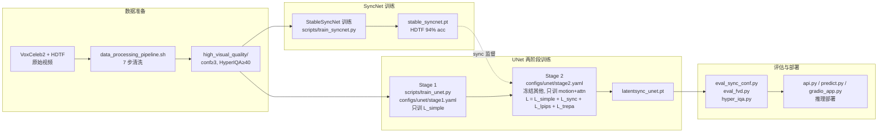
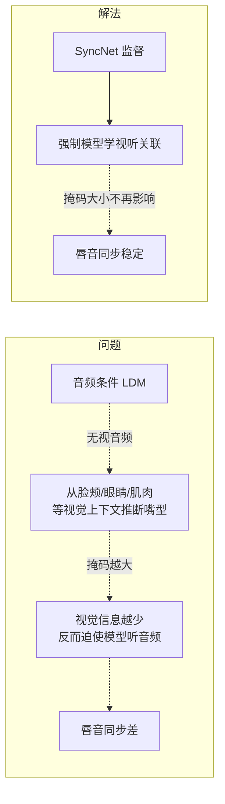
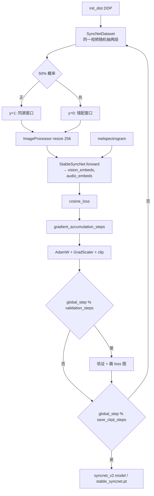
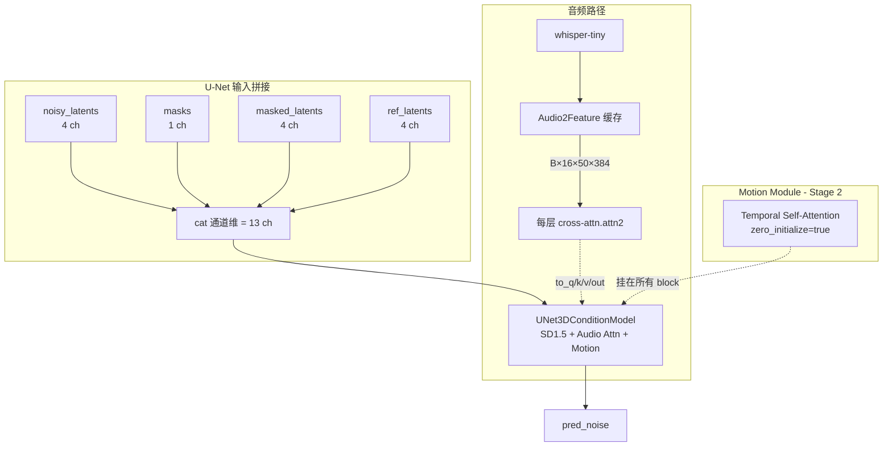
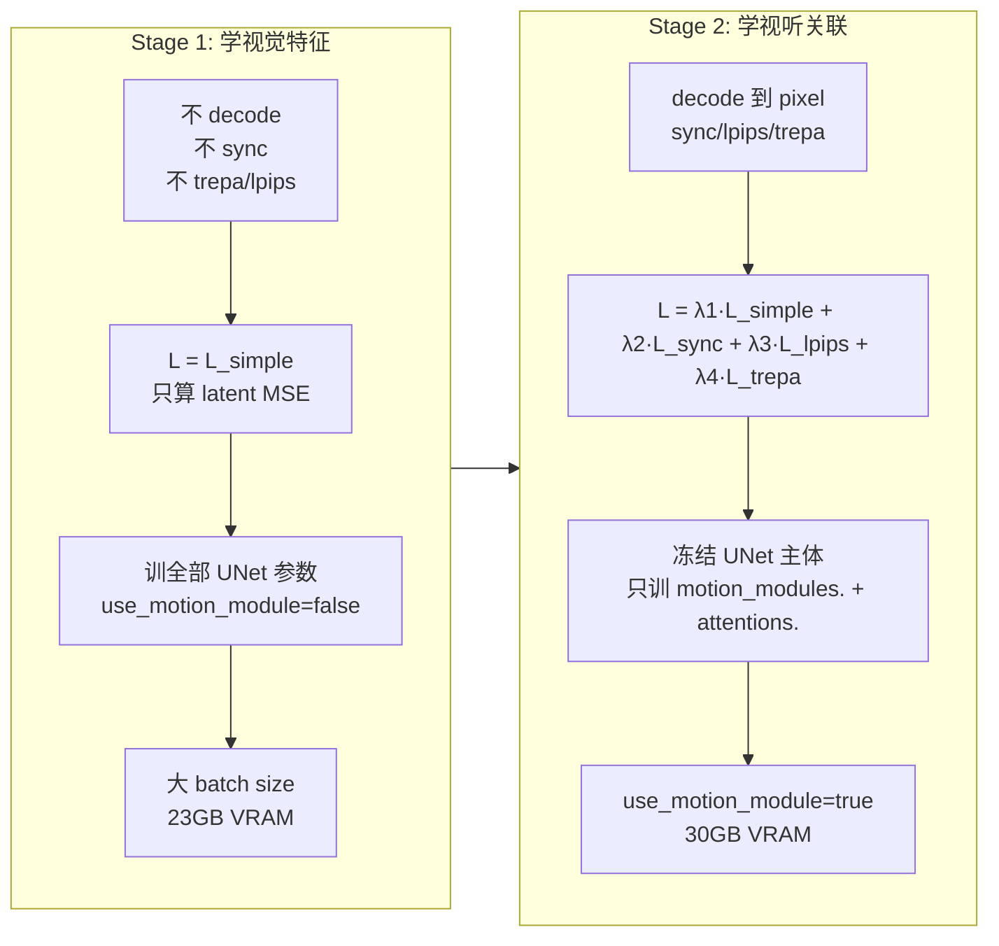
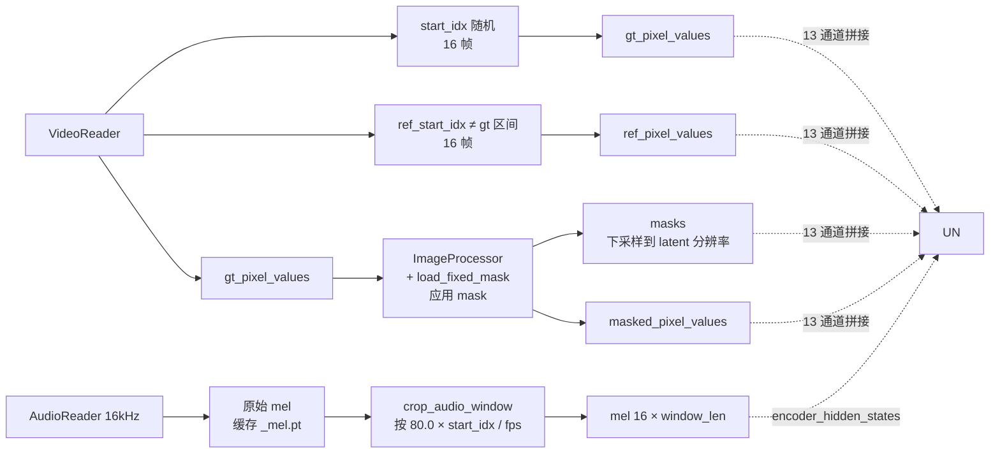
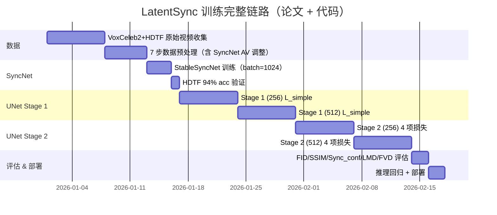

# LatentSync 完整训练 & 微调链路

> **资料来源**：
> 1. 论文 [LatentSync: Taming Audio-Conditioned Latent Diffusion Models for Lip Sync with SyncNet Supervision](https://arxiv.org/abs/2412.09262)（arXiv:2412.09262v2, 2025-03-13）
> 2. 中文解读：[视频对口型LatentSync：音频条件LDM的唇形同步](https://zhuanlan.zhihu.com/p/15729709724)、[论文评述 - Moonlight](https://www.themoonlight.io/zh/review/latentsync-audio-conditioned-latent-diffusion-models-for-lip-sync)、[CSDN 论文解读](https://blog.csdn.net/gitblog_00129/article/details/154668331)
> 3. 本仓库源码与 `AGENTS.md` / `docs/` 内置文档
>
> **目标读者**：希望训练/微调 LatentSync 的工程师与研究者

---

## 0. 一句话总览

> **LatentSync = SD1.5 UNet（+音频 cross-attention + 时序 motion module） + SyncNet 监督 + TREPA 时序对齐损失** 的两阶段端到端训练框架。
> **训练 = 数据清洗 → SyncNet 训练 → UNet Stage1 → UNet Stage2 → 评估**。

---

## 1. 全局训练链路（论文视角 + 代码映射）



---

## 2. 论文核心洞察：**Shortcut Learning 问题**

论文最大的理论贡献：**直接用 audio-conditioned LDM 做 lip-sync 会失败**，原因是「shortcut learning」。



> **关键实验**（论文 Fig. 2）：没 SyncNet 监督时，mask 越大 sync_conf 越好（因为模型被迫听音频）；有 SyncNet 监督时，无论 mask 大小，sync_conf 都稳定在高水平。

**代码体现**：
- **整脸 mask**（不只遮嘴）：`latentsync/utils/mask.png`，专门把整张脸都遮掉，迫使模型必须看 mask 外的极少信息 → 不得不靠音频。
- **如果用 landmark 动态画 mask**：嘴部周围 landmark 移动本身就是"嘴型变化线索"，等于让模型走视觉 shortcut。所以论文明确说"不用 landmark 画 mask"。

---

## 3. 数据预处理链路（`preprocess/` + `data_processing_pipeline.sh`）

### 3.1 七步流水线（论文 §5.1 + 代码）

| 步骤 | 脚本 | 论文依据 | 关键过滤阈值 | 代码行 |
|---|---|---|---|---|
| 1. 去损坏 | `remove_broken_videos.py` | AVReader 读不出就丢 | 损坏 | `preprocess/remove_broken_videos.py` |
| 2. 重采样 | `resample_fps_hz.py` | 论文实验：25 FPS / 16 kHz | fps=25, sr=16000 | `preprocess/resample_fps_hz.py` |
| 3. 镜头切分 | `detect_shot.py` | PySceneDetect adaptive detect | — | `preprocess/detect_shot.py` |
| 4. 5s 切片 | `segment_videos.py` | 每段 ≥ num_frames*3=48 帧 | segment_time=5 | `preprocess/segment_videos.py` |
| 5. 可选：高分辨率 | `filter_high_resolution.py` | mediapipe 人脸尺寸 ≥ res | face≥256 | `preprocess/filter_high_resolution.py` |
| 6. **仿射对齐** | `affine_transform.py` | **论文关键**：用 InsightFace landmark 把人脸正面化（侧脸也能用），降 side profile | 256×256 | `preprocess/affine_transform.py` |
| 7. **音视频同步** | `sync_av.py` | **论文关键**：用官方 SyncNet 调 AV offset 到 0，丢弃 conf<3 的视频 | conf≥3, \|offset\|≤6 | `preprocess/sync_av.py` |
| 8. 视觉质量 | `filter_visual_quality.py` | HyperIQA 分数过滤 | score≥40 | `preprocess/filter_visual_quality.py` |

### 3.2 为什么"先仿射再调 AV offset"？

论文 §4「Data preprocessing」专门做了 ablation（Fig. 10）：
- **不做 offset 调整**：SyncNet loss 卡在 0.69（= log 2，意味着没在学）。
- **先仿射再调 offset**：最佳收敛曲线。

原因：仿射变换去掉了大量侧脸 / 怪角度样本，让官方 SyncNet 估 AV offset 更准。

### 3.3 数据预处理 → 训练字段映射

| 预处理产物 | 训练集字段 | 用途 |
|---|---|---|
| `high_visual_quality/*.mp4` | `video_paths` | 视频源 |
| 视频内嵌音频（16 kHz） | `original_mel` (缓存 `_mel.pt`) | UNet `mel` / SyncNet `audio_samples` |
| 仿射对齐后的人脸 | `gt_pixel_values` / `masked_pixel_values` / `ref_pixel_values` | UNet 三元组 |

---

## 4. SyncNet 训练（论文 §4 + `scripts/train_syncnet.py`）

> **论文贡献**：StableSyncNet —— 把 SyncNet 视觉/音频编码器重做成 SD U-Net encoder 结构，HDTF 准确率 91% → **94%**。

### 4.1 为什么"loss 卡在 0.69"

论文给出了数学证明：

```
q(x=1) ≈ q(x=0) ≈ 0.5  (模型在学之前等概率猜)
L_syncnet = -1/N ∑ p(xᵢ) log q(xᵢ) ≈ 0.693 = ln 2
```

**含义**：SyncNet 没学到任何判别能力时，loss 的下界就是 ln 2 ≈ 0.69。这是判断"模型是否在训练"的强信号。

### 4.2 论文五因素消融（Fig. 6-10）

| 因素 | 论文结论 | 代码对应配置字段 |
|---|---|---|
| **Batch size** | 1024 最优，128 卡在 0.69，256 振荡 | `data.batch_size=256`（可调到 1024） |
| **架构** | SD U-Net encoder 改造的 StableSyncNet > Wav2Lip 原始架构 | `configs/syncnet/syncnet_16_pixel_attn.yaml`（含 attention） |
| **Embedding dim** | 2048 最优；512 太小，4096/6144 太稀疏 | `block_out_channels` 末层 2048 |
| **帧数** | 16 最优；25 在训练初期卡住 | `data.num_frames=16` |
| **数据预处理** | 先 affine 再调 AV offset | pipeline 顺序固定 |

### 4.3 StableSyncNet 架构

```mermaid
flowchart LR
    subgraph VE[Visual Encoder<br/>输入 (48, H, W)]
        VRES[ResBlock×N<br/>下采样 [1,2],2,2,2,2,2,2,2] --> VATTN[Self-Attn block 4,5]
        VATTN --> VOUT[2048×1×1]
    end

    subgraph AE[Audio Encoder<br/>输入 (1, 80, 52)]
        ARES[ResBlock×N<br/>下采样 [[2,1],2,2,1,2,2,[2,3]]] --> AATTN[Self-Attn block 3,4]
        AATTN --> AOUT[2048×1×1]
    end

    VOUT --> COS[cosine_loss<br/>同源 y=1 / 错配 y=0]
    AOUT --> COS
```

> **只取下半脸**：`configs/syncnet/syncnet_16_pixel_attn.yaml` 的 `data.lower_half: true` —— SyncNet 只看嘴部区域，因为上半脸对"嘴-音"同步是噪声。

### 4.4 训练循环



### 4.5 SyncNet 损失函数（论文附录 A + `latentsync/utils/util.py:314`）

```python
# cosine_loss(vision_embeds, audio_embeds, y)
# y=1: 1 - cos(v, a)        # 同源 → 鼓励对齐
# y=0: max(0, cos(v, a))    # 错配 → hinge 鼓励远离
```

---

## 5. UNet 训练（论文 §3.2 + `scripts/train_unet.py`）

### 5.1 模型架构



> **输入通道数 = 13**：4（noise latent）+ 1（mask）+ 4（masked latent）+ 4（reference latent）。
> **初始化**：SD1.5 权重初始化，但 `conv_in`（13 通道）和 cross-attn 层（dim 384 而非 1280）随机初始化。

### 5.2 音频特征怎么喂

论文公式（§3.1）：
```
A^(f) = {a^(f-m), ..., a^(f), ..., a^(f+m)}
```

**代码**：`configs/unet/stage1.yaml` → `audio_feat_length: [2, 2]`，即 `m=2`，每帧用"前 2 帧 + 自己 + 后 2 帧"共 5 帧音频特征（每帧 50 个 token），shape `(B, 16, 50, 384)`。

> **音频特征 384 dim** 来自 whisper-tiny。如果换成 whisper-small 则是 768（`cross_attention_dim=768`），对应 `whisper_model_path="checkpoints/whisper/small.pt"`。

### 5.3 **两阶段训练策略**（论文核心 §3.2）

> 论文动机：**decoded pixel space supervision 需要保留 VAE decoder 的 activations 给反传**，显存爆炸。
> 解决：先不 decode（不耗显存），学视觉特征；再加 sync/lpips/trepa 学视听关联。



### 5.4 训练目标（论文 Eq. 2-6 + 代码 `scripts/train_unet.py:415-420`）

**Stage 1**：
```
L_simple = E[||ε - ε_θ(z_t, t, τ_θ(A))||²]
```
代码：`recon_loss = MSE(pred_noise, noise)`，`recon_loss_weight=1`。

**Stage 2**：
```
L_total = λ1·L_simple + λ2·L_sync + λ3·L_lpips + λ4·L_trepa
```
| 损失 | 公式（论文） | 代码位置 | 权重 |
|---|---|---|---|
| `L_simple` | `MSE(ε_pred, ε_target)` | `train_unet.py:360` | 1 |
| `L_sync` | `cosine_loss(SyncNet(D(ẑ⁰), a))` | `train_unet.py:411` | 0.05 |
| `L_lpips` | `||V_l(D(ẑ⁰_f)) - V_l(x_f)||²`（仅下半脸） | `train_unet.py:375` | 0.1 |
| `L_trepa` | `||T(D(ẑ⁰)) - T(x)||²`（VideoMAE-v2 特征） | `train_unet.py:388` | 10 |

> **L_sync 输入**：UNet 推理 → one-step 估计 ẑ⁰ → VAE decode 到 pixel → 只取下半脸 → 喂给冻结的 StableSyncNet → 算 cosine loss。
> **`lower_half`**：`SyncNetDataset` 训练时也用 `lower_half=true`（见 `syncnet_16_pixel_attn.yaml`），推理时一致。

### 5.5 one-step estimation（论文 Eq. 1 + `latentsync/utils/util.py:267`）

```python
# z^0 = (z_t - sqrt(1 - α_t) * ε_θ(z_t)) / sqrt(α_t)
def one_step_sampling(ddim_scheduler, pred_noise, timesteps, x_t):
    alpha_prod_t = ddim_scheduler.alphas_cumprod[timesteps]
    beta_prod_t = 1 - alpha_prod_t
    return (x_t - beta_prod_t ** 0.5 * pred_noise) / alpha_prod_t ** 0.5
```

> **意义**：单步从 `z_t` 直接估计干净的 `z^0`，避免跑完整个 DDIM 反向过程，**且保留梯度**让 sync/lpips/trepa 反传。

### 5.6 **Mixed Noise**（论文 §3.1 + 代码 `train_unet.py:319-332`）

```python
# noise = noise_ind + noise_shared
# noise_shared = randn_like(...)[:, :, 0:1].repeat(全帧) * α / sqrt(1+α²)
# noise_ind    = randn_like(...) * 1 / sqrt(1+α²)
# mixed_noise_alpha=1
```

- **`noise_shared`**：所有帧共用同一噪声 → 强制 UNet 学**时序一致性**（相邻帧差异由去噪过程产生而非噪声产生）。
- **`noise_ind`**：每帧独立噪声 → 提供帧间变化。
- 论文引用 [AnimateDiff](https://arxiv.org/abs/2308.09716) 的做法。

### 5.7 数据采样（`UNetDataset`）



> 训练时 `affine_transform=False`（在数据集里已经做过），但 `ImageProcessor.prepare_masks_and_masked_images` 仍会调一次（mask 应用 + resize）。

### 5.8 **Stage 2 训练对象（论文 §3.2）**

论文原话：
> *"In the second stage of training, we only train the temporal layer and audio layer while freezing the other parameters of the U-Net."*

代码对应：
```yaml
# configs/unet/stage2.yaml
trainable_modules:
  - motion_modules.    # Motion Module（时序层）
  - attentions.        # cross-attn 之外的 self-attn（Stage 2 标准）
```

**stage2_efficient.yaml 进一步缩范围**：
```yaml
trainable_modules:
  - motion_modules.
  - attn2.             # 只训 cross-attn（attn2.to_q/k/v/out）
decoder_only: true     # Motion Module 只挂在 decoder，encoder 不挂
trepa_loss_weight: 0   # 省显存
```

### 5.9 **TREPA（论文 §3.3 + `latentsync/trepa/loss.py`）**

> **问题**：单帧 pixel-level 损失（LPIPS）只管每帧好不好看，不管帧间是否一致 → 牙齿/胡须闪烁。
> **解法**：用大规模自监督视频模型 **VideoMAE-v2** 提取**时序表示**（embeddings before head projection），让生成的 16 帧的时序特征 ≈ GT 16 帧的时序特征。

```python
# latentsync/trepa/loss.py:33
def __call__(self, videos_fake, videos_real):
    # resize to 224x224
    # 输入范围 [0, 1]
    feats_fake = self.model.forward_features(videos_fake)  # VideoMAE-v2
    feats_real = self.model.forward_features(videos_real)
    feats_fake = F.normalize(feats_fake, p=2, dim=1)        # ℓ2 归一化
    feats_real = F.normalize(feats_real, p=2, dim=1)
    return F.mse_loss(feats_fake, feats_real)
```

> **权重 10**：远大于 sync=0.05、lpips=0.1；因为 MSE on normalized features 数值小，需要放大。

### 5.10 配置全表

| config | 分辨率 | motion | decoder_only | trainable | trepa | sync | mask | VRAM |
|---|---|---|---|---|---|---|---|---|
| `stage1.yaml` | 256 | false | — | 全部 | 10 | false | `mask.png` | 23 GB |
| `stage1_512.yaml` | 512 | false | — | 全部 | 10 | false | `mask.png` | 30 GB |
| `stage2.yaml` | 256 | true | false | motion + attn | 10 | true | `mask.png` | 30 GB |
| `stage2_512.yaml` | 512 | true | false | motion + attn | 10 | true | `mask2.png` | 55 GB |
| `stage2_efficient.yaml` | 256 | true | **true** | motion + attn2 | **0** | true | `mask.png` | 20 GB |

---

## 6. 评估（`eval/` + 论文 §5.2）

### 6.1 评估指标（论文 Table 1）

| 指标 | 含义 | 越大/越小 | 代码 |
|---|---|---|---|
| **FID** | Fréchet Inception Distance，视觉质量 | ↓ 越好 | `eval/eval_fvd.py` (I3D) |
| **SSIM** | Structural Similarity，重建质量 | ↑ 越好 | 同上 |
| **Sync_conf** | SyncNet confidence，唇音同步 | ↑ 越好 | `eval/eval_sync_conf.py` |
| **LMD** | Landmark Distance，嘴部 landmark 距离 | ↓ 越好 | 同上 |
| **FVD** | Fréchet Video Distance，时序质量 | ↓ 越好 | `eval/eval_fvd.py` |

### 6.2 论文 Table 1（HDTF 测试集）

| 方法 | FID↓ | SSIM↑ | Sync_conf↑ | LMD↓ | FVD↓ |
|---|---|---|---|---|---|
| Wav2Lip | 12.5 | 0.70 | 8.2 | 0.34 | 304.35 |
| VideoReTalking | 9.5 | 0.75 | 7.5 | 0.49 | 270.56 |
| Diff2Lip | 10.3 | 0.72 | 7.9 | 0.36 | 260.45 |
| MuseTalk | 9.35 | 0.74 | 6.8 | 0.56 | 246.75 |
| **LatentSync** | **7.22** | **0.79** | **8.9** | **0.30** | **162.74** |

### 6.3 论文 Table 2 消融（HDTF）

| 变体 | Sync_conf↑ | FVD↓ |
|---|---|---|
| w/o SyncNet | 4.6 | 220.37 |
| + latent space SyncNet | 7.9 | 180.45 |
| **+ pixel space SyncNet** | **8.9** | **162.74** |

> **结论**：pixel space supervision 全面胜出 → 论文选 decoded pixel space。

### 6.4 SyncNet 训练数据集 vs HDTF 测试

论文说 StableSyncNet **在 VoxCeleb2 上训练，在 HDTF 上测试**（跨数据集 OOD 测试），验证泛化。

---

## 7. 微调实战指南

### 7.1 微调场景矩阵

| 微调目标 | 推荐入口 | 关键改动 | 风险 |
|---|---|---|---|
| **新增场景/语种** | Stage 1 → Stage 2 全流程 | 换 `train_fileslist` + `audio_mel_cache_dir` | 低 |
| **256 → 512 升分辨率** | `stage1_512.yaml` → `stage2_512.yaml` | `resolution: 512`，`mask2.png` | 中（VRAM 翻倍） |
| **省显存** | `stage2_efficient.yaml` | `decoder_only: true`, `trepa=0`, 只训 motion+attn2 | 质量略降 |
| **重训 SyncNet** | `train_syncnet.sh` | 改 `train_fileslist` / `val_data_dir`；batch_size 越大越好（论文建议 1024） | 低 |
| **LoRA 风格微调** | 不原生支持，需改 `scripts/train_unet.py` 加 PEFT | — | 高 |
| **唇音同步精度 ↑** | 用更大 batch 重训 SyncNet（1024+），再 Stage 2 | SyncNet 训不动 → 全链路崩 | 中 |

### 7.2 通用 checklist（结合论文 §4 的 5 因素）

#### 数据准备
- [ ] 数据走过 `data_processing_pipeline.sh` 到 `high_visual_quality/`。
- [ ] `python -m tools.write_fileslist` 生成 `train_fileslist.txt`。
- [ ] `audio_mel_cache_dir` / `audio_embeds_cache_dir` 可写（每视频几十 MB）。
- [ ] **新数据必须重新跑 SyncNet offset 调整**（论文 §4 结论：不做 loss 卡 0.69）。

#### 配置继承
- [ ] **复制**最近的 config，不要改原文件。
- [ ] 必改：`train_fileslist`, `val_video_path`, `val_audio_path`, `train_output_dir`, `audio_embeds_cache_dir`, `audio_mel_cache_dir`。
- [ ] 如果改分辨率：`cross_attention_dim` 仍为 384（whisper-tiny），或 768（whisper-small）。
- [ ] `mask_image_path`：256 用 `mask.png`，512 用 `mask2.png`。

#### 断点续训
- [ ] `ckpt.resume_ckpt_path` 指向上阶段产物（如 `latentsync_unet.pt`）。
- [ ] 从 `resume_global_step` 继续；scaler/optimizer 状态**不会**恢复，混合精度需要 warm-up。
- [ ] Stage 2 训练时 `trainable_modules` 必须正确列出，否则全 UNet 一起动 = 显存爆炸 + 灾难遗忘。

#### SyncNet 监督（论文 §4 五因素）
- [ ] Stage 2 必须有 SyncNet（`inference_ckpt_path` 必填）。
- [ ] **Batch size ≥ 256**（论文 128 卡 0.69，1024 最优）。
- [ ] **Embedding dim 末层 = 2048**（太小信息不够，太大稀疏）。
- [ ] **`num_frames=16`**（25 帧卡住）。
- [ ] **先 affine 再调 AV offset**（这是论文 Fig. 10 唯一收敛的预处理顺序）。

#### 监控
- [ ] `progress_bar.step_loss`：recon 单调下降，sync 收敛到 ~0.1-0.2。
- [ ] `val_videos/*.mp4`：每 `save_ckpt_steps` 抽检。
- [ ] `sync_conf_results/*.png`：曲线应稳定上升（>7 为合格）。
- [ ] **如果 sync_conf 卡在某个低值不升**：八成是 SyncNet 没训好，回去检查 batch size / 数据预处理。

#### 推理回归（论文 §5.1 设置）
- [ ] 把新 ckpt 放 `checkpoints/latentsync_unet.pt`，重启 server 让 singleton 重新加载（env 仅启动时生效）。
- [ ] **DDIM 20 步 + guidance=1.5** 是论文标准设置。
- [ ] 用 `eval_sync_conf.py` 在 HDTF/VoxCeleb2 30 个测试视频上跑一遍，对比论文 Table 1 基线。

### 7.3 常见坑

| 现象 | 根因 | 解决 |
|---|---|---|
| SyncNet loss 卡在 0.69 | batch 太小 / 数据没调 AV offset | 加大 batch，回 `sync_av.py` 步骤 |
| Stage 1 后 Stage 2 显存爆 | `trainable_modules` 错（全部解冻） | 严格只 train motion + attn |
| 512 训练 mask 错位 | 用了 `mask.png`（256 设计） | 改 `mask2.png` |
| Sync loss 一直在抖 | SyncNet 没训稳 | 重训 SyncNet（>=1024 batch） |
| 时序闪烁严重 | TREPA=0 或 weight 太小 | 恢复 `trepa_loss_weight=10` |
| 前端改了参数没生效 | 没加 `_override` 后缀 | 字段名必须 `guidance_scale_override` 等 |
| 训练完效果没变化 | `train_fileslist` 还是老的 | 重新生成 |

### 7.4 论文实验设置速查（§5.1）

- **数据集**：VoxCeleb2 + HDTF 混合训练。
- **训练分辨率**：256×256（论文）/ 512×512（v1.6 changelog）。
- **音频**：16 kHz，melspectrogram 80 mel，hop 200。
- **DDIM 推理步数**：20。
- **评估视频数**：HDTF/VoxCeleb2 各 30 个。
- **评估设置**：
  - *Reconstruction setting*：原视频原音频 → 看 SSIM。
  - *Cross generation setting*：换音频 → 看 FID, Sync_conf, LMD, FVD。

---

## 8. 文件 ↔ 角色 ↔ 论文章节 三向速查

| 文件 | 角色 | 论文对应章节 |
|---|---|---|
| `scripts/train_unet.py` | UNet 训练主循环 | §3.2 |
| `scripts/train_syncnet.py` | SyncNet 训练主循环 | §4 |
| `latentsync/data/unet_dataset.py` | UNet 三元组采样 | §3.1 |
| `latentsync/data/syncnet_dataset.py` | SyncNet 正/负样本 | §3.1 SyncNet 部分 |
| `latentsync/models/unet.py` | UNet3DConditionModel 定义 | §3.1 |
| `latentsync/models/motion_module.py` | Temporal Self-Attention | §3.1 (引用 AnimateDiff) |
| `latentsync/models/stable_syncnet.py` | StableSyncNet 编码器 | §4 |
| `latentsync/whisper/audio2feature.py` | Whisper → 帧级特征 | §3.1 Audio layers |
| `latentsync/trepa/loss.py` | TREPA 感知损失 | §3.3 Eq. 6 |
| `latentsync/utils/util.py:267 one_step_sampling` | ẑ⁰ 一步估计 | §3.1 Eq. 1 |
| `latentsync/utils/util.py:314 cosine_loss` | SyncNet 对比损失 | 附录 A |
| `latentsync/utils/util.py:237 init_dist` | DDP 初始化 | 训练基础设施 |
| `preprocess/*.py` | 7 步数据清洗 | §5.1 + §4 |
| `eval/*.py` | 离线评估指标 | §5.2 |
| `configs/scheduler_config.json` | DDIMScheduler 配置 | 推理 |
| `configs/audio.yaml` | melspectrogram 参数 | §5.1 |
| `configs/unet/stage1.yaml` 等 | 训练超参 | §3.2 |
| `configs/syncnet/syncnet_16_pixel_attn.yaml` | StableSyncNet 配置 | §4 |

---

## 9. 关键 takeaway

1. **论文核心贡献**：
   - 识别并解决 shortcut learning（用 SyncNet + 整脸 mask）。
   - StableSyncNet 架构改进（HDTF 94%）。
   - TREPA 时序对齐损失。
   - 两阶段训练策略（解决 VAE decode 显存爆炸）。

2. **训练核心链路**：
   ```
   VoxCeleb2+HDTF → 7步清洗 → StableSyncNet → Stage1 (L_simple) → Stage2 (L_simple+sync+lpips+trepa) → 评估
   ```

3. **微调黄金法则**（论文实证）：
   - SyncNet batch ≥ 256，**最好 1024**；低于 128 一定卡 0.69。
   - 数据必须先 affine 再调 AV offset。
   - Stage 2 冻结 UNet 主体，只训 motion + attn。
   - 256 → 512 仅改 `resolution` 和 `mask_image_path`。

4. **不要碰的 baseline**：
   - `mask.png` 整脸 mask（不是嘴部 mask）—— 故意遮大是为了反 shortcut。
   - `mixed_noise_alpha=1` —— 必须用 mixed noise 才能学时序。
   - `lower_half=true` for SyncNet —— 只看嘴部。

---

## 10. 端到端时间线（示意图）



> 时间数字为示意量级。实际取决于 GPU 数量与数据规模。论文未给出确切训练时长。

---

## 附录 A：论文数学公式对照

| 公式 | 含义 | 代码位置 |
|---|---|---|
| Eq. 1: `ẑ⁰ = (z_t - √(1-ᾱ_t)·ε_θ(z_t)) / √ᾱ_t` | one-step 估计干净 latent | `latentsync/utils/util.py:267` |
| Eq. 2: `L_simple = E[||ε - ε_θ(z_t,t,τ_θ(A))||²]` | Stage 1 噪声预测 MSE | `train_unet.py:360` |
| Eq. 3: `L_sync = E[SyncNet(D(ẑ⁰)_{f:f+16}, a_{f:f+16})]` | Stage 2 SyncNet 监督 | `train_unet.py:411` |
| Eq. 4: `L_lpips = E[||V_l(D(ẑ⁰_f)) - V_l(x_f)||²]` | LPIPS 感知损失 | `train_unet.py:375` |
| Eq. 5: `L_total = λ1·L_simple + λ2·L_sync + λ3·L_lpips + λ4·L_trepa` | Stage 2 总损失 | `train_unet.py:415-420` |
| Eq. 6: `L_trepa = E[||T(D(ẑ⁰)_{f:f+16}) - T(x_{f:f+16})||²]` | TREPA 时序对齐 | `latentsync/trepa/loss.py:33` |
| Eq. 7: `L_syncnet ≈ 0.693` | SyncNet 不学时的下界 | 诊断信号 |

## 附录 B：知乎文章要点（间接获取）

[知乎文章](https://zhuanlan.zhihu.com/p/15729709724) 因 403 无法直接抓取，通过搜索引擎摘要和同主题解读还原其核心要点：

1. **构建自监督训练方式**：训练视频只需"唇音同步"，无需额外标注，可大数据训练。
2. **StableSyncNet 关键**：基于 SD U-Net 编码器改造的 SyncNet，整个训练过程中训练/验证 loss 始终低于 Wav2Lip 原始架构。
3. **解码像素空间监督**：论文最终选择 decoded pixel space supervision 而非 latent space supervision（前者收敛更好）。
4. **两阶段训练动机**：第一阶段不解码到像素空间、不加 SyncNet loss → 省显存、可大 batch；第二阶段再上 sync/lpips/trepa 学视听关联。
5. **TREPA 引入**：用 VideoMAE-v2 自监督时序特征对齐，显著改善帧间一致性。

---

> **文档版本**：基于 arXiv:2412.09262v2 (2025-03-13) + 当前仓库 main 分支
> **最后更新**：2026-07-13