# LatentSync 完整训练 & 微调链路

> **资料来源**：
> 1. 论文 [LatentSync: Taming Audio-Conditioned Latent Diffusion Models for Lip Sync with SyncNet Supervision](https://arxiv.org/abs/2412.09262)（arXiv:2412.09262v2, 2025-03-13）
> 2. 中文解读：[视频对口型LatentSync：音频条件LDM的唇形同步](https://zhuanlan.zhihu.com/p/15729709724)、[论文评述 - Moonlight](https://www.themoonlight.io/zh/review/latentsync-audio-conditioned-latent-diffusion-models-for-lip-sync)、[CSDN 论文解读](https://blog.csdn.net/gitblog_00129/article/details/154668331)
> 3. 本仓库源码与 `AGENTS.md` / `docs/` 内置文档
>
> **目标读者**：希望训练/微调 LatentSync 的工程师与研究者
>
> **文档风格**：尽量通俗，必要时配类比。看完前 4 节你应该能跟别人讲清楚 LatentSync 在干什么。

---

## 0. 一句话总览

> **LatentSync = SD1.5 UNet（+ 音频 cross-attention + 时序 motion module） + SyncNet 监督 + TREPA 时序对齐损失** 的两阶段端到端训练框架。
>
> **训练链路 = 数据清洗 → SyncNet 训练 → UNet Stage1 → UNet Stage2 → 评估**。

---

## 1. 通俗版：SyncNet 是什么、UNet 是什么

> 这一节先用人话讲清楚两个核心模型是什么，后面再讲训练细节。

### 1.1 用一个类比开场

想象你在教一个"配音演员"（UNet）表演一段新台词：

- **配音演员（UNet）**：拿到一张嘴被遮住的脸 + 音频，要"画"出对应的嘴型。
- **嘴型审核员（SyncNet）**：每画完一段，就审核"这段嘴型配这段声音真的对吗？"，告诉演员哪里要改。

光让演员"画得像嘴"（pixel loss）还不够，因为演员会偷懒——他从眼睛、脸颊的肌肉运动就能猜到嘴型，根本不听声音。审核员 SyncNet 就是来防止这种"偷懒"的。

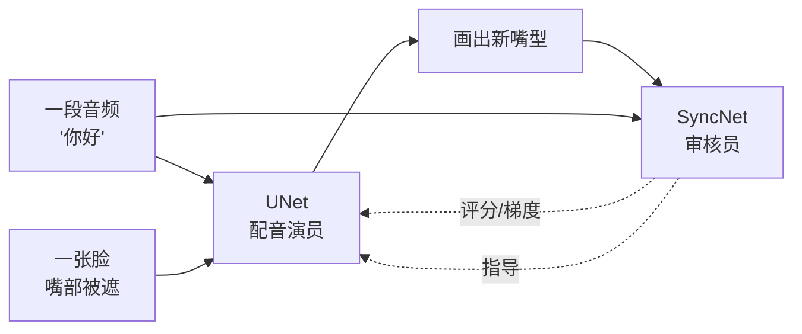

### 1.2 SyncNet 是什么？

#### 一句话定义
**SyncNet 是一个二分类网络：给定 16 帧人脸 + 16 帧对应音频，判断这俩是否"对得上嘴型"。**

#### 输入输出

| | 形状 | 含义 |
|---|---|---|
| **输入（视觉）** | `(16, 3, 256, 256)` 像素值 | 16 帧人脸下半张图（只看嘴） |
| **输入（音频）** | `(1, 80, 52)` mel 频谱 | 16 帧对应的 0.64 秒音频 |
| **输出 A** | `vision_embeds`: 2048 维向量 | 视频的"嘴型指纹" |
| **输出 B** | `audio_embeds`: 2048 维向量 | 音频的"声音指纹" |
| **最终判断** | 两个向量的余弦相似度 | 越接近 1 越同步 |

#### 它解决什么问题？
在训练 UNet 时充当"判官"——如果 UNet 画的嘴型和音频不匹配，SyncNet 会通过梯度"骂"UNet，让它必须听音频而不是偷懒看视觉。

#### 推理阶段用不用 SyncNet？
**不用。** SyncNet 是"训练阶段的老师"，不是"推理阶段的裁判"。

UNet 训好之后，唇音同步的能力已经通过 SyncNet 的梯度反向传播烧进了 UNet 权重。推理时只需要 UNet + VAE + Whisper 三件套，SyncNet 完全不加载。

```python
# api.py / gradio_app.py / predict.py 实际加载
vae     = AutoencoderKL.from_pretrained("stabilityai/sd-vae-ft-mse")
unet    = UNet3DConditionModel.from_config(...).to(device)
unet.load_state_dict(ckpt["state_dict"])
audio_encoder = Audio2Feature(model_path="checkpoints/whisper/tiny.pt")
# 就这三个，没有 SyncNet
```

代码层面验证：`scripts/inference.py`、`api.py`、`gradio_app.py`、`predict.py`、`latentsync/pipelines/lipsync_pipeline.py` 里 **0 处引用** `StableSyncNet`。`AGENTS.md:147` 也明确标注 `stable_syncnet.py # SyncNet (lip-sync confidence, training only)`。

#### 仓库里其实有两个 SyncNet，别搞混

| 名称 | 文件 | 作用 | 推理用吗 |
|---|---|---|---|
| **StableSyncNet** | `latentsync/models/stable_syncnet.py` | UNet Stage 2 训练的 `L_sync` 监督者 | ❌ 仅训练 |
| **SyncNetEval** | `eval/syncnet.py` | Joon Son Chung 原始 SyncNet（`syncnet_v2.model`） | ❌ 仅离线评估 |

SyncNetEval 用在：
- 数据预处理算 AV offset（`preprocess/sync_av.py`）
- 训练时验证生成的 val_video（`scripts/train_unet.py:489`）
- 离线评估（`eval/eval_sync_conf.sh`）

#### 能不能独立训练？
**能。** SyncNet 完全独立于 UNet，本质就是一个二分类器，论文甚至把它当通用工具贡献了出来。
- 数据：任意带人脸的视频 + 内嵌音频（必须先做音视频对齐，详见 §3）。
- 训练：`./train_syncnet.sh`，5-30 分钟看完一轮。
- 产物：`stable_syncnet.pt`，HDTF 准确率 91% → 94%。

#### 训练集格式
一行一个 mp4 绝对路径：

```
/data/voxceleb2/abc/001.mp4
/data/voxceleb2/abc/002.mp4
...
```

数据集会自动从视频里抽音频做 mel。

### 1.3 UNet 是什么？

#### 一句话定义
**UNet 是一个图像生成网络：拿到被遮住的脸 + 音频 + 参考脸，画出没被遮的完整脸。** 它就是 LatentSync 真正对外服务的"演员"。

#### 为什么叫 UNet？
因为它长得像个 U：左边一层层缩小（编码器），右边一层层放大（解码器），中间用 skip connection 连起来。这是 Stable Diffusion 的核心架构。

#### LatentSync 的 UNet 在 SD 基础上加了三个东西

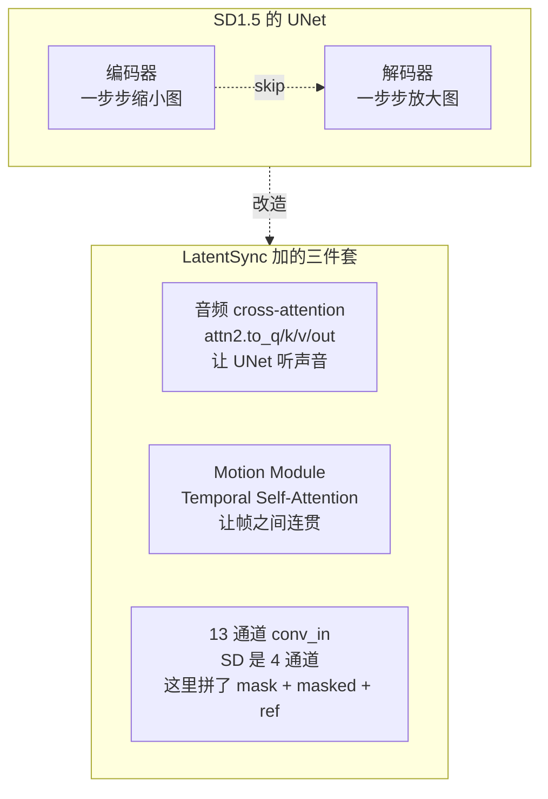

#### ⚠️ 关键澄清：SD1.5 是"起点"不是"成品"

| 组件 | SD1.5 提供 | LatentSync 是否重训 |
|---|---|---|
| **VAE 编码器/解码器** | `stabilityai/sd-vae-ft-mse` | ❌ 冻结不训 |
| **UNet 骨架结构** | SD UNet 架构 | 复用结构 |
| **UNet 初始权重** | SD1.5 unet 权重（warm start） | ✅ **全部重训** |
| **UNet conv_in（13 ch）** | SD 是 4 通道，shape 不兼容 | 🆕 随机初始化 |
| **Cross-attn（384 dim）** | SD 是 768/1280 维，shape 不兼容 | 🆕 随机初始化 |
| **Motion Module** | SD 没有 | 🆕 新增、随机初始化 |
| **Audio 注入路径** | SD 没有 | 🆕 新增 |

**论文 §3.1 原话**：
> *"At the beginning of training, the model is initialized with the parameters of SD 1.5, except for the first conv_in layer with 13 channels and cross-attention layers of dimension 384, which are randomly initialized."*

**代码层面**（`scripts/train_unet.py`）：

```python
# VAE 真的直接用 SD 的
vae = AutoencoderKL.from_pretrained("stabilityai/sd-vae-ft-mse", ...)

# UNet 加载时 ckpt_path 默认是 latentsync_unet.pt（不是 SD1.5）
unet, resume_global_step = UNet3DConditionModel.from_pretrained(
    OmegaConf.to_container(config.model),
    config.ckpt.resume_ckpt_path,  # = checkpoints/latentsync_unet.pt
    device=device,
)
```

**关键点**：
1. 首次跑 Stage 1 之前，需要先把 SD1.5 UNet 的权重塞到 `latentsync_unet.pt` 里（conv_in 和 cross-attn 因为 shape 不对会被 `strict=False` 跳过，留随机初始化）。
2. Stage 1 训全部 UNet 参数（SD1.5 的 resnet/attn 全部更新）。
3. Stage 2 冻结 SD1.5 原有 resnet/attn，只训新加的 `motion_modules.` + `attentions.`。

**为什么不直接用 SD1.5 训好的 frozen UNet？**

论文 §2 Fig.2 实验证明：直接把 SD1.5 的 UNet 接上音频 cross-attn、训唇音同步，**会严重 shortcut learning**（从眼睛/脸颊推断嘴型，不听音频）。所以必须用 SyncNet 监督强制学视听关联，并且是在唇音同步数据上完整训练一遍。

**为什么不复用 SD1.5 的 conv_in 和 cross-attn 权重？**

- **conv_in**：SD1.5 接受 4 通道 latent，LatentSync 接受 13 通道（4 noise + 1 mask + 4 masked + 4 ref）。维度对不上，必须随机初始化。
- **cross-attention**：SD1.5 用 768 维（text encoder）做 cross-attn，LatentSync 用 384 维（whisper-tiny）做 cross-attn，维度对不上，必须随机初始化。

其他 resnet、self-attn、time embedding 等模块 shape 兼容，可以从 SD1.5 权重 warm start 加速收敛。

### 1.4 嘴部 mask 怎么算？推理需要吗？

#### 一句话回答

**mask 是一张预先画好的 PNG（`latentsync/utils/mask.png`），不是实时算的。训练和推理都要用它把原图的嘴部抹黑后再喂给 UNet。**

#### mask.png 长什么样？

一张预先生成的、人脸形状的二值图（256×256）。约定：

| mask 像素值 | 含义 | masked_face 中表现 |
|---|---|---|
| **0**（黑） | 要 inpaint 的区域 | 嘴部被抹成黑色 |
| **1**（白） | 保留原图 | 眼睛/额头/背景不动 |

#### 怎么从原图得到"嘴被遮住的脸"？

**逐像素相乘**，一行代码：

```python
# latentsync/utils/image_processor.py:244
mask_to_use = self.mask_image[0:1]              # 加载好的固定 mask
masked_pixel_values = pixel_values * mask_to_use  # 逐像素相乘
```

数学上：`masked = face × mask`，mask=0 的位置 → 全 0（黑），mask=1 的位置 → 原值。

#### 训练侧（`UNetDataset`）

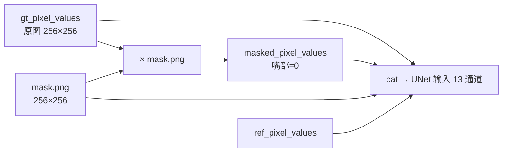

#### 推理侧（`LipsyncPipeline`）

**推理也要做相同的 mask 操作**，因为 UNet 只接受这种 13 通道格式的输入。

```python
# lipsync_pipeline.py:4194
ref_pixel_values, masked_pixel_values, masks = self.image_processor.prepare_masks_and_masked_images(
    inference_faces, affine_transform=False
)
```

#### 为什么用"整脸 mask"而不是只遮嘴？

论文 §3.1 原话：
> *"We applied a mask that covers the entire face to minimize the model's tendency to learn visual-visual shortcuts."*

**核心动机**：如果只遮嘴，眼睛/脸颊/肌肉的运动会"剧透"嘴型——UNet 会偷懒不学音频。**把整张脸都遮掉**，UNet 在 mask 内看不到任何视觉线索，就被迫只能听音频。

这正是论文 §2 Fig.2 的实验结论：**mask 越大 → sync 越好**（因为偷不了懒）。

#### 推理侧多了一个东西：动态嘴部 mask

```python
# lipsync_pipeline.py:3197 / 4141
fixed_keep_mask = self.image_processor.mask_image[0:1]  # 固定 mask（mask.png）
dynamic_region_mask = generate_dynamic_mouth_mask(
    mouth_info,
    fixed_keep_mask=fixed_keep_mask,  # ← 用固定 mask 当边界约束
)
```

- **固定 mask** = mask.png → 决定"哪些像素**可以**改"
- **动态 mask** = 每帧根据 landmark 实时算 → 决定"哪些像素**实际需要**改"
- 动态 mask 不能超出固定 mask 的边界（AGENTS.md 里强调的 clamp）

> 训练时只用固定 mask；推理时多一层动态 mask 保护，避免极端表情时生成内容扩散到脸外。

#### 训练 vs 推理 mask 流程对比

| 步骤 | 训练 (`UNetDataset`) | 推理 (`LipsyncPipeline`) |
|---|---|---|
| **加载 mask** | `__init__` 时 `load_fixed_mask` | `__init__` 时 `load_fixed_mask` |
| **应用 mask** | `prepare_masks_and_masked_images` | `prepare_masks_and_masked_images` |
| **mask 类型** | 固定 mask | 固定 mask + 动态 mask |
| **是否对齐** | ❌（preprocess 已做过） | ✅（推理时实时仿射对齐） |

#### 完整推理时的 mask 链路

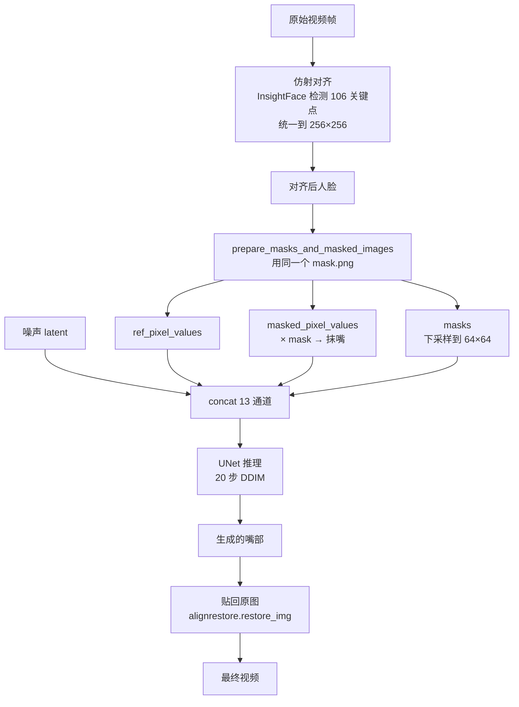

### 1.5 Mask 策略的优化空间（侧脸 & 快速变动）

> 这一节专门讨论用户提出的两个核心痛点：**侧脸 / 大角度** + **脸快速变动**。

#### 当前 mask 策略的问题诊断

**1. 固定 mask 在数学上就是个"对称刚性区域"**

`mask.png` 是一张对称的、人脸形状的二值图，问题：

| 场景 | 问题 |
|---|---|
| **正脸** | 完美对齐 mask 边界 = 人脸边界 |
| **侧脸 30°** | mask 一侧盖到背景；另一侧没盖到脸颊 |
| **仰头/低头** | mask 下半部盖到脖子；上半部漏掉额头 |
| **快速转头** | landmark 检测抖，mask 跟不上 |

**2. 侧脸的具体痛点**

`lipsync_pipeline.py:3197`：

```python
dynamic_region_mask = generate_dynamic_mouth_mask(
    mouth_info,
    fixed_keep_mask=fixed_keep_mask  # ← 动态 mask 被固定 mask 边界限制
)
```

`fixed_keep_mask` 是固定 mask 的"保留区"，**动态 mask 不能超过它**。所以侧脸时如果嘴部 landmark 跑到了固定 mask 外面，会被硬截回去。

**3. 快速变动的痛点**

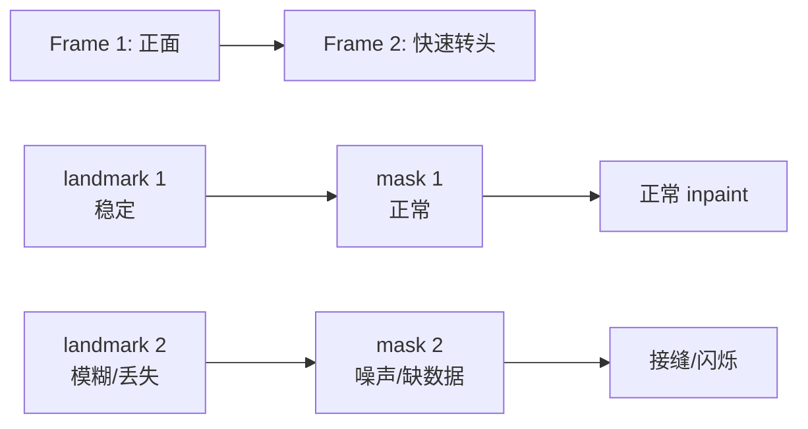

**4. 论文 Fig.2 揭示的三难 trade-off**

- mask 越大 → sync 越好（被迫听音频）
- mask 越大 → 视觉质量越差（重建压力大）
- mask 越小 → sync 越差（能偷懒）

整脸 mask 是 sync 的极端选择，但牺牲了**身份信息**、**时序一致性**、**侧脸鲁棒性**、**计算效率**（9 个无关通道）。

#### 6 个潜在优化方向

| 方向 | 改动 | sync | 视觉 | 侧脸 | 时序 | 难度 |
|---|---|---|---|---|---|---|
| **A. Pose-aware 自适应 mask** | mask 随 yaw/pitch warp | ↑ | ↑ | ✅ | 中 | 中 |
| **B. Landmark-based 全脸 mask** | 用 106 landmark 实时画 mask | ↑ | ↑ | ✅ | ⚠️ | 低 |
| **C. Learned mask** | UNet 加 mask 预测头 | ↑↑ | ↑ | ✅ | ✅ | 高 |
| **D. 分区域 mask** | 只 inpaint 嘴部 + 鼻子下方 | ↓（破坏反 shortcut） | ↑↑ | ✅ | ✅ | 低 |
| **E. 多 mask 集成** | 推理时取并集 | ↑ | ↓ | ✅ | ⚠️ | 低 |
| **F. 时序平滑** | mask 帧间 EMA | — | ↑ | — | ✅✅ | 低 |

**各方向核心代码示意**：

```python
# A. Pose-aware
def get_adaptive_mask(yaw, pitch, base_mask):
    if abs(yaw) > 15:
        mask = warp_mask(base_mask, yaw_rotation=-yaw)
        mask = dilate_along_axis(mask, axis=sign(yaw), ratio=1.2)
    return mask

# B. Landmark-based
def landmark_mask(landmarks_106, image_shape):
    face_outline = landmarks_106[0:17]
    eyebrows = landmarks_106[17:27]
    return fill_polygon(face_outline + eyebrows)

# C. Learned (需重训)
mask_logits = unet(input_4ch, t).mask_pred
predicted_mask = torch.sigmoid(mask_logits)

# F. 时序平滑
mask_ema = ema(mask_ema, dynamic_mask_t, alpha=0.3)
```

#### ⚠️ AGENTS.md 的硬约束

```markdown
> Mask & feather baseline is locked
> Baseline: ef3903f with latentsync/utils/mask.png.
> Do not toggle masks, mask width, or feather without an explicit ask.
> Previous revert cycles were explicitly rejected.
```

**意思**：
- mask 已经被反复 revert 过几次
- 维护者明确说"别动"
- 任何 mask 改动都要**用户明确要求**

**原因推测**：
- mask 改小 → sync 变差（用户最在意的指标）
- mask 改大 → 视觉质量变差（用户也关心）
- mask 改形状 → 训练数据分布变了，全链路要重训
- 加羽化 → 边界软了但 mask 覆盖率变了，相当于改 mask

#### 不破 baseline 的实际可优化点

**1. 侧脸：优化检测而不是 mask**

`AGENTS.md` 已经说：
> *"Threshold tuning alone (`yaw_skip_threshold`) is a band-aid. Real fixes require improving the underlying signals."*

即：**检测侧做得更准**（让侧脸能进得来），而不是改 mask 范围。

具体能做：
- 改进 `_estimate_yaw_degrees` 的多信号融合
- 降低 landmark 噪声（EMA 平滑已经在做，alpha=0.7）
- 用 `generate_dynamic_mouth_mask(..., fixed_keep_mask=fixed_keep_mask)` 的 clamp（已经在做）

**2. 快速变动：优化 landmark 跟踪**

- 用 InsightFace tracker 而不是每帧检测
- landmark 帧间 EMA（已做）
- motion_blur skip（已做）

**3. 边界接缝：优化合成而非 mask**

- `paste_surrounding_pixels_back`（已做）
- 颜色匹配 `_match_color_to_reference`（已做）

#### 研究项目路线（如果要真做）

如果要**研究**新 mask 策略（不是生产改）：

1. **第一阶段**：mask ablation 实验
   - Baseline: mask.png
   - 实验 1: pose-aware warp
   - 实验 2: landmark-based mask
   - 实验 3: learned mask
   - 测 sync_conf + FID，找最佳 trade-off

2. **第二阶段**：在最佳 mask 上重训 Stage 1 + Stage 2

3. **第三阶段**：跑侧脸 / 快速变动 case，看是否真的解决 badcase

**但这是研究项目，不是生产改动。先和用户对齐要不要做。**

#### 极端嘴型的额外硬伤（大嘴 / 大笑 / 唱歌 / 打哈欠）

> 用户追问：嘴特别大时不能完全遮住，是不是也不行？

**答：是的，这是当前 mask 策略的另一个硬伤。**

##### 代码层面的双重 clamp

`lipsync_pipeline.py:1663-1752` 的 `generate_dynamic_mouth_mask` 有两层限制：

```python
# 第一层：动态 mask 自身的 max 上限
max_rx_norm: float = 0.40,   # 嘴宽最大 40% 图宽
max_ry_norm: float = 0.30,   # 嘴高最大 30% 图高

rx = max(min_rx_norm, min(max_rx_norm, rx))   # 硬卡
ry = max(min_ry_norm, min(max_ry_norm, ry))   # 硬卡

# 第二层：固定 mask 的 keep 区域强制保留（line 1750）
keep_mask = torch.maximum(keep_mask, m)  # 动态不能扩展 inpaint 到 fixed keep 区
```

也就是说：256×256 图上，**动态 mask 最大只能覆盖 ~102×77 像素的椭圆区域**；超出这个范围的嘴部，**mask 覆盖不到**。

##### 大嘴 / 大笑时实际发生什么


**具体表现**：
- **嘴中央**：UNet 生成（但训练数据里几乎没见过大笑样本 → 画成"正常说话"嘴型）
- **嘴角/外翻嘴唇**：原图保留（在 mask 外）
- **牙齿**：原位没动（没跟音频对齐）
- **整体效果**：**嘴角在笑但嘴中央是中性 → 诡异的"嘴型分裂"**

##### 更深层的问题：训练数据分布缺陷

```python
# UNetDataset 训练时
gt_pixel_values = gt_frames               # 包含大笑嘴
masked_pixel_values = gt_pixel_values * mask_image  # 用固定 mask 抹掉
```

**训练时**：
- gt 里有大笑/唱歌嘴
- 但 mask 永远只覆盖固定区域 → UNet 看不到这些极端 ground truth
- UNet 学到的是"在这个固定区域内画嘴型" → 永远只生成"正常说话"的嘴

**推理时**：
- 实际嘴是大笑
- mask 也不覆盖大笑的边缘
- UNet 在 mask 内画"正常说话"的嘴 → 和原图嘴角打架

> **核心矛盾**：UNet 是"盲人画师"——只看到 mask 内的"涂黑的脸"，不知道外面嘴角是咧着的，自然画不出匹配的整体表情。

##### 修复路径对比

| 限制 | 原因 |
|---|---|
| **mask 改大** | AGENTS.md 锁定 baseline；改大后训练分布全变 |
| **max_rx/max_ry 改大** | UNet 没在更大 inpaint 区训过 → 推理画不好 |
| **landmark-based 大 mask** | 推理能扩展但 UNet 还是画不出大笑 |
| **重训 UNet 用更大 mask** | 等于全链路重训（Stage 1+2） |
| **加极端嘴型数据集** | 训练分布需要补足 |
| **mask 大小随机化** | 研究级改动 |
| **条件化 mask** | 让 UNet 知道"这次画多大" |

**根本解决方案**（研究级）：

1. **数据集增强**：训练集里加大量"大笑/唱歌/打哈欠"极端嘴型视频
2. **mask 大小随机化**：训练时 mask 在 [30%, 60%] 区间随机，让 UNet 适应不同 inpaint 范围
3. **条件化 mask**：把 mask 本身作为输入，让 UNet 知道"这次要画多大"
4. **表情感知**：先识别"这是大笑/正常说话"，再决定 mask 大小

但这些都是**研究方向**，不破 baseline 做不到。

##### 当前最佳 fallback

在 prefilters 中（`yaw_skip`、`motion_blur_skip`、`mouth_occlusion` 等）检测大嘴型：
- 触发 skip → **fallback 到原视频帧**
- 坏处：sync 失败
- 好处：避免"嘴型分裂" badcase

这是当前默认行为。生产环境**宁可不生成也不要分裂**。

#### 输入输出

| | 形状 | 含义 |
|---|---|---|
| **输入（图像侧）** | `(B, 13, 16, 64, 64)`（256 分辨率） | 4 通道 noise + 1 通道 mask + 4 通道 masked 帧 + 4 通道 ref 帧 |
| **输入（音频侧）** | `(B, 16, 50, 384)` | 16 帧各 50 个 whisper-tiny token 的 384 维特征 |
| **输入（时间步）** | `(B,)` 整数 | 0-999 的扩散步数 |
| **输出** | `(B, 4, 16, 64, 64)` | 预测的噪声 ε |

#### 它解决什么问题？
- 训练时：学会"看到 masked 脸 + 听到声音 → 还原嘴型"。
- 推理时：把遮住的嘴部补出来。

#### 能不能独立训练？
**Stage 1 可以独立训练**（只用视频 + 音频，不依赖 SyncNet）。
**Stage 2 必须依赖 SyncNet**（需要 SyncNet 算 sync_loss）。

#### 训练集格式
和 SyncNet 一样，一行一个 mp4。但 Stage 2 必须先有 Stage 1 的 checkpoint（fine-tune 模式）。

### 1.4 对比总结

| | SyncNet | UNet (LatentSync) |
|---|---|---|
| **类比** | 嘴型审核员 | 配音演员 |
| **任务** | 二分类：嘴和音对不对 | 图像生成：补全被遮的脸 |
| **输入** | 16 帧脸 + 16 帧音频 mel | 13 通道 noise+mask+masked+ref + 16 帧音频特征 |
| **输出** | 2048 维两个 embedding | 4 通道噪声预测 |
| **判别 vs 生成** | 判别式 | 生成式 |
| **能否独立训练** | ✅ 完全独立 | Stage 1 独立；Stage 2 需 SyncNet |
| **训练数据格式** | 一行一个 mp4 路径 | 一行一个 mp4 路径 |
| **产物** | `stable_syncnet.pt` | `latentsync_unet.pt` |

---

## 2. 全局训练链路（论文视角 + 代码映射）

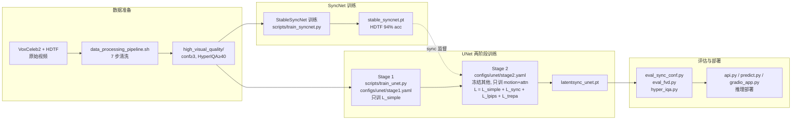

---

## 3. 数据预处理（`preprocess/`）

> **目标**：把"乱七八糟的原始视频"压成"干净的、256×256 人脸对齐、同步、高质量"的训练样本。
> **入口**：`./data_processing_pipeline.sh`

### 3.1 七步流水线

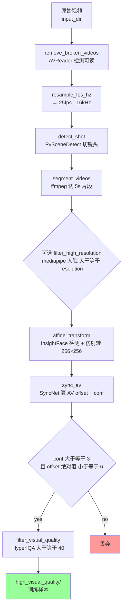

### 3.2 每步干什么

| 步骤 | 干什么 | 为什么要 |
|---|---|---|
| **1. 去损坏** | 用 AVReader 读，读不出就删 | 数据集里有损坏文件会卡死训练 |
| **2. 重采样** | 全部统一到 25 fps + 16 kHz | 网络设计死了 25 fps，音频窗口对齐才能算 |
| **3. 切镜头** | 用 PySceneDetect 找切点 | 一个长视频里可能换了人，要切 |
| **4. 5s 切片** | 每段切成 5 秒 | 训练时一次取 16 帧（0.64s），太长的视频浪费 |
| **5. 高分辨率筛选**（可选） | mediapipe 检测人脸，要求 ≥ 256 | 人脸太小训练出来没用 |
| **6. 仿射对齐** | InsightFace 检测 106 个关键点 → 把人脸"摆正"到 256×256 | 侧脸、歪脸统一变正脸，简化学习 |
| **7. 音视频对齐** | SyncNet 算 offset，把音频移动到嘴型同步的位置，丢弃 conf<3 | 没同步的样本会把 SyncNet 教傻 |
| **8. 视觉质量** | HyperIQA 评分，≥ 40 才留 | 太糊、太暗、太花的样本没用 |

### 3.3 关键：为什么"先仿射再调 AV offset"？

论文 §4 Fig.10 的实验结果：
- **不做 offset 调整**：SyncNet loss 卡在 0.69（= ln 2），永远学不会。
- **先 affine 再调 offset**：唯一能正常收敛的顺序。

原因：仿射变换去掉了大量侧脸 / 怪角度样本，让官方 SyncNet 估 AV offset 更准。

### 3.4 数据集目录结构

```
VoxCeleb2/
├── raw/                          # 原始 mp4
├── resampled/                    # 25fps 16kHz
├── shot/                         # 切镜头后
├── segmented/                    # 5s 一段
├── affine_transformed/           # 256×256 人脸对齐
├── av_synced_3/                  # AV 对齐后
└── high_visual_quality/          # ← 最终训练用
    └── abc/001.mp4
    └── abc/002.mp4
    └── ...
```

每一步生成一个新目录，万一某步挂掉可以从那一步重跑，不用从头来。

### 3.5 训练集格式

最终训练输入就是一个文本文件，每行一个 mp4 绝对路径：

```
/data/VoxCeleb2/high_visual_quality/abc/001.mp4
/data/VoxCeleb2/high_visual_quality/abc/002.mp4
/data/HDTF/high_visual_quality/xyz/001.mp4
...
```

训练时 `UNetDataset` / `SyncNetDataset` 会自动：
- 用 decord 解码视频帧
- 用 ffmpeg 抽音频
- 用 melspectrogram 转 mel
- cache 到 `audio_mel_cache_dir`（避免每次都重算）

---

## 4. SyncNet 训练详解

### 4.1 一句话目标
让 SyncNet 学会"看一眼嘴，听一声音，判断它们对不对得上"。

### 4.2 训练循环

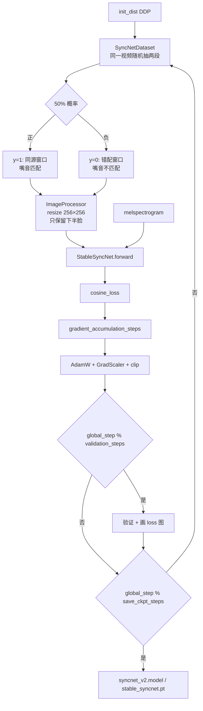

### 4.3 正负样本怎么造

```python
# 伪代码
start_idx   = 随机选一段 16 帧
wrong_idx   = 再随机选一段 16 帧（≠ start_idx）
audio       = 视频原始音频的 mel

if random.random() < 0.5:
    sample = (start_idx 帧, audio, y=1)    # 正样本：嘴音同源
else:
    sample = (wrong_idx 帧, audio, y=0)    # 负样本：嘴音错配
```

这就是自监督——**不需要任何标签**，视频本身的对齐音频就是正样本，错位的就是负样本。

### 4.4 损失函数

```python
# latentsync/utils/util.py:314 cosine_loss
# y=1: 1 - cos(v, a)        # 同源 → 鼓励对齐
# y=0: max(0, cos(v, a))    # 错配 → hinge 鼓励远离
```

### 4.5 论文五因素消融（必须记牢）

| 因素 | 论文结论 | 你的配置 |
|---|---|---|
| **Batch size** | 1024 最优，128 卡 0.69 | `data.batch_size=256`，可加大 |
| **架构** | SD U-Net encoder > Wav2Lip 原架构 | `syncnet_16_pixel_attn.yaml` |
| **Embedding dim** | 2048 最优 | `block_out_channels` 末层 2048 |
| **帧数** | 16 最优，25 卡住 | `data.num_frames=16` |
| **数据预处理** | 先 affine 再调 AV offset | pipeline 顺序固定 |

### 4.6 loss 卡 0.69 = 完蛋了吗？

论文给了数学证明：`0.693 = ln 2`，是 SyncNet 完全没学到任何东西时 loss 的下界。

**诊断方法**：训练几个 step 看 loss，如果不往下走，就卡这 5 个因素里。

---

## 5. UNet 训练详解

### 5.1 模型架构

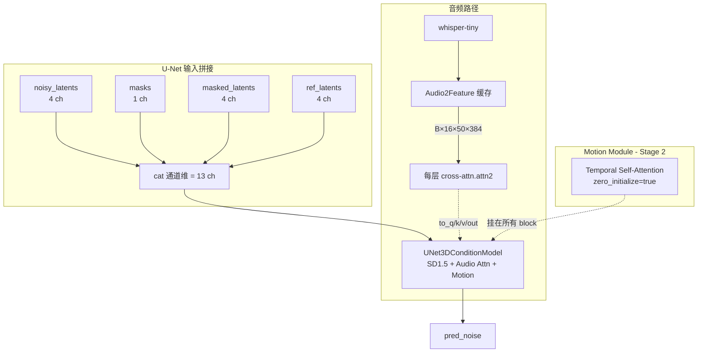

### 5.2 音频特征怎么喂

公式（论文 §3.1）：
```
A^(f) = {a^(f-m), ..., a^(f), ..., a^(f+m)}
```

**代码**：`configs/unet/stage1.yaml` → `audio_feat_length: [2, 2]`，即 `m=2`，每帧用"前 2 帧 + 自己 + 后 2 帧"共 5 帧音频特征。

> 为什么要前后各看几帧？因为嘴型有滞后性，看周围的音频能让模型更好对齐。

### 5.3 两阶段训练（论文核心）

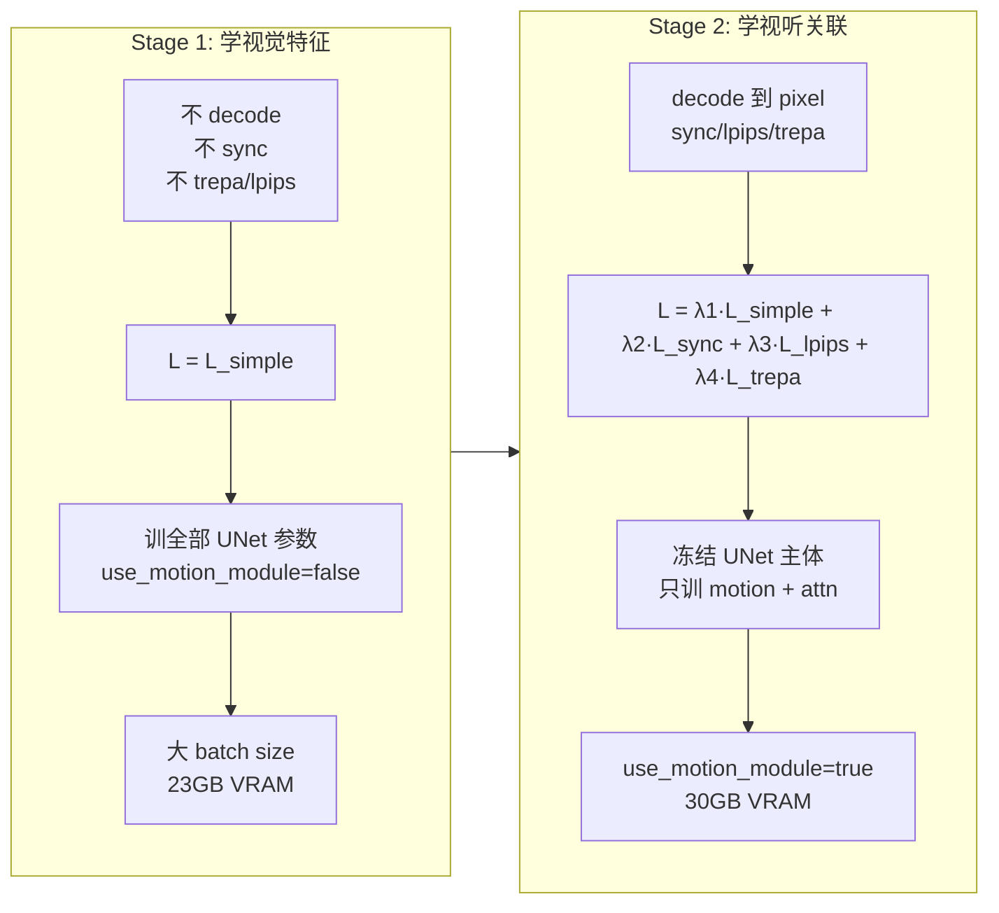

> **动机**：decoded pixel space supervision 需要保留 VAE decoder 的 activations 给反传，显存爆炸。Stage 1 先不 decode，省显存；Stage 2 再加 sync/lpips/trepa。

### 5.4 训练目标

**Stage 1**：
```
L_simple = E[||ε - ε_θ(z_t, t, τ_θ(A))||²]
```

**Stage 2**：
```
L_total = λ1·L_simple + λ2·L_sync + λ3·L_lpips + λ4·L_trepa
```

| 损失 | 作用 | 权重 |
|---|---|---|
| `L_simple` | 噪声预测主目标 | 1 |
| `L_sync` | 嘴音同步（用 SyncNet 监督） | 0.05 |
| `L_lpips` | 感知相似（只看下半脸） | 0.1 |
| `L_trepa` | 时序一致性（VideoMAE-v2 特征） | 10 |

### 5.5 数据采样（`UNetDataset`）

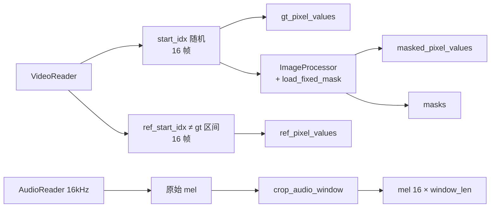

> 训练时 `affine_transform=False`（预处理已经做过），但 ImageProcessor 仍会再调一次（mask 应用 + resize）。

### 5.6 Stage 2 训练对象

**冻结**：UNet 主体（SD1.5 原有参数）
**训练**：
- `motion_modules.`（时序层）
- `attentions.`（cross-attn 之外的 self-attn）

**stage2_efficient.yaml** 进一步缩范围：
- `decoder_only: true`（Motion Module 只挂 decoder）
- 只训 `attn2.`（cross-attn）
- `trepa_loss_weight: 0`（省显存）

### 5.7 Mixed Noise 干嘛的

```python
# noise = noise_shared + noise_ind
# noise_shared = randn()[:, :, 0:1].repeat(全帧)  # 所有帧共用
# noise_ind    = randn()                            # 每帧独立
```

- **noise_shared**：所有帧共用同一噪声 → 强制 UNet 学时序一致性（相邻帧差异由去噪过程产生）。
- **noise_ind**：每帧独立噪声 → 提供帧间变化。

### 5.8 TREPA：时序对齐损失（论文核心创新）

> **一句话**：TREPA 让 UNet 学会"生成的 16 帧视频在'时间维度上的特征'要和真实的 16 帧尽量一致"。

#### 5.8.1 它解决什么问题？

假设你已经把 UNet 训得不错，单帧看着挺好。但播放出来发现：

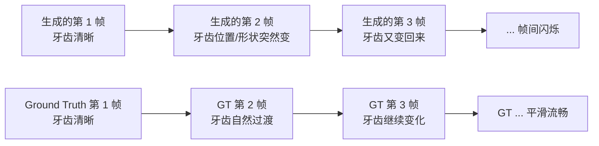

**具体表现**：
- **牙齿闪烁**：每帧牙齿的形状/位置/亮度有微抖动
- **嘴唇闪烁**：上下唇边缘在抖
- **胡须闪烁**：男士胡须区域每帧不一样
- **整体感觉**：诡异、不真实、像 PPT 翻页

#### 5.8.2 为什么 LPIPS 解决不了这个问题？

LPIPS 是个**单帧损失**——它只看"这一帧和 GT 这一帧像不像"，**完全不看帧间关系**。

```python
# LPIPS 的"视角"
for frame_i in generated_frames:
    lpips_loss += LPIPS_vgg(frame_i, gt_frame_i)  # 逐帧独立算
```

所以理论上：
- 第 1 帧 UNet 可以画"张大嘴"
- 第 2 帧 UNet 可以画"闭嘴"（即使音频是要连续说话）
- 每帧单独看都不错 → LPIPS 很低
- 但连起来看 → 闪烁

**论文原话**：
> *"Merely employing distance loss between individual images improves the content quality of single generated images but does not enhance the temporal consistency of the generated image sequence."*

#### 5.8.3 TREPA 的核心思路

既然单帧损失不行，那就让 UNet 学习**"16 帧一起"的特征**。

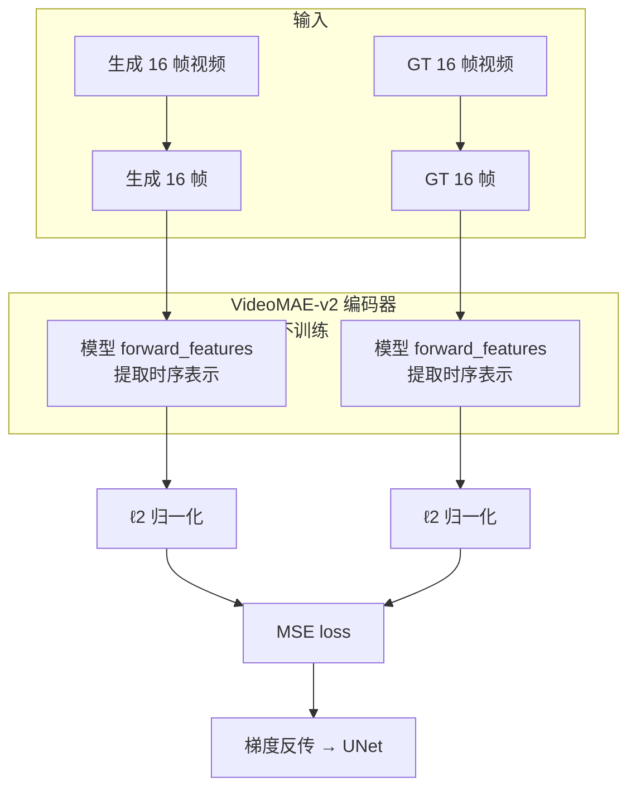

**直觉类比**：

| 单帧损失（LPIPS） | TREPA |
|---|---|
| 让 100 个学生**单独**考试都及格 | 让 100 个学生**合唱**听起来和谐 |
| 每个学生自己写自己的 | 一个指挥协调所有人 |
| 不管学生之间怎么配合 | 强制学生之间的"节奏、音调、配合"对齐 |
| 类比：每帧好看 | 类比：帧间平滑 |

#### 5.8.4 用什么模型提取"时序表示"？

论文选了 **VideoMAE-v2**（`vit_g_hybrid_pt_1200e_ssv2_ft.pth`）。

**为什么选它**：
1. **大规模自监督**：在海量无标注视频上预训练 → 不需要标签
2. **时空建模**：不是只看单帧，而是用 Transformer attention 跨帧融合信息
3. **特征丰富**：embedding 维度足够大，能捕捉细微的时空差异
4. **强泛化**：在 lip-sync 数据上没训过，但能提取通用的"视频时序特征"

**自动下载**：

```python
# latentsync/trepa/loss.py:29
def __init__(self, device="cuda",
             ckpt_path="checkpoints/auxiliary/vit_g_hybrid_pt_1200e_ssv2_ft.pth",
             with_cp=False):
    check_model_and_download(ckpt_path)  # 没就自动从 HF 下
    self.model = load_videomae_model(device, ckpt_path, with_cp).eval().to(dtype=torch.float16)
    self.model.requires_grad_(False)  # 冻结，不训练
```

#### 5.8.5 代码逐行解读

```python
# latentsync/trepa/loss.py:33
class TREPALoss:
    def __call__(self, videos_fake, videos_real):
        # 输入：UNet 生成的 16 帧 vs GT 16 帧
        # shape 都是 (B, 3, 16, 256, 256)

        # 1. 把 (B, 3, 16, H, W) 拆成 (B*16, 3, H, W) —— 把 16 帧当成独立 batch
        videos_fake = rearrange(videos_fake, "b c f h w -> (b f) c h w")
        videos_real = rearrange(videos_real, "b c f h w -> (b f) c h w")

        # 2. resize 到 224×224（VideoMAE-v2 的输入要求）
        videos_fake = F.interpolate(videos_fake, size=(224, 224), mode="bicubic")
        videos_real = F.interpolate(videos_real, size=(224, 224), mode="bicubic")

        # 3. 还原成 (B, 3, 16, 224, 224) —— 让模型看完整 16 帧序列
        videos_fake = rearrange(videos_fake, "(b f) c h w -> b c f h w", f=16)
        videos_real = rearrange(videos_real, "(b f) c h w -> b c f h w", f=16)

        # 4. 像素范围 [-1,1] → [0,1]（VideoMAE 预训练时的范围）
        videos_fake = (videos_fake / 2 + 0.5).clamp(0, 1)
        videos_real = (videos_real / 2 + 0.5).clamp(0, 1)

        # 5. 提取"时序表示"（embeddings before head projection）
        feats_fake = self.model.forward_features(videos_fake)
        feats_real = self.model.forward_features(videos_real)

        # 6. L2 归一化 —— 让特征在单位球面上，MSE 等价于余弦距离
        feats_fake = F.normalize(feats_fake, p=2, dim=1)
        feats_real = F.normalize(feats_real, p=2, dim=1)

        # 7. MSE 损失
        return F.mse_loss(feats_fake, feats_real)
```

#### 5.8.6 为什么用 `forward_features` 而不是 `forward`？

`forward()` = 提取特征 + 分类头（head projection）
`forward_features()` = **只提取特征，不分类**

我们要的就是"通用时序表示"，不需要分类。所以用 `forward_features()`，避免 head projection 把特征压成"用于分类"的特定形状。

#### 5.8.7 为什么 L2 归一化后再算 MSE？

```python
feats_fake = F.normalize(feats_fake, p=2, dim=1)
return F.mse_loss(feats_fake, feats_real)
```

**数学等价**：
- `||a_normalized - b_normalized||² = 2 - 2·cos(a, b)`
- 即 `MSE(L2_norm(a), L2_norm(b))` 与 `余弦距离` 成正比

**实际意义**：
- 不关心特征的"绝对大小"，只关心"方向"（即"语义相似度"）
- 训练更稳定（数值范围固定在 [0, 4]）
- 和 SyncNet 的 cosine_loss 哲学一致

#### 5.8.8 完整训练时的 TREPA 流程

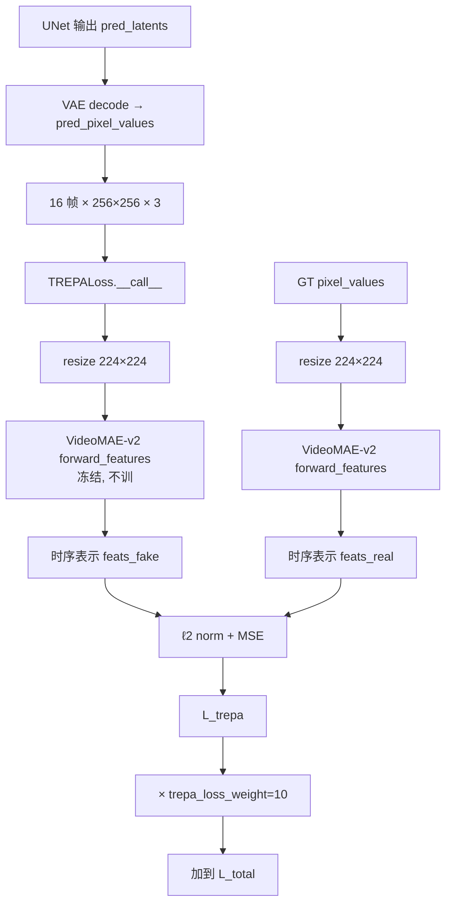

**关键代码**（`scripts/train_unet.py:381-388`）：

```python
if config.run.trepa_loss_weight != 0 and config.run.pixel_space_supervise:
    trepa_pred_pixel_values = rearrange(pred_pixel_values, "(b f) c h w -> b c f h w", f=16)
    trepa_gt_pixel_values   = rearrange(gt_pixel_values,   "(b f) c h w -> b c f h w", f=16)
    trepa_loss = trepa_loss_func(trepa_pred_pixel_values, trepa_gt_pixel_values)
else:
    trepa_loss = 0
```

**只在 Stage 2 生效**（因为 `pixel_space_supervise=True`）。

#### 5.8.9 权重为什么是 10？

看配置：
```yaml
# configs/unet/stage2.yaml
trepa_loss_weight: 10
```

**数学分析**：
- LPIPS loss ≈ 0.1-0.3 数量级
- TREPA loss（L2 normalized features 的 MSE）≈ 0.01-0.05 数量级
- 权重 10 让 TREPA 和 LPIPS 在数值上平衡
- 如果改成 1，TREPA 几乎不起作用
- 如果改成 100，TREPA 会盖过其他损失，破坏视觉质量

**经验值**，调权重时要先看 loss 曲线，不能盲调。

#### 5.8.10 TREPA 的局限性

| 场景 | TREPA 表现 |
|---|---|
| 正常说话 | ✅ 显著改善帧间一致性 |
| 大笑/唱歌/极端嘴型 | ⚠️ 改善有限（mask 本身盖不到这些区域） |
| 侧脸快速转头 | ⚠️ 改善有限（landmark 抖动传到特征） |
| 单帧质量本身很差 | ❌ TREPA 不管单帧，只管帧间 |
| 训练数据本身有闪烁 | ❌ TREPA 学不到不闪烁的表示 |

#### 5.8.11 配置与开关

| config | trepa_loss_weight | 效果 |
|---|---|---|
| `stage1.yaml` | 10 | 但因 `pixel_space_supervise=false` 实际不生效 |
| `stage2.yaml` | 10 | ✅ 标准配置 |
| `stage2_512.yaml` | 10 | ✅ 512 标准 |
| `stage2_efficient.yaml` | **0** | ❌ 关闭（省显存优先） |

**省显存策略**：
- 关闭 TREPA 可以省 ~2GB VRAM（VideoMAE-v2 模型占显存）
- 代价：帧间一致性略降
- 适合：消费级 GPU（如 RTX 3090）跑 Stage 2

#### 5.8.12 一句话总结

> **TREPA = 让 UNet 生成的 16 帧视频在 VideoMAE-v2 提取的"时序特征空间"上和 GT 尽量对齐。**
> **本质：从"让单帧好看"升级到"让 16 帧作为一个整体好看"。**
> **配合 Mixed Noise + Motion Module，是 LatentSync 解决"帧间闪烁"问题的三件套。**

#### 5.8.13 TREPA 输入输出速查

> 这一节单独讲 TREPA 的接口签名，方便快速复用 / 离线评估。

##### 5.8.13.1 输入详解

| 参数 | 形状 | 来源 | 值域 | dtype |
|---|---|---|---|---|
| `videos_fake` | `(B, 3, 16, 256, 256)` | UNet 输出 → VAE decode | `[-1, 1]` | fp16 |
| `videos_real` | `(B, 3, 16, 256, 256)` | 数据集 `gt_pixel_values` | `[-1, 1]` | fp16 |

> B 一般 = 1（UNet 训练时 batch_size），256 = 训练分辨率，16 = `num_frames`。

##### 5.8.13.2 内部 5 步处理

```python
# latentsync/trepa/loss.py:33
def __call__(self, videos_fake, videos_real):
    # 1. 拆 batch 和帧
    videos_fake = rearrange(videos_fake, "b c f h w -> (b f) c h w")
    videos_real = rearrange(videos_real, "b c f h w -> (b f) c h w")

    # 2. resize 到 224×224（VideoMAE-v2 预训练分辨率）
    videos_fake = F.interpolate(videos_fake, size=(224, 224), mode="bicubic")
    videos_real = F.interpolate(videos_real, size=(224, 224), mode="bicubic")

    # 3. 还原 batch 维度
    videos_fake = rearrange(videos_fake, "(b f) c h w -> b c f h w", f=16)
    videos_real = rearrange(videos_real, "(b f) c h w -> b c f h w", f=16)

    # 4. 像素范围 [-1,1] → [0,1]（VideoMAE 预训练范围）
    videos_fake = (videos_fake / 2 + 0.5).clamp(0, 1)
    videos_real = (videos_real / 2 + 0.5).clamp(0, 1)

    # 5. VideoMAE-v2 提特征 → L2 norm → MSE
    feats_fake = self.model.forward_features(videos_fake)  # (B, D)
    feats_real = self.model.forward_features(videos_real)
    feats_fake = F.normalize(feats_fake, p=2, dim=1)
    feats_real = F.normalize(feats_real, p=2, dim=1)
    return F.mse_loss(feats_fake, feats_real)
```

##### 5.8.13.3 输出详解

| 输出 | 形状 | 类型 | 数值范围 | 含义 |
|---|---|---|---|---|
| `trepa_loss` | 标量 | `float` | 0 ~ 0.1+ | 时序特征距离，越小越一致 |

**后续处理**（`scripts/train_unet.py:419`）：

```python
loss = (
    recon_loss * config.run.recon_loss_weight        # 通常 1
    + sync_loss * config.run.sync_loss_weight        # 通常 0.05
    + lpips_loss * config.run.perceptual_loss_weight # 通常 0.1
    + trepa_loss * config.run.trepa_loss_weight      # 通常 10
)
```

**典型 loss 值范围**：
- < 0.001：极好（16 帧时序特征几乎一致）
- 0.001-0.01：好
- 0.01-0.05：一般
- 0.05+：差（明显时序不一致）

##### 5.8.13.4 训练时的调用方式

```python
# scripts/train_unet.py:381-388
if config.run.trepa_loss_weight != 0 and config.run.pixel_space_supervise:
    # UNet 输出是 (B*16, 3, 256, 256)，reshape 回 (B, 3, 16, 256, 256)
    trepa_pred_pixel_values = rearrange(pred_pixel_values, "(b f) c h w -> b c f h w", f=16)
    trepa_gt_pixel_values   = rearrange(gt_pixel_values,   "(b f) c h w -> b c f h w", f=16)
    trepa_loss = trepa_loss_func(trepa_pred_pixel_values, trepa_gt_pixel_values)
```

##### 5.8.13.5 离线评估用法（§13 提到的 TREPA score）

```python
from latentsync.trepa.loss import TREPALoss

trepa = TREPALoss(device="cuda", with_cp=True)

def trepa_score(real_video, gen_video):
    """
    输入 shape: (B, 3, 16, 256, 256) 范围的张量
    像素值范围: [0, 1]
    """
    return trepa(gen_video, real_video).item()

# 判读
# < 0.001: 极好
# 0.001-0.01: 好
# 0.01-0.05: 一般
# > 0.05: 差
```

> ⚠️ **注意**：训练时 `pred_pixel_values` / `gt_pixel_values` 是 `[-1, 1]` 范围；离线评估时如果直接用 `latentsync.trepa.loss.TREPALoss`，会做 `(/2 + 0.5).clamp(0, 1)` 自动转。如果你自己写评估代码，确保输入在 `[0, 1]` 范围或自己转换。

#### 5.8.14 TREPA 推理阶段用不用？——**完全不用**

> **直答**：TREPA **只在训练阶段**用，**推理阶段完全不用**。

##### 5.8.14.1 代码验证

```bash
# 训练用 TREPA
$ grep -rn "TREPALoss\|trepa_loss" scripts/ | head
scripts/train_unet.py:50:from latentsync.trepa.loss import TREPALoss
scripts/train_unet.py:212:        trepa_loss_func = TREPALoss(device=device, with_cp=True)
scripts/train_unet.py:382:                trepa_loss = trepa_loss_func(...)
scripts/train_unet.py:419:                + trepa_loss * config.run.trepa_loss_weight
```

```bash
# 推理 / pipeline 完全不引用 TREPA
$ grep -rn "TREPALoss\|trepa_loss" latentsync/pipelines/ api.py gradio_app.py scripts/inference.py
# 无结果
```

##### 5.8.14.2 为什么推理不需要？

| 原因 | 解释 |
|---|---|
| **训练时是 teacher** | TREPA 教 UNet "时序特征要对齐 GT" |
| **训完能力已烧进 UNet 权重** | UNet 通过反传学会了"如何让 16 帧时序一致" |
| **推理不需要 teacher** | 推理时只要 UNet 前向，不需要再"教"它 |
| **省 VideoMAE-v2 加载** | ~2GB VRAM + 数秒启动时间 |

**直觉类比**：
> TREPA 像驾校教练。**学车时需要**（教你时序一致性），**上路后不需要**（你已会开）。

##### 5.8.14.3 推理时用什么代替 TREPA 监督时序一致性？

| 机制 | 在哪 | 替代 TREPA 的哪部分 |
|---|---|---|
| **Motion Module** | UNet 内部 | 跨帧时序建模（structural） |
| **Mixed Noise** | 训练时加到 noise | 强制 UNet 学时序平滑（perceptual） |
| **EMA smoothing** | 推理后处理 | 帧间像素级平滑 |
| **mouth_temporal_stabilization** | 推理后处理 | 嘴部帧间稳定 |

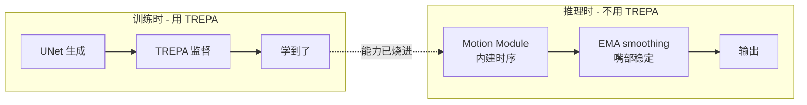

##### 5.8.14.4 推理阶段用的 4 个时序相关后处理

虽然 TREPA 不用，推理时**确实**有时序后处理，详见 §16 推理独有组件：

| 后处理 | 作用 | 默认参数 |
|---|---|---|
| `_smooth_face_sequence` | 帧间 EMA（3-tap 三角核） | 默认开 |
| `mouth_temporal_stabilization` | 嘴部 1-order EMA | strength=0.15 |
| `mouth_motion_preserve` | 音频 RMS 自适应 | strength=0.45 |
| `dynamic_region_mask` | 嘴部椭圆 mask | pad_width=1.5 |

但这些是**像素级**处理，不是**特征级**监督。TREPA 走的是特征空间；后处理走的是像素空间。

##### 5.8.14.5 想离线测"时序一致性"怎么办？

虽然推理不跑 TREPA，**离线评估**可以单独加载 TREPA 算指标（参考 §13.3.3）：

```python
# eval/evaluate_checkpoint.py 风格的离线测
from latentsync.trepa.loss import TREPALoss
from decord import VideoReader
import numpy as np

trepa = TREPALoss(device="cuda", with_cp=True)
vr = VideoReader("generated.mp4")
frames = np.stack([f.asnumpy() for f in vr[:16]])
# 注意：(3, 16, 256, 256) 范围 [0, 1]
videos = torch.from_numpy(frames).permute(3, 0, 1, 2).unsqueeze(0).float() / 255.0
videos = videos * 2 - 1  # 转到 [-1, 1]
score = trepa(videos, videos_groundtruth).item()
```

但这只在离线评估时跑，**不进入推理流程**。

#### 5.8.15 有了 SyncNet，为何还需要这些时序机制？

> **直答**：**SyncNet 只管一件事（嘴音是否同步），其他时序机制管其他维度**。它们是**互补**的，不是冗余。

##### 5.8.15.1 视频时序质量包含哪些维度

| 维度 | 含义 | 例子 |
|---|---|---|
| 嘴音对齐 | 嘴的动作是否跟得上音频 | 嘴在说"你好"时嘴型对 |
| 整视频时序 | 16 帧作为整体是否连贯 | 牙齿/胡须不闪烁 |
| 像素级稳定 | 帧间像素是否平滑 | 边像素不抖 |
| 嘴部区域动态 | inpaint 范围是否对 | 大嘴/大笑覆盖完整 |

**SyncNet 只管第一个维度**，剩下三个需要其他机制：

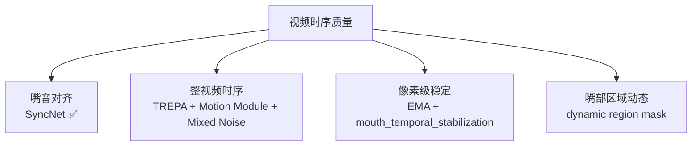

##### 5.8.15.2 7 个时序机制对比

| 机制 | 关注维度 | 训练/推理 | 解决什么 | 看不到什么 |
|---|---|---|---|---|
| **SyncNet** | 嘴音对齐（粗粒度） | 训练 loss | 嘴型对不上音 | 嘴部细节、面部其他区域 |
| **TREPA** | 16 帧整视频时序（特征级） | 训练 loss | 牙齿/胡须帧间闪烁 | 具体的音视关系 |
| **Motion Module** | UNet 内建时序结构 | 架构组件 | UNet 知道"这是连续 16 帧" | 时序好坏（需要 loss 监督） |
| **Mixed Noise** | 训练时分布层面时序 | 训练 noise 策略 | 强制 UNet 学时序平滑 | 推理时如何平滑 |
| **EMA smoothing** | 像素级帧间平滑 | 推理后处理 | 残存抖动 | 同步问题 |
| **mouth_temporal_stabilization** | 嘴部 1-order EMA | 推理后处理 | 嘴部最敏感区域的稳定 | 整脸一致性 |
| **dynamic region mask** | 嘴部动态椭圆 | 推理 mask | 大嘴/极端表情覆盖 | 时序本身 |

##### 5.8.15.3 SyncNet 看不到的东西

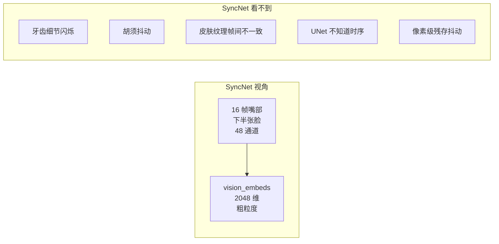

**SyncNet 看不到的具体问题**：
1. **牙齿闪烁**（论文 Fig.11 主推的 TREPA 卖点）— 嘴在动、音也对，但每帧牙齿形状/亮度微抖动
2. **胡须抖动** — 男士胡须每帧不一样
3. **皮肤纹理帧间不一致** — 痣、皱纹位置/亮度变
4. **UNet 不知道时序** — 没有 Motion Module 时，UNet 把 16 帧当 16 张独立图
5. **像素级残存抖动** — 训练时 loss 再小，推理输出仍有微抖

##### 5.8.15.4 4 个层级的时序保障

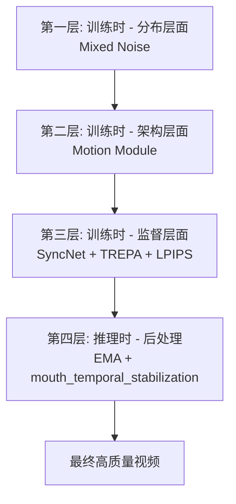

**每一层都是必要的**：
- 去掉 L1：UNet 不知道"这是 16 帧而不是 16 张图"
- 去掉 L2：UNet 不知道"前后帧要连贯"
- 去掉 L3：UNet 不知道"目标是什么"
- 去掉 L4：推理时残存抖动没修

##### 5.8.15.5 类比：学开车

| 机制 | 类比 | 关注什么 |
|---|---|---|
| SyncNet | 教练："看前面！" | 音视同步 |
| TREPA | 教练："动作要连贯！" | 整视频连贯 |
| Motion Module | 车本身的转向系统 | 结构性时序能力 |
| Mixed Noise | 路面坑少 | 训练分布的时序 |
| EMA smoothing | 车身稳定系统 | 像素级平滑 |

> **问：有了教练（SyncNet），为何还要车身稳定系统（EMA）？**
> **答：教练管"对不对"，车身稳定系统管"平不平"，两件事。**

##### 5.8.15.6 反过来：每个机制单独存在都不够

| 组合 | 缺什么 | 实际表现 |
|---|---|---|
| SyncNet | ❌ Motion Module | UNet 把 16 帧当 16 张独立图 |
| SyncNet | ❌ TREPA | 单帧好看，帧间牙齿/胡须闪烁 |
| SyncNet | ❌ EMA smoothing | 推理时残存抖动 |
| SyncNet | ❌ dynamic mask | 大嘴/极端表情覆盖不全 |

**论文 Eq.5 印证**：

```
L_total = λ1·L_simple + λ2·L_sync + λ3·L_lpips + λ4·L_trepa
```

4 项 loss 各管一摊，**互不替代**。Stage 2 训练时 4 项**全部开启**才是完整方案。

##### 5.8.15.7 时序相关代码引用

| 机制 | 文件 | 行号 |
|---|---|---|
| SyncNet | `scripts/train_unet.py` | 392-411 |
| TREPA | `scripts/train_unet.py` | 381-388 |
| Motion Module | `latentsync/models/motion_module.py` | 全文件 |
| Mixed Noise | `scripts/train_unet.py` | 319-332 |
| EMA smoothing | `lipsync_pipeline.py` | `_smooth_face_sequence` |
| mouth_temporal_stabilization | `lipsync_pipeline.py` | 推理后处理 |
| dynamic region mask | `lipsync_pipeline.py` | 1663-1752 |

##### 5.8.15.8 一句话总结

> **SyncNet 只管"嘴对不对得上音"（粗粒度），其他机制分别管"16 帧整视频连贯不"、"UNet 内部有没有时序结构"、"训练分布有没有时序"、"推理输出有没有残存抖动"、"嘴部覆盖范围对不对"**。
> **不是冗余，是 5 个不同维度的时序保障。任何一个去掉都会出现对应类型的 badcase。**
> **论文 Eq.5 的 4 项 loss 各管一摊，互不替代——这就是为什么 Stage 2 要把 4 项全开。**

### 5.9 LPIPS & Pixel-Space Supervision：把嘴部"画清楚"

> **一句话**：LPIPS 让 UNet 生成的嘴部**看起来像嘴**（像素级感知相似），pixel-space supervision 是 LPIPS / TREPA / Sync 三大损失能算的前提（因为它们都在像素空间算）。

#### 5.9.1 一句话回顾：UNet 在哪个空间工作？

SD 类扩散模型有**两个空间**：

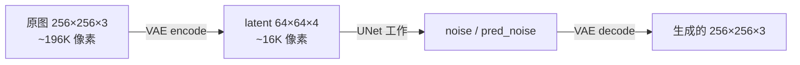

| 空间 | 维度（256 分辨率） | 谁在里面工作 | 损失 |
|---|---|---|---|
| **Pixel 空间**（原图） | `(B, 3, 16, 256, 256)` | VAE 编/解码 | LPIPS、TREPA、SyncNet |
| **Latent 空间** | `(B, 4, 16, 64, 64)` | UNet 内部 | Recon (MSE) |

#### 5.9.2 什么是 "pixel-space supervision"？

**问题**：Stage 1 时只算 `recon_loss = MSE(pred_noise, noise)`，所有计算都在 latent 空间。**完全不看生成出来的像素长啥样**。

```python
# Stage 1 训练循环（极简）
pred_noise = unet(...)           # latent 空间
recon_loss = MSE(pred_noise, noise)  # latent 空间 MSE
loss.backward()
```

**问题**：UNet 噪声预测准 ≠ 生成图像好看。噪声预测只是中间任务。

**解决**：Stage 2 引入 `pixel_space_supervise: true`，把生成的 latent **解码到像素空间**，再加感知损失：

```python
# Stage 2 训练循环（极简）
pred_noise = unet(...)             # latent 空间
recon_loss = MSE(pred_noise, noise) # 主损失（仍在 latent 空间）

# 解码到 pixel 空间才能算下面的损失
pred_pixel = vae.decode(pred_latents)  # ← 这步是关键

lpips_loss = LPIPS(pred_pixel, gt_pixel)  # 像素空间感知损失
sync_loss = SyncNet(pred_pixel, audio)    # 像素空间同步损失
trepa_loss = TREPA(pred_pixel, gt_pixel)  # 像素空间时序损失
```

**代价**：VAE decoder 必须保留 activations 给反传，**显存爆炸**（这就是为什么分两阶段训练——Stage 1 省显存，Stage 2 算全）。

#### 5.9.3 什么是 LPIPS？

**LPIPS = Learned Perceptual Image Patch Similarity**

不是简单的"像素差"，而是**用 VGG 网络看"像不像"**。

直觉：

```mermaid
flowchart TB
    subgraph A[普通 MSE 视角]
        A1[生成的嘴] --> A2[和 GT 嘴逐像素比较]
        A3[GT 嘴] --> A2
        A2 --> A4[数值差距]
    end

    subgraph B[LPIPS 视角]
        B1[生成的嘴] --> B3[VGG 提取特征]
        B3 --> B4[高层特征]
        B5[GT 嘴] --> B6[VGG 提取特征]
        B6 --> B4
        B4 --> B7[比较特征差距<br/>'像不像嘴']
    end
```

**为什么不用普通 MSE？**

| 指标 | 普通 MSE (像素) | LPIPS (VGG 特征) |
|---|---|---|
| **关注点** | 每个像素的颜色值 | 图像的"语义/结构" |
| **人眼对齐** | ❌ 不对齐（像素差 5% 人眼可能无感） | ✅ 对齐（特征差 5% 人眼能感知） |
| **小位移敏感度** | ❌ 极敏感（嘴偏 1 像素 MSE 就大涨） | ⚠️ 中等（VGG 池化后小位移不敏感） |
| **风格敏感度** | ❌ 极敏感（颜色偏一点就大涨） | ✅ 较鲁棒 |
| **训练表现** | 学到"颜色对齐" | 学到"语义对齐" |

**通俗比喻**：
- **MSE** 像"严苛的复印机"——颜色稍微偏差就扣分，逼模型死磕颜色对齐
- **LPIPS** 像"宽松的艺术总监"——只关心"看起来像不像嘴"，颜色细节交给后续优化

#### 5.9.4 LPIPS 在 LatentSync 里怎么用？

**只看下半脸**（`train_unet.py:373`）：

```python
# 只取下半张脸算 LPIPS（嘴部区域）
pred_pixel_values_perceptual = pred_pixel_values[:, :, pred_pixel_values.shape[2] // 2 :, :]
gt_pixel_values_perceptual = gt_pixel_values[:, :, gt_pixel_values.shape[2] // 2 :, :]
lpips_loss = lpips_loss_func(pred_pixel_values_perceptual, gt_pixel_values_perceptual).mean()
```

```mermaid
flowchart LR
    FULL[整张脸 256×256] --> HALF[下半张脸<br/>256×128]
    HALF --> VGG[VGG 提取特征]
    VGG --> LOSS[LPIPS loss]
```

**为什么只看下半脸**：
- 我们只关心嘴部生成质量
- 上半脸（眼睛、额头）UNet 不改 → 不算 loss 免得分心
- 节省计算量

**backbone**：VGG（论文 Eq. 4 中的 `V_l`，`scripts/train_unet.py:209`）：

```python
lpips_loss_func = lpips.LPIPS(net="vgg").to(device)  # 冻结，不训
```

#### 5.9.5 LPIPS 解决了 Stage 1 没解决的问题

Stage 1 只有 `recon_loss`，UNet 学到：
- ✅ 噪声预测准（latent 空间 MSE 小）
- ❌ 生成的嘴可能很糊（细节、纹理、对比度）
- ❌ 颜色可能偏（skin tone、牙齿白度）
- ❌ 边缘可能糊（mask 边界接缝）

Stage 2 加 LPIPS 后：
- ✅ 嘴部细节清晰（VGG 特征对齐）
- ✅ 颜色自然
- ✅ 边缘锐利
- ❌ 但**帧间闪烁**（这是 LPIPS 解决不了的，TREPA 解决）

#### 5.9.6 LPIPS 的局限性

| 场景 | LPIPS 表现 |
|---|---|
| 正常嘴型生成 | ✅ 显著提升细节质量 |
| 大嘴/大笑/极端嘴型 | ⚠️ mask 本身盖不到，LPIPS 也无能为力 |
| 单帧质量本身差 | ⚠️ LPIPS 看单帧，能学到一点但被 mask 限制 |
| **帧间闪烁** | ❌ **完全管不了**（单帧损失） |
| 训练数据本身质量差 | ❌ 学不到高质量 |

#### 5.9.7 LPIPS 权重 0.1 怎么来的？

```yaml
# configs/unet/stage2.yaml
perceptual_loss_weight: 0.1
```

**数量级平衡**：
- `recon_loss` (latent MSE) ≈ 0.01-0.1
- `lpips_loss` (VGG 特征距离) ≈ 0.3-0.8
- `sync_loss` (cosine distance) ≈ 0.05-0.2
- `trepa_loss` (normalized feature MSE) ≈ 0.001-0.01

**权重作用**：
- LPIPS 原始值大，权重 0.1 让它和 recon_loss 数量级匹配
- 太小 → 嘴部糊（Stage 1 病）
- 太大 → 颜色过饱和、细节过度锐化（"油画感"）

**经验值**，调参时先看 `progress_bar.step_loss` 各分项。

#### 5.9.8 pixel_space_supervise 开关

| config | pixel_space_supervise | LPIPS / TREPA / Sync 生效？ |
|---|---|---|
| `stage1.yaml` | **false** | ❌ 都不生效，只算 recon_loss |
| `stage1_512.yaml` | false | ❌ 同上 |
| `stage2.yaml` | **true** | ✅ 全开 |
| `stage2_512.yaml` | true | ✅ 全开 |
| `stage2_efficient.yaml` | true | ✅ LPIPS / Sync 开，**TREPA 关**（weight=0） |

**为什么 Stage 1 不开**？
- VAE decode 需要保留 activations → 显存爆炸
- Stage 1 batch_size 大、训得快，先把视觉特征学好
- Stage 2 才需要"画清楚"细节

#### 5.9.9 三个 pixel 空间损失分工

| 损失 | 关注维度 | 解决什么问题 |
|---|---|---|
| **LPIPS** | 单帧 + 感知特征 | 嘴部**细节**糊 |
| **TREPA** | 16 帧 + 时序特征 | 帧间**闪烁** |
| **SyncNet** | 单帧 + 视听对齐 | 嘴和音频**不同步** |

```mermaid
flowchart TB
    G[生成的 16 帧像素视频] --> L[LPIPS<br/>VGG 特征<br/>单帧感知]
    G --> T[TREPA<br/>VideoMAE-v2 特征<br/>16 帧时序]
    G --> S[SyncNet<br/>2048 维 embedding<br/>视听对齐]

    G2[GT 16 帧像素视频] --> L
    G2 --> T
    A[音频 mel] --> S

    L --> LOSS[加权和]
    T --> LOSS
    S --> LOSS
```

三者互补，缺一不可。

#### 5.9.10 一句话总结

> **LPIPS 让 UNet 学会"画得像嘴"，pixel-space supervision 是 LPIPS/TREPA/Sync 三大损失能算的前提。**
> **Stage 1 只算 recon（latent 空间），不画细节 → 23GB；Stage 2 开 pixel 监督，画清楚 → 30-55GB。**
> **LPIPS 管单帧细节，TREPA 管帧间时序，SyncNet 管音视对齐——三个 pixel 损失各管各的，互补。**

| config | 分辨率 | motion | decoder_only | trainable | trepa | sync | mask | VRAM |
|---|---|---|---|---|---|---|---|---|
| `stage1.yaml` | 256 | false | — | 全部 | 10 | false | `mask.png` | 23 GB |
| `stage1_512.yaml` | 512 | false | — | 全部 | 10 | false | `mask.png` | 30 GB |
| `stage2.yaml` | 256 | true | false | motion + attn | 10 | true | `mask.png` | 30 GB |
| `stage2_512.yaml` | 512 | true | false | motion + attn | 10 | true | `mask2.png` | 55 GB |
| `stage2_efficient.yaml` | 256 | true | **true** | motion + attn2 | **0** | true | `mask.png` | 20 GB |

---

## 6. 评估

### 6.1 指标

| 指标 | 含义 | 越大/越小 | 代码 |
|---|---|---|---|
| **FID** | 视觉质量 | ↓ 越好 | `eval/eval_fvd.py` |
| **SSIM** | 重建质量 | ↑ 越好 | 同上 |
| **Sync_conf** | 唇音同步 | ↑ 越好 | `eval/eval_sync_conf.py` |
| **LMD** | 嘴部 landmark 距离 | ↓ 越好 | 同上 |
| **FVD** | 时序质量 | ↓ 越好 | `eval/eval_fvd.py` |

### 6.2 论文 Table 1（HDTF 测试集）

| 方法 | FID↓ | SSIM↑ | Sync_conf↑ | LMD↓ | FVD↓ |
|---|---|---|---|---|---|
| Wav2Lip | 12.5 | 0.70 | 8.2 | 0.34 | 304.35 |
| MuseTalk | 9.35 | 0.74 | 6.8 | 0.56 | 246.75 |
| **LatentSync** | **7.22** | **0.79** | **8.9** | **0.30** | **162.74** |

---

## 7. Badcase 与对应训练策略（重点）

> 这一节是实际项目中**最常遇到的问题**和**怎么通过训练/微调解决**。

### 7.1 Badcase 一览

```mermaid
flowchart TB
    BC[常见 Badcase] --> BC1[嘴部模糊/牙齿糊]
    BC --> BC2[侧脸/大角度]
    BC --> BC3[嘴型对不上音]
    BC --> BC4[帧间闪烁/抖动]
    BC --> BC5[身份丢失/人脸不像]
    BC --> BC6[Mask 边界明显]
    BC --> BC7[大段静音/无嘴型]
```

### 7.2 Badcase 1：嘴部模糊、牙齿糊

#### 现象
生成的嘴部细节丢失，看起来像糊了一层，牙齿看不清。

#### 根因
- Stage 2 没训够，LPIPS / pixel 监督不够强。
- 分辨率太低（256），细节本身就没学清楚。

#### 训练策略
1. **升分辨率训练**：256 → 512，改用 `stage1_512.yaml` + `stage2_512.yaml`，mask 换 `mask2.png`（更紧的嘴部 mask）。
2. **加大 LPIPS 权重**：把 `perceptual_loss_weight` 从 0.1 调到 0.3+。
3. **加训练步数**：Stage 2 多训几个 epoch。
4. **数据侧**：检查 `audio_mel_cache_dir` 里的 mel 是否正常（糊的可能从源头就糊）。
5. **推理后处理**：开 `codeformer_enabled=true`（见 `docs/codeformer_integration.md`）。

### 7.3 Badcase 2：侧脸 / 大角度

#### 现象
人脸偏转超过 30°，生成的嘴部要么扭曲、要么粘贴到脸上其他地方。

#### 根因
- 侧脸时人脸 landmark 检测不准，mask 区域错位。
- 模型没怎么见过大角度样本。

#### 训练策略
1. **数据侧**：让预处理阶段**保留更多侧脸样本**（不强制要求正面）。
2. **检测侧**：`_estimate_yaw_degrees` 阈值放宽（参考 `AGENTS.md` 的 multi-signal fusion 说明）。
3. **训练侧**：
   - 用更大的 mask 覆盖范围（不要只遮嘴）。
   - 加更多侧脸样本到训练集。
4. **推理侧**：调小 `yaw_skip_threshold`，让大角度也能生成（但可能质量下降）。

> ⚠️ **AGENTS.md 警告**：不要轻易改 `yaw_skip_threshold`，调阈值只是治标。要从提高检测信号质量入手。

### 7.4 Badcase 3：嘴型对不上音（sync 差）

#### 现象
生成的嘴型在动，但和音频节奏对不上。

#### 根因
- SyncNet 没训好（最常见）。
- Stage 2 的 `sync_loss_weight=0.05` 太低。

#### 训练策略
1. **重训 SyncNet**：
   - 用**更大的 batch size**（论文建议 1024+）。
   - 检查数据是否经过 `sync_av.py`（AV offset 调整过）。
   - 如果 loss 卡 0.69，按 §4.5 五因素排查。
2. **加大 sync 权重**：把 `sync_loss_weight` 从 0.05 调到 0.1+（注意不要破坏视觉质量）。
3. **数据侧**：检查训练视频的音频是否清晰、有无背景音乐干扰。

### 7.5 Badcase 4：帧间闪烁、牙齿/胡须抖

#### 现象
单帧看着还行，但连续播放帧间有"闪烁感"，特别是牙齿、胡须区域。

#### 根因
- TREPA 权重太低或没训。
- Motion Module 没训够。

#### 训练策略
1. **恢复 TREPA**：`trepa_loss_weight=10`（如果用了 efficient 改成 0，调回来）。
2. **Motion Module 训练**：
   - Stage 2 训够步数。
   - 用标准 `stage2.yaml` 而不是 efficient。
3. **数据侧**：检查训练视频是否有频繁的镜头切换（预处理阶段已切，但 5s 内的快速运动也会影响）。
4. **推理后处理**：增大 `mouth_temporal_stabilization_strength`（默认 0.15，可调到 0.25）。

### 7.6 Badcase 5：身份丢失（生成的脸不像原人物）

#### 现象
生成的视频里人脸变了，五官不像原视频。

#### 根因
- `ref_pixel_values` 没起到作用。
- 训练时 ref 窗口选得太近（论文要求 `ref_start_idx` 必须离 gt 区间足够远）。

#### 训练策略
1. **检查 ref 窗口选择**（`latentsync/data/unet_dataset.py:75-80`）：ref 必须和 gt 不重叠。
2. **数据侧**：单视频时长足够（>3×num_frames=48 帧）。
3. **推理侧**：调高 `identity_similarity` 阈值（强制更相似）。

### 7.7 Badcase 6：Mask 边界明显

#### 现象
生成的人脸上能看到 mask 边缘的"接缝"。

#### 根因
- mask 太硬（边界 0/1 跳变）。
- 训练时 mask 和推理时不一致。

#### 训练策略
1. **检查 mask 是否归一化**：`latentsync/utils/mask.png` 是否被正确读取。
2. **mask 边缘羽化**：参考 `AGENTS.md` 的 mask baseline 警告（baseline 是 `mask.png`，不要轻易换）。
3. **推理后处理**：开 `_match_color_to_reference` 做颜色平滑。

### 7.8 Badcase 7：大段静音 / 无嘴型

#### 现象
音频有大段静音，但生成的嘴型还在动，或者反过来。

#### 根因
- Stage 2 的 sync loss 让模型过度响应音频。

#### 训练策略
1. **数据侧**：训练数据里保留一些"说话停顿"的样本（自然语料都有）。
2. **推理侧**：调小 `mouth_audio_motion_min_scale`（默认 0.85，可调到 0.7）。

### 7.9 Badcase 排查流程

```mermaid
flowchart TB
    START[遇到 badcase] --> Q1{是嘴糊?<br/>单帧质量差}
    Q1 -->|是| FIX1[升分辨率训练<br/>加大 LPIPS<br/>开 CodeFormer]
    Q1 -->|否| Q2{是 sync 差?<br/>嘴和音对不上}
    Q2 -->|是| FIX2[重训 SyncNet<br/>batch≥1024<br/>加大 sync_loss_weight]
    Q2 -->|否| Q3{是闪烁?<br/>帧间不一致}
    Q3 -->|是| FIX3[恢复 TREPA=10<br/>Motion Module 训够<br/>开时序稳定]
    Q3 -->|否| Q4{是身份丢失?}
    Q4 -->|是| FIX4[检查 ref 窗口<br/>调 identity_similarity]
    Q4 -->|否| Q5{是边界接缝?}
    Q5 -->|是| FIX5[检查 mask<br/>开颜色匹配]
    Q5 -->|否| Q6["检查 FaceMatch 日志<br/>看是哪个 filter 在 skip"]
```

> **诊断第一步永远是看 `[FaceMatch]` 日志**：它会告诉你每种 filter 跳过了多少帧（yaw_skip、face_jump_skip 等）。如果某类 skip 异常多，说明那类样本在过滤阶段就被丢了，根本没进生成。

---

## 8. 微调实战指南

### 8.1 微调场景矩阵

| 微调目标 | 推荐入口 | 关键改动 | 风险 |
|---|---|---|---|
| **新增场景/语种** | Stage 1 → Stage 2 全流程 | 换 `train_fileslist` + `audio_mel_cache_dir` | 低 |
| **256 → 512 升分辨率** | `stage1_512.yaml` → `stage2_512.yaml` | `resolution: 512`，`mask2.png` | 中（VRAM 翻倍） |
| **省显存** | `stage2_efficient.yaml` | `decoder_only: true`, `trepa=0`, 只训 motion+attn2 | 质量略降 |
| **重训 SyncNet** | `train_syncnet.sh` | 改 `train_fileslist` / `val_data_dir`；batch_size 越大越好（论文建议 1024） | 低 |
| **提升嘴部细节** | §7.2 策略组合 | 升分辨率 + 加 LPIPS | 中 |
| **提升 sync** | §7.4 策略组合 | 重训 SyncNet（batch 1024） | 中 |
| **提升时序一致性** | §7.5 策略组合 | 恢复 TREPA + Motion Module | 低 |

### 8.2 通用 checklist

#### 数据准备
- [ ] 数据走过 `data_processing_pipeline.sh` 到 `high_visual_quality/`。
- [ ] `python -m tools.write_fileslist` 生成 `train_fileslist.txt`。
- [ ] `audio_mel_cache_dir` / `audio_embeds_cache_dir` 可写。
- [ ] **新数据必须重新跑 SyncNet offset 调整**（不做 loss 卡 0.69）。

#### 配置继承
- [ ] **复制**最近的 config，不要改原文件。
- [ ] 必改：`train_fileslist`, `val_video_path`, `val_audio_path`, `train_output_dir`, `audio_embeds_cache_dir`, `audio_mel_cache_dir`。
- [ ] `cross_attention_dim=384`（whisper-tiny）或 768（whisper-small）。
- [ ] `mask_image_path`：256 用 `mask.png`，512 用 `mask2.png`。

#### 断点续训
- [ ] `ckpt.resume_ckpt_path` 指向上阶段产物。
- [ ] 从 `resume_global_step` 继续；scaler/optimizer 状态不会恢复。
- [ ] Stage 2 训练时 `trainable_modules` 必须正确列出。

#### SyncNet 监督
- [ ] Stage 2 必须有 SyncNet（`inference_ckpt_path` 必填）。
- [ ] **Batch size ≥ 256**（128 卡 0.69，1024 最优）。
- [ ] **Embedding dim 末层 = 2048**。
- [ ] **`num_frames=16`**（25 帧卡住）。
- [ ] **先 affine 再调 AV offset**。

#### 监控
- [ ] `progress_bar.step_loss`：recon 单调下降，sync 收敛到 ~0.1-0.2。
- [ ] `val_videos/*.mp4`：每 `save_ckpt_steps` 抽检。
- [ ] `sync_conf_results/*.png`：曲线应稳定上升（>7 为合格）。

#### 推理回归
- [ ] 把新 ckpt 放 `checkpoints/latentsync_unet.pt`，重启 server。
- [ ] **DDIM 20 步 + guidance=1.5** 是论文标准设置。
- [ ] 用 `eval_sync_conf.py` 跑一遍，对比论文 Table 1 基线。

### 8.3 常见坑

| 现象 | 根因 | 解决 |
|---|---|---|
| SyncNet loss 卡在 0.69 | batch 太小 / 数据没调 AV offset | 加大 batch，回 `sync_av.py` 步骤 |
| Stage 1 后 Stage 2 显存爆 | `trainable_modules` 错（全部解冻） | 严格只 train motion + attn |
| 512 训练 mask 错位 | 用了 `mask.png`（256 设计） | 改 `mask2.png` |
| Sync loss 一直在抖 | SyncNet 没训稳 | 重训 SyncNet（>=1024 batch） |
| 时序闪烁严重 | TREPA=0 或 weight 太小 | 恢复 `trepa_loss_weight=10` |
| 前端改了参数没生效 | 没加 `_override` 后缀 | 字段名必须 `guidance_scale_override` 等 |
| 训练完效果没变化 | `train_fileslist` 还是老的 | 重新生成 |
| 嘴部很糊 | 256 分辨率不够 | 升 512 + 加 LPIPS 权重 |

---

## 9. 文件 ↔ 角色 ↔ 论文章节 三向速查

| 文件 | 角色 | 论文对应章节 |
|---|---|---|
| `scripts/train_unet.py` | UNet 训练主循环 | §3.2 |
| `scripts/train_syncnet.py` | SyncNet 训练主循环 | §4 |
| `latentsync/data/unet_dataset.py` | UNet 三元组采样 | §3.1 |
| `latentsync/data/syncnet_dataset.py` | SyncNet 正/负样本 | §3.1 |
| `latentsync/models/unet.py` | UNet3DConditionModel 定义 | §3.1 |
| `latentsync/models/motion_module.py` | Temporal Self-Attention | §3.1 (引用 AnimateDiff) |
| `latentsync/models/stable_syncnet.py` | StableSyncNet 编码器 | §4 |
| `latentsync/whisper/audio2feature.py` | Whisper → 帧级特征 | §3.1 |
| `latentsync/trepa/loss.py` | TREPA 感知损失 | §3.3 |
| `latentsync/utils/util.py:267` | one_step_sampling | §3.1 Eq. 1 |
| `latentsync/utils/util.py:314` | cosine_loss | 附录 A |
| `preprocess/*.py` | 7 步数据清洗 | §5.1 + §4 |
| `eval/*.py` | 离线评估指标 | §5.2 |
| `configs/scheduler_config.json` | DDIMScheduler 配置 | 推理 |
| `configs/audio.yaml` | melspectrogram 参数 | §5.1 |
| `configs/unet/stage1.yaml` 等 | 训练超参 | §3.2 |
| `configs/syncnet/syncnet_16_pixel_attn.yaml` | StableSyncNet 配置 | §4 |

---

## 10. 关键 takeaway

1. **两个核心模型**：
   - **SyncNet** = 嘴型审核员 = 二分类网络 = 判别式
   - **UNet** = 配音演员 = 图像生成网络 = 生成式

2. **训练链路**：数据清洗 → SyncNet → UNet Stage1 → UNet Stage2 → 评估

3. **微调黄金法则**（论文实证）：
   - SyncNet batch ≥ 256，最好 1024；低于 128 一定卡 0.69。
   - 数据必须先 affine 再调 AV offset。
   - Stage 2 冻结 UNet 主体，只训 motion + attn。
   - 256 → 512 仅改 `resolution` 和 `mask_image_path`。

4. **不要碰的 baseline**：
   - `mask.png` 整脸 mask（不是嘴部 mask）—— 故意遮大是为了反 shortcut。
   - `mixed_noise_alpha=1` —— 必须用 mixed noise 才能学时序。
   - `lower_half=true` for SyncNet —— 只看嘴部。

5. **Badcase 第一步永远是查 `[FaceMatch]` 日志**，看哪个 filter 在 skip。

---

## 11. 端到端时间线（示意图）

```mermaid
gantt
    title LatentSync 训练完整链路（论文 + 代码）
    dateFormat  YYYY-MM-DD
    section 数据
    VoxCeleb2+HDTF 原始视频收集  :a1, 2026-01-01, 7d
    7 步数据预处理（含 SyncNet AV 调整）:a2, after a1, 5d
    section SyncNet
    StableSyncNet 训练（batch=1024）:b1, after a2, 3d
    HDTF 94% acc 验证            :b2, after b1, 1d
    section UNet Stage 1
    Stage 1 (256) L_simple         :c1, after b2, 7d
    Stage 1 (512) L_simple         :c2, after c1, 7d
    section UNet Stage 2
    Stage 2 (256) 4 项损失          :d1, after c2, 7d
    Stage 2 (512) 4 项损失          :d2, after d1, 7d
    section 评估 & 部署
    FID/SSIM/Sync_conf/LMD/FVD 评估 :e1, after d2, 2d
    推理回归 + 部署                  :e2, after e1, 2d
```

---

## 12. 与 HeyGen Avatar V 的对比分析

> **资料来源**：HeyGen Research 技术报告（2026 年公开发布）：
> 1. [Avatar V: Scaling Video-Reference Avatar Generation](https://www.heygen.com/research/avatar-v-model)（2026-04-08）
> 2. [Avatar Inference at Scale: Streaming Long-Form AI Video](https://www.heygen.com/research/avatar-inference-at-scale)（2026-06-03）
> 3. [Curating Millions of Videos: The Data Engine Behind Avatar V](https://www.heygen.com/research/avatar-v-data)（2026-04-03）
> 4. [From Model to Production: Optimizing Avatar V Inference at Scale](https://www.heygen.com/research/avatar-v-inference)
> 5. [HELIOS: Unified GPU Infrastructure for Training, Inference, and Data at Scale](https://www.heygen.com/research/avatar-v-infrastructure)
>
> **重要声明**：HeyGen 是闭源商业产品，本节基于其公开技术报告进行**架构层面对比**，不涉及具体代码或参数。

### 12.1 两者定位的根本差异

```mermaid
flowchart LR
    subgraph LS[LatentSync]
        LSA[开源学术项目<br/>ByteDance + 北交大]
        LSB[唇音同步<br/>Lip Sync]
        LSC[Video-to-Video<br/>保留视频其他部分]
        LSD[学术研究导向<br/>arXiv:2412.09262]
        LSA --> LSB --> LSC --> LSD
    end

    subgraph HG[HeyGen Avatar V]
        HGA[闭源商业产品<br/>估值 5 亿美元]
        HGB[数字分身<br/>Digital Avatar]
        HGC[Image-to-Video<br/>跨场景生成]
        HGD[商业落地导向<br/>175+ 语言 / 5000+ GPU]
        HGA --> HGB --> HGC --> HGD
    end
```

| 维度 | LatentSync | HeyGen Avatar V |
|---|---|---|
| **目标** | 唇音同步（lip sync） | 数字分身（digital avatar） |
| **输入** | 已有视频 + 新音频 | 单张/多张参考图 + 任意音频/文本 |
| **输出** | 修改后的视频（其他部分保持不变） | 全新生成的视频 |
| **任务类型** | Video-to-Video inpainting | Image-to-Video / Text-to-Video |
| **开源** | ✅ 完全开源 | ❌ 闭源 |
| **规模** | 学术项目（VoxCeleb2 + HDTF） | 商业系统（5000+ GPU，5000 万视频） |

### 12.2 架构层面对比（最核心的差异）

```mermaid
flowchart TB
    subgraph LS[LatentSync 架构]
        LSA[SD1.5 UNet<br/>UNet3DConditionModel]
        LSB[音频 cross-attention<br/>attn2.to_q/k/v/out]
        LSC[Motion Module<br/>Temporal Self-Attention]
        LSD[DDIM 采样<br/>20-40 步]
        LSA --> LSB --> LSC --> LSD
    end

    subgraph HG[HeyGen Avatar V 架构]
        HGA[Diffusion Transformer DiT<br/>flow matching]
        HGB[Sparse Reference Attention<br/>全参考视频 token 序列]
        HGC[Identity-Aware Super-Resolution<br/>专门 SR DiT]
        HGD[DMD 蒸馏<br/>few-step sampling]
        HGA --> HGB --> HGC --> HGD
    end
```

| 组件 | LatentSync | HeyGen Avatar V |
|---|---|---|
| **基础架构** | SD1.5 UNet | Diffusion Transformer (DiT) |
| **采样方式** | DDPM / DDIM（latent noise prediction） | Flow Matching（连续时间 ODE） |
| **Reference 注入** | 4 通道 latent 拼接 | Sparse Reference Attention（每个 block 跨层条件） |
| **Reference 表示** | 16 帧 latent（仅压缩后的特征） | 全视频 token 序列（无信息瓶颈） |
| **音频注入** | cross-attention（attn2） | cross-attention 模块 |
| **时序建模** | 显式 Motion Module（外挂） | DiT 原生 temporal attention |
| **超分辨率** | 单阶段 VAE decode | 独立 SR DiT + streaming VAE |
| **推理步数** | 20-40 步 | 蒸馏后 few-step（推测 ≤8 步） |

**关键架构差异解读**：

1. **UNet vs DiT**：SD1.5 UNet 是 2022 年架构，DiT + flow matching 是 2024-2025 年主流。HeyGen 用更新的架构，效果上限更高。

2. **Reference 注入方式**：
   - LatentSync: 把 16 帧 ref 通过 VAE encode 成 4 通道 latent，直接 concat 进 UNet 输入 → **有信息瓶颈**
   - HeyGen: 全参考视频的 token 序列直接进每个 transformer block → **无信息瓶颈**

3. **时序建模**：
   - LatentSync: 需要外挂 Motion Module（AnimateDiff 风格）
   - HeyGen: DiT 天然支持任意长度 attention，不需要外挂

### 12.3 训练策略对比

#### LatentSync 训练链路（2 阶段）

```mermaid
flowchart LR
    S1[Stage 1<br/>L_simple only<br/>学视觉特征] --> S2[Stage 2<br/>L_simple + L_sync + L_lpips + L_trepa<br/>学视听关联]
```

#### HeyGen Avatar V 训练链路（5 阶段）

```mermaid
flowchart LR
    T1[Stage 1<br/>Text-to-Video Pretrain<br/>通用视频先验] --> T2[Stage 2<br/>Audio-to-Video Pretrain<br/>音频-视觉关联]
    T2 --> T3[Stage 3<br/>Personality SFT<br/>同身份跨场景配对]
    T3 --> T4[Stage 4<br/>Distillation<br/>CFG + DMD]
    T4 --> T5[Stage 5<br/>RLHF Alignment<br/>GRPO + DPO]
```

#### 详细对比表

| 训练阶段 | LatentSync | HeyGen Avatar V |
|---|---|---|
| **第 1 阶段** | Stage 1（visual feature） | T2V Pretrain（通用视频） |
| **第 2 阶段** | Stage 2（audio-visual） | A2V Pretrain（音频-视觉） |
| **第 3 阶段** | ❌ 无 | Personality SFT（同身份跨场景） |
| **第 4 阶段** | ❌ 无 | Distillation（CFG + DMD） |
| **第 5 阶段** | ❌ 无 | RLHF（GRPO + DPO） |
| **损失函数** | recon + sync + lpips + trepa | diffusion + identity + motion + RLHF reward |
| **数据规模** | VoxCeleb2 + HDTF（~10 万视频） | 50M raw → 100M clips → 10M avatar pairs |
| **计算资源** | 学术级（几卡到几十卡） | 5000+ GPUs（HELIOS 平台） |

**核心差异**：

1. **LatentSync 没做 T2V pretrain**：直接 fine-tune SD1.5 UNet → 省事但效果上限受限于 SD1.5 已有能力。
2. **LatentSync 没做 RLHF**：靠 SyncNet + LPIPS + TREPA 自动对齐 → 简单但天花板低。
3. **HeyGen 5 阶段是"渐进式"**：先学通用能力，再学特化能力，最后对齐人类偏好。

### 12.4 关键技术创新对比

| 技术 | LatentSync | HeyGen Avatar V |
|---|---|---|
| **抗 shortcut learning** | 整脸 mask + SyncNet 监督 | 多人多场景数据 + Personality SFT |
| **时序一致性** | TREPA（VideoMAE-v2 特征对齐） | DiT 原生 temporal attention + chunk 一致性 |
| **音视同步** | StableSyncNet（94% HDTF acc） | Audio Engine（LLM backbone，10s 音频即可克隆） |
| **身份保持** | ref 帧 latent 拼接 | Sparse Reference Attention（无瓶颈） |
| **多语言** | ❌ 单语（需重训） | ✅ 175+ 语言（同一模型） |
| **不限时长** | ❌ 受 num_frames 限制 | ✅ chunk-based streaming，常数显存 |

### 12.5 推理框架对比

| 维度 | LatentSync | HeyGen Avatar V |
|---|---|---|
| **架构** | 单次 forward + 多次反向 DDIM | 3 阶段 pipeline（A2V → SR → VAE） |
| **时长** | 16 帧固定（0.64 秒） | 不限时长（chunk-based） |
| **Time to First Frame** | ~5-15 秒 | < 5 秒 |
| **吞吐量** | 20-40 步 / 1.6 秒视频 | 27+ fps 720p（实时） |
| **显存占用** | 与视频时长线性 | **常数显存**（rolling state） |
| **Chunk 策略** | 无 | N chunks（主时间线）+ I chunks（插值） |
| **GPU 利用** | 单卡推理 | 8 GPU/请求（FSDP） |
| **流式发布** | 整段生成完后输出 | 边生成边 publish 到 Kinesis Video Streams |

**核心差异**：

1. **LatentSync 是"实验室级"**：每段只能生成 16 帧，需要循环拼接
2. **HeyGen 是"生产级"**：chunk-based streaming，显存常数，能实时流式输出
3. HeyGen 的 N+I chunk 策略值得借鉴：相邻 N chunk 之间插一个 I chunk 做平滑

### 12.6 训练数据规模对比

| 维度 | LatentSync | HeyGen Avatar V |
|---|---|---|
| **原始视频数** | VoxCeleb2 (~100 万) + HDTF (362) | 50M+ |
| **预处理后训练样本** | ~10-50 万（high_visual_quality/） | 100M+ pretrain clips + 10M+ avatar fine-tune clips |
| **数据流水线** | 7 步 ffmpeg + InsightFace + SyncNet | 25+ 处理阶段 + 20+ AI 模型 |
| **质量过滤** | HyperIQA ≥ 40 | 10-stage segment cascade + 13 parallel feature extractors |
| **身份关联** | 无（每个视频独立） | Cross-clip identity connectivity graph |

**数据量级差距**：
- LatentSync: ~10^5 量级
- HeyGen: ~10^8 量级（**1000 倍差距**）

这也是为什么 HeyGen 效果远超 LatentSync 的根本原因之一。

### 12.7 评估指标对比

| 指标 | LatentSync（论文 §5.2） | HeyGen Avatar V |
|---|---|---|
| **LSE-C** | Sync_conf（论文 Table 1） | 8.97（HeyGen 报告） |
| **LSE-D** | ❌ 未单独报告 | 6.75（HeyGen 报告） |
| **Face Sim** | ❌ 未单独报告 | 0.840 |
| **FID** | ✅ HDTF 7.22 / VoxCeleb2 5.7 | ❌ 未报告 |
| **SSIM** | ✅ HDTF 0.79 / VoxCeleb2 0.81 | ❌ 未报告 |
| **FVD** | ✅ HDTF 162.74 / VoxCeleb2 123.27 | ❌ 未报告 |
| **Q-Align** | ❌ 未报告 | 第二高（仅次于 Veo 3.1） |
| **MOS 人评** | ❌ 未做 | 6 维度全部第一 |

**HeyGen 公开的关键数字**：
- LSE-C 8.97，超越 ground truth
- 相对 Kling O3 Pro 偏好 69.6%
- 相对 Seedance 2.0 偏好 68.9%
- 相对 Veo 3.1 偏好 72.5%
- 相对 OmniHuman 1.5 偏好 85.7%

### 12.8 计算资源对比

| 维度 | LatentSync | HeyGen Avatar V |
|---|---|---|
| **GPU 数量** | 几卡到几十卡 | 5000+ GPUs |
| **云厂商** | 任意 | 5+ 厂商混合（HELIOS 平台） |
| **训练时长** | Stage1+2 各几天 | 未公开，推测数周 |
| **数据引擎** | 7 步 ffmpeg + Python | 25+ 阶段、200K+ 并发任务、95%+ GPU 利用 |
| **调度** | torchrun | 自研两阶段 QoS-aware scheduler |

### 12.9 LatentSync 能从 HeyGen 学到什么？

| 启发点 | 现状 | 借鉴方向 |
|---|---|---|
| **架构升级** | SD1.5 UNet | 迁移到 DiT + flow matching（参考 Stable Diffusion 3 / Wan 2.x） |
| **Reference 注入** | 4 通道 concat | 引入 Sparse Reference Attention（无瓶颈） |
| **多阶段训练** | 2 阶段 | 引入 T2V pretrain 阶段，从通用视频先验出发 |
| **数据规模** | ~10^5 | 借鉴数据引擎（25+ 处理阶段 + 跨身份图） |
| **Chunk 一致性** | 16 帧固定 | 引入 N+I chunk 策略支持任意时长 |
| **Identity 建模** | 单帧 ref | 引入 Sparse Reference Attention + Personality SFT |
| **RLHF 对齐** | 无 | 用 GRPO + DPO 对齐人类感知 |
| **多语言** | 需重训 | 借鉴 LLM-based Audio Engine（一次训练多语言） |

### 12.10 一句话总结

> **LatentSync 是 2024 年学术项目（SD1.5 U-Net + 2 阶段训练），HeyGen Avatar V 是 2026 年商业系统（DiT + 5 阶段训练 + 5000 GPU）。**
>
> **LatentSync 适合学习原理、做微调、研究 badcase；HeyGen 代表生产级 SOTA，提供架构演进方向但不开源。**
>
> 两者差距不仅是**架构代际**（UNet → DiT），更是**数据规模**（10^5 → 10^8）和**训练阶段**（2 → 5）。

---

## 13. UNet 生成质量评估：怎么判断"糊不糊"

> **这一节专门讲工程实操**：训练完一个 checkpoint，怎么量化评估它的生成质量？哪些指标能告诉你"嘴糊"、"抖动"、"不像原人物"等问题？

### 13.1 三维评估框架

UNet 生成质量可以从三个维度量化：

```mermaid
flowchart TB
    Q[UNet 生成质量] --> S[单帧质量<br/>Per-frame Quality]
    Q --> T[时序质量<br/>Temporal Quality]
    Q --> C[语义质量<br/>Semantic Quality]
```

| 维度 | 关心的问题 | 典型指标 | 工具 |
|---|---|---|---|
| **单帧质量** | 嘴糊不糊、牙齿清晰不清晰、颜色正不正常 | LPIPS / PSNR / SSIM / HyperIQA / Laplacian 方差 | `eval/hyper_iqa.py` |
| **时序质量** | 帧间闪烁不闪烁、抖动不抖动 | FVD / TREPA 分数 / 帧差 | `eval/eval_fvd.py` |
| **语义质量** | 嘴音同步、身份保持、landmark 准不准 | Sync_conf / Face Sim / LMD | `eval/eval_sync_conf.py` |

### 13.2 单帧质量评估

#### 13.2.1 视觉清晰度（最直接的"糊不糊"指标）

**Laplacian 方差**（最快、最直观）：

```python
import cv2
import numpy as np

def laplacian_sharpness(image_path):
    """Laplacian 方差越大，图像越清晰"""
    img = cv2.imread(image_path, cv2.IMREAD_GRAYSCALE)
    return cv2.Laplacian(img, cv2.CV_64F).var()

# 用法
sharpness = laplacian_sharpness("frame.png")
print(f"Sharpness score: {sharpness:.2f}")
# < 50  : 很糊
# 50-200: 一般
# 200-500: 清晰
# > 500 : 非常清晰
```

**口部区域专项**（更精准）：

```python
def mouth_sharpness(image, mouth_bbox):
    """只看嘴部区域是否清晰"""
    x, y, w, h = mouth_bbox
    mouth = image[y:y+h, x:x+w]
    return cv2.Laplacian(mouth, cv2.CV_64F).var()
```

**为什么有效**：Laplacian 算子检测图像的二阶导数（即"边缘变化"）。**清晰图像边缘锐利 → Laplacian 大；糊图像边缘平滑 → Laplacian 小**。

#### 13.2.2 LPIPS（感知相似度，论文 Eq. 4）

> 训练时已经在用这个损失，评估时同样可以离线算。

```python
import lpips
import torch
from torchvision import transforms

loss_fn = lpips.LPIPS(net="vgg").to("cuda")

def compute_lpips(real_frame, generated_frame):
    """两张图的感知距离，越小越像"""
    transform = transforms.Compose([
        transforms.ToTensor(),
        transforms.Resize((256, 256)),
    ])
    real = transform(real_frame).unsqueeze(0).to("cuda")
    gen = transform(generated_frame).unsqueeze(0).to("cuda")
    return loss_fn(real, gen).item()

# 注意：只算下半脸（嘴部区域），和训练一致
def mouth_lpips(real, gen, lower_half=True):
    if lower_half:
        h = real.shape[2]
        real, gen = real[:, :, h//2:, :], gen[:, :, h//2:, :]
    return loss_fn(real, gen).item()
```

**判读**：
- LPIPS < 0.05: 极好（生成图和 GT 几乎一致）
- LPIPS 0.05-0.15: 好（嘴部细节清晰）
- LPIPS 0.15-0.30: 一般（有些糊但能看）
- LPIPS > 0.30: 差（明显模糊或颜色不对）

#### 13.2.3 HyperIQA（无参考质量评估）

> **不需要 GT**，直接给生成图打分（0-100），分数越高视觉质量越好。

```bash
# 仓库自带
python -m eval.hyper_iqa --input_dir debug/generated_videos
```

底层用 HyperNet + TargetNet（koniq-10k 数据集预训练）：

```python
# eval/hyper_iqa.py:56
model_hyper = HyperNet(16, 112, 224, 112, 56, 28, 14, 7).to(device)
model_hyper.load_state_dict(torch.load("checkpoints/auxiliary/koniq_pretrained.pkl"))

# 评分
pred = model_target(paras["target_in_vec"])
quality_score = pred.mean().item()  # 0-100
# < 20 : 极差（基本不能用）
# 20-40: 差
# 40-60: 一般（preprocess 过滤阈值就是 40）
# 60-80: 好
# > 80 : 非常好
```

**和 LPIPS 互补**：
- LPIPS 需要 GT（用于对比）
- HyperIQA 不需要 GT（直接打分）
- 训练时两者都用，评估时建议两个都跑

#### 13.2.4 PSNR / SSIM（经典指标）

```python
from skimage.metrics import peak_signal_noise_ratio, structural_similarity

def compute_psnr_ssim(real, gen):
    psnr = peak_signal_noise_ratio(real, gen, data_range=255)
    ssim = structural_similarity(real, gen, channel_axis=-1)
    return psnr, ssim

# 论文 Table 1 中 LatentSync 在 HDTF 上 SSIM=0.79
# PSNR > 30 dB  : 好
# PSNR 25-30 dB: 一般
# PSNR < 25 dB : 差
```

**局限**：PSNR/SSIM 对像素级对齐敏感，但人眼不敏感（参见 §5.9 LPIPS 部分）。**和 LPIPS 一起用更全面**。

### 13.3 时序质量评估

#### 13.3.1 FVD（Fréchet Video Distance，论文 §5.1 重点指标）

> 衡量**整段视频**的时序一致性，用 I3D 提取视频特征后算 Fréchet 距离。

```bash
# 评估脚本（仓库自带）
python -m eval.eval_fvd \
    --real_videos_dir /path/to/ground_truth_videos \
    --fake_videos_dir /path/to/generated_videos
```

**实现原理**（`eval/eval_fvd.py`）：

```mermaid
flowchart LR
    R[真实视频] --> FD[Face detect<br/>mediapipe]
    G[生成视频] --> FD
    FD --> I3D[I3D 特征提取<br/>2048 维]
    I3D --> F[Fréchet 距离<br/>mean, cov]
    F --> OUT[FVD score]
```

**判读**（参考论文 Table 1）：

| FVD 范围 | 质量 | 论文对比 |
|---|---|---|
| < 100 | 极好 | （无方法达到） |
| 100-150 | 好 | （无方法达到） |
| 150-200 | 不错 | LatentSync VoxCeleb2=123 |
| 200-250 | 一般 | LatentSync HDTF=162.74 / MuseTalk 246.75 |
| 250-350 | 差 | Diff2Lip 260.45 / Wav2Lip 304.35 |
| > 350 | 极差 | — |

#### 13.3.2 帧间差分（最简单）

```python
def frame_difference_score(video_frames):
    """相邻帧差异的均值"""
    diffs = []
    for i in range(1, len(video_frames)):
        diff = np.abs(video_frames[i].astype(float) - video_frames[i-1].astype(float)).mean()
        diffs.append(diff)
    return np.mean(diffs)

# 判读（嘴部区域）：
# < 2  : 闪烁严重（每帧变化太大）
# 2-8  : 正常范围
# > 10 : 帧间跳跃（可能丢帧或 mask 错位）
```

**注意**：这是 **无参考** 的指标，单纯小不代表好（如果生成是静态图 diff 会很小）。

#### 13.3.3 TREPA 分数（论文核心指标）

> 训练时已经在算 TREPA loss，评估时可以直接复现。

```python
from latentsync.trepa.loss import TREPALoss

trepa = TREPALoss(device="cuda", with_cp=True)

def trepa_score(real_video, gen_video):
    """
    输入 (B, 3, 16, 256, 256) 范围的张量
    范围在 [0, 1]
    """
    return trepa(gen_video, real_video).item()

# 判读：
# < 0.001: 极好（时序特征几乎一致）
# 0.001-0.01: 好（轻微差异）
# 0.01-0.05: 一般
# > 0.05: 差（明显时序不一致）
```

**和 FVD 对比**：
- FVD 用 I3D 特征（更"通用"）
- TREPA 用 VideoMAE-v2 特征（更"时序"敏感）
- 建议两个都跑

### 13.4 语义质量评估

#### 13.4.1 SyncNet Confidence（最关键的同步指标）

> **不是训练用的 StableSyncNet**，是评估用的 SyncNetEval（`checkpoints/auxiliary/syncnet_v2.model`）。

```bash
# 仓库自带脚本
./eval/eval_sync_conf.sh
# 或：
python -m eval.eval_sync_conf --videos_dir debug/generated_videos
```

**实现**（`eval/eval_sync_conf.py:25`）：

```python
def syncnet_eval(syncnet, syncnet_detector, video_path, temp_dir):
    # 1. 用 mediapipe 检测人脸
    syncnet_detector(video_path, min_track=50)
    
    # 2. 对每张裁剪的人脸跑 SyncNet 算 confidence
    for video in crop_videos:
        av_offset, _, conf = syncnet.evaluate(video, temp_dir)
    
    # 3. 返回平均 confidence（越高越同步）
    return av_offset, conf
```

**判读**：

| Sync_conf 范围 | 唇音同步质量 | 论文对比 |
|---|---|---|
| > 9 | 极好 | （无方法达到） |
| 7-9 | 好 | LatentSync HDTF=8.9, VoxCeleb2=7.3 |
| 5-7 | 一般 | MuseTalk 6.8 |
| 3-5 | 差 | — |
| < 3 | 极差（preprocess 阶段就会被过滤） | — |

#### 13.4.2 LMD（Landmark Distance）

> 用 landmark 检测算嘴部关键点的距离，越小越准。

```python
import numpy as np
from latentsync.utils.face_detector import FaceDetector

detector = FaceDetector()

def mouth_landmark_distance(real_frame, gen_frame):
    """嘴部 landmark 距离"""
    _, _, real_lmk = detector(real_frame)
    _, _, gen_lmk = detector(gen_frame)
    
    # 取嘴部 landmark（最后 20 个点通常是嘴）
    real_mouth = real_lmk[-20:]
    gen_mouth = gen_lmk[-20:]
    
    return np.linalg.norm(real_mouth - gen_mouth, axis=1).mean()

# 判读（论文 Table 1）：
# < 0.3 : 好
# 0.3-0.5: 一般
# > 0.5 : 差
```

**局限**：依赖 landmark 检测，landmark 本身抖动会污染指标。

#### 13.4.3 Face Similarity（身份保持）

> 用人脸 embedding 的余弦相似度衡量生成图是否保留了原人物身份。

```python
import numpy as np
from latentsync.utils.face_detector import FaceDetector

def face_similarity(real_frame, gen_frame):
    """人脸 embedding 余弦相似度"""
    _, _, real_emb = detector(real_frame)
    _, _, gen_emb = detector(gen_frame)
    
    if real_emb is None or gen_emb is None:
        return 0.0
    
    cos_sim = np.dot(real_emb, gen_emb) / (
        np.linalg.norm(real_emb) * np.linalg.norm(gen_emb)
    )
    return cos_sim

# 判读：
# > 0.8  : 很好（基本一致）
# 0.6-0.8: 一般（有些变化）
# < 0.6  : 差（明显不像原人物）
```

### 13.5 完整的离线评估 Pipeline

#### 13.5.1 推荐评估脚本

```python
# scripts/evaluate_checkpoint.py
"""完整评估一个 checkpoint 的生成质量"""

import os
import json
import argparse
import subprocess
from pathlib import Path


def main():
    parser = argparse.ArgumentParser()
    parser.add_argument("--ckpt_path", required=True)
    parser.add_argument("--test_video_dir", required=True,
                        help="原始测试视频目录（GT）")
    parser.add_argument("--output_dir", required=True,
                        help="生成的视频输出目录")
    parser.add_argument("--num_samples", type=int, default=30)
    args = parser.parse_args()

    Path(args.output_dir).mkdir(parents=True, exist_ok=True)
    
    # ===== 1. 对测试集跑推理，生成视频 =====
    print("Step 1: Running inference on test set...")
    subprocess.run([
        "python", "-m", "eval.inference_videos",
        "--video_fileslist", ...,
        "--audio_fileslist", ...,
        "--output_dir", args.output_dir,
        "--ckpt_path", args.ckpt_path,
    ], check=True)
    
    # ===== 2. 单帧质量 =====
    print("Step 2: Computing per-frame quality...")
    sharpness_scores = compute_sharpness(args.output_dir)
    hyperiqa_scores = compute_hyperiqa(args.output_dir)
    lpips_scores = compute_lpips(args.test_video_dir, args.output_dir)
    
    # ===== 3. 时序质量 =====
    print("Step 3: Computing temporal quality...")
    fvd_score = compute_fvd(args.test_video_dir, args.output_dir)
    trepa_scores = compute_trepa(args.test_video_dir, args.output_dir)
    
    # ===== 4. 语义质量 =====
    print("Step 4: Computing semantic quality...")
    sync_confs = compute_sync_conf(args.output_dir)
    lmds = compute_lmd(args.test_video_dir, args.output_dir)
    face_sims = compute_face_sim(args.test_video_dir, args.output_dir)
    
    # ===== 5. 汇总报告 =====
    report = {
        "ckpt_path": args.ckpt_path,
        "num_samples": args.num_samples,
        "single_frame": {
            "avg_sharpness": sum(sharpness_scores) / len(sharpness_scores),
            "avg_hyperiqa": sum(hyperiqa_scores) / len(hyperiqa_scores),
            "avg_lpips": sum(lpips_scores) / len(lpips_scores),
        },
        "temporal": {
            "fvd": fvd_score,
            "avg_trepa": sum(trepa_scores) / len(trepa_scores),
        },
        "semantic": {
            "avg_sync_conf": sum(sync_confs) / len(sync_confs),
            "avg_lmd": sum(lmds) / len(lmds),
            "avg_face_sim": sum(face_sims) / len(face_sims),
        },
    }
    
    out_report = Path(args.output_dir) / "evaluation_report.json"
    with open(out_report, "w") as f:
        json.dump(report, f, indent=2)
    
    print(f"\n✅ Report saved to {out_report}")
    print(json.dumps(report, indent=2))


if __name__ == "__main__":
    main()
```

#### 13.5.2 推荐评估流程

```mermaid
flowchart TB
    A[新 checkpoint] --> B[1. 推理测试集<br/>eval/inference_videos.py]
    B --> C[2. 单帧指标<br/>Sharpness / HyperIQA / LPIPS]
    C --> D[3. 时序指标<br/>FVD / TREPA]
    D --> E[4. 语义指标<br/>Sync_conf / LMD / Face_sim]
    E --> F{全部达标?}
    F -->|否| G[查 [FaceMatch] 日志<br/>分析 badcase]
    G --> H[针对性微调]
    H --> A
    F -->|是| I[✅ 发布]
```

### 13.6 Badcase 专项检测

#### 13.6.1 检测"嘴糊"

```python
def detect_blurry_mouth(video_path, threshold=50):
    """检测视频中嘴部模糊的帧数"""
    vr = VideoReader(video_path)
    detector = FaceDetector()
    blurry_count = 0
    total_count = 0
    
    for i, frame in enumerate(vr):
        frame_np = frame.asnumpy()
        face, _, lmk = detector(frame_np)
        if face is None:
            continue
        total_count += 1
        
        # 取嘴部区域
        mouth_bbox = compute_mouth_bbox(lmk)
        x, y, w, h = mouth_bbox
        mouth = frame_np[y:y+h, x:x+w]
        
        # Laplacian 方差
        sharpness = cv2.Laplacian(
            cv2.cvtColor(mouth, cv2.COLOR_RGB2GRAY), cv2.CV_64F
        ).var()
        
        if sharpness < threshold:
            blurry_count += 1
    
    return blurry_count, total_count, blurry_count / total_count

# 比例 > 30%: 嘴部整体偏糊，需要调 LPIPS / 升分辨率
# 比例 < 5% : 正常
```

#### 13.6.2 检测"帧间闪烁"

```python
def detect_flicker(video_path, region='mouth'):
    """检测指定区域的帧间闪烁程度"""
    vr = VideoReader(video_path)
    detector = FaceDetector()
    prev_region = None
    flicker_scores = []
    
    for frame in vr:
        frame_np = frame.asnumpy()
        face, _, lmk = detector(frame_np)
        if face is None:
            continue
        
        if region == 'mouth':
            x, y, w, h = compute_mouth_bbox(lmk)
            region_img = frame_np[y:y+h, x:x+w]
        else:  # 'teeth'
            x, y, w, h = compute_teeth_bbox(lmk)
            region_img = frame_np[y:y+h, x:x+w]
        
        if prev_region is not None and region_img.shape == prev_region.shape:
            # 帧差（越小越闪烁）
            diff = np.abs(region_img.astype(float) - prev_region.astype(float)).mean()
            flicker_scores.append(diff)
        
        prev_region = region_img
    
    return np.mean(flicker_scores) if flicker_scores else 0

# 嘴部帧差：
# > 8: 闪烁严重（需要 TREPA / Motion Module）
# 4-8: 轻微闪烁
# < 4: 正常
```

#### 13.6.3 检测"嘴音不同步"

```python
def detect_desync_frames(video_path):
    """逐帧检查嘴音是否同步"""
    from eval.syncnet import SyncNetEval
    syncnet = SyncNetEval(device="cuda")
    syncnet.loadParameters("checkpoints/auxiliary/syncnet_v2.model")
    
    vr = VideoReader(video_path)
    frames = [f.asnumpy() for f in vr]
    audio = extract_audio(video_path)
    
    window_size = 16  # SyncNet 看 16 帧
    desync_scores = []
    
    for start in range(0, len(frames) - window_size, window_size // 2):
        window_frames = frames[start:start + window_size]
        window_audio = audio[start * 0.04:(start + window_size) * 0.04]  # 25fps
        
        conf = syncnet.evaluate_frames(window_frames, window_audio)
        desync_scores.append(conf)
    
    return desync_scores

# 每 16 帧窗口的 conf：
# > 7 : 同步
# 4-7: 弱同步
# < 4 : 不同步，需要重训 SyncNet 或加大 sync_loss_weight
```

### 13.7 评估结果判读决策表

| 指标 | 差的表现 | 根因 | 解决方向 |
|---|---|---|---|
| **Sharpness < 50** | 嘴部模糊 | 分辨率低 / LPIPS 权重小 | 升 512 + 加 LPIPS weight |
| **LPIPS > 0.30** | 感知差异大 | pixel_space 监督不够 | Stage 2 训够 + LPIPS weight |
| **HyperIQA < 40** | 整体质量差 | 训练数据质量差 / mask 错位 | 数据侧 + 推理侧 mask 检查 |
| **FVD > 250** | 时序不一致 | TREPA 关闭 / Motion Module 没训 | 恢复 TREPA=10 + Stage 2 |
| **TREPA > 0.05** | 时序特征不一致 | 同上 | 同上 |
| **Sync_conf < 5** | 嘴音不同步 | SyncNet 没训稳 / sync_loss 太小 | 重训 SyncNet（batch≥1024） |
| **LMD > 0.5** | landmark 偏离大 | 训练数据 landmark 噪声 | preprocess landmark 过滤 |
| **Face_sim < 0.6** | 身份丢失 | ref 窗口选错 / identity_similarity 太低 | 检查 UNetDataset ref 选择 |
| **闪烁比例 > 20%** | 帧间跳变 | Motion Module 没训够 / TREPA 关闭 | 开 TREPA + Motion Module 训够 |
| **avg diff > 8** | 帧间不稳定 | 同上 | 同上 |

### 13.8 一句话总结

> **单帧用 Sharpness/HyperIQA/LPIPS，时序用 FVD/TREPA，语义用 Sync_conf/LMD/Face_sim——三个维度全面看，才能定位"糊"是哪种糊。**
> **建议把评估脚本化，每次训完一个 ckpt 都跑一遍，写到 evaluation_report.json 里好对比。**
> **最重要的一步**：拿到差指标后，**回查 `[FaceMatch]` 日志看具体哪个 filter 在跳**。

---

## 14. "整脸 mask 会改变脸吗？"——4 层身份保持防线

> **常见误解**：整脸 mask → UNet 重新生成整张脸 → 脸就变了。
> **实际机制**：UNet **确实** 生成整张脸，但 **后处理只保留嘴部**，其他区域 paste 回原图。

### 14.1 实际机制：UNet 生成 + paste back

```mermaid
flowchart LR
    subgraph INPUT[UNet 输入]
        A[gt 帧 + ref 帧<br/>13 通道拼接]
    end
    
    subgraph GEN[UNet 输出]
        B[decoded_latents<br/>整张 256×256×3<br/>被 mask 区域都是新生成的]
    end
    
    subgraph PASTE[paste_surrounding_pixels_back]
        C1[嘴部椭圆内<br/>UNet 生成]
        C2[嘴部椭圆外<br/>ref_pixel_values 原图]
    end
    
    A --> B --> C1
    A --> B --> C2
    B --> PASTE
    
    C1 --> OUT[最终输出]
    C2 --> OUT
```

**代码层面**（`lipsync_pipeline.py:4286-4300`）：

```python
# 1. UNet 输出整张脸（mask 内都是新生成的）
decoded_latents = unet(...)

# 2. 用"动态嘴部 mask"（不是整脸 mask）决定哪些像素保留 generated
# dynamic_region_mask_batch: 1=keep (reference), 0=inpaint (generated)
generated_region_mask = (1.0 - dynamic_region_mask_batch).to(device=device, dtype=decoded_latents.dtype)

# 3. **关键**：mask 外全部用原图替换
decoded_latents = self.paste_surrounding_pixels_back(
    decoded_latents, ref_pixel_values, generated_region_mask, device, weight_dtype
)
```

```python
# lipsync_pipeline.py:253
def paste_surrounding_pixels_back(decoded_latents, pixel_values, masks, device, weight_dtype):
    # masks: 1=generated, 0=reference
    masks = masks.to(device=device, dtype=weight_dtype)
    combined_pixel_values = decoded_latents * masks + pixel_values * (1 - masks)
    return combined_pixel_values
```

### 14.2 4 层身份保持防线

| 层级 | 机制 | 代码位置 | 防御目标 |
|---|---|---|---|
| **L1 输入** | `ref_pixel_values` 提供 4 通道 identity 信息 | `train_unet.py:289-292` | 给 UNet identity 提示 |
| **L2 生成** | UNet 通过"看着 ref 还原 masked"自动保留 identity | `train_unet.py` 全流程 | 训练分布学习 |
| **L3 Mask 截断** | `paste_surrounding_pixels_back` 只保留嘴部椭圆内的生成 | `lipsync_pipeline.py:4298` | 强制不扩散 |
| **L4 细节贴回** | `_restore_reference_detail` 把原图高频细节贴回嘴部周围 | `lipsync_pipeline.py:4349` | 皮肤纹理保留 |

```mermaid
flowchart TB
    L1[L1: ref_pixel_values<br/>输入层 identity 提示] --> L2
    L2[L2: UNet 训练学到<br/>'看着 ref 还原 identity'] --> L3
    L3[L3: paste_surrounding_pixels_back<br/>mask 外全用原图] --> L4
    L4[L4: _restore_reference_detail<br/>贴回嘴周围高频细节]
    
    L4 --> OUT[✅ 只有嘴部改变<br/>identity 完全保留]
```

### 14.3 L4 细节贴回的细节

`_restore_reference_detail`（`lipsync_pipeline.py:1550`）做了什么：

```python
def _restore_reference_detail(face, ref_face, mask, strength=0.65, radius=3, ...):
    # 1. 算嘴部核心 mask（保护嘴中心不要被原图覆盖）
    mouth_core = _mouth_core_mask(mask, ...)  # 嘴中心区域
    
    # 2. detail_mask = mask * (1 - mouth_core)
    #    → 嘴中心外的生成区域，要贴回原图细节
    detail_mask = (mask * (1.0 - mouth_core)).expand(-1, 3, -1, -1)
    
    # 3. 算 ref 的高频细节（残差：原图 - 模糊版）
    ref_detail = ref_face - gaussian_blur(ref_face, radius=3)
    #    → 皮肤纹理、痣、皱纹等
    
    # 4. 把 ref 的高频细节贴回生成的嘴部周围（除嘴核心外）
    out = face + detail_mask * strength * ref_detail
```

**视觉效果**：

| 区域 | 处理 | 结果 |
|---|---|---|
| 嘴中心（lip aperture） | UNet 生成新嘴型 | ✅ 嘴型跟音频 |
| 嘴周围（脸颊、下巴、鼻翼） | 贴回原图细节 | ✅ 皮肤纹理、痣、皱纹都保留 |
| 额头、眼睛、脸外 | paste back 用 ref | ✅ 完全不动 |

### 14.4 实际还能出问题的场景

| 场景 | 问题 | 根本原因 |
|---|---|---|
| **侧脸** | identity 偏离更大 | 仿射对齐误差 + landmark 不稳 |
| **大嘴/极端表情** | 椭圆 mask 不够大 → 部分嘴部保留原图 | `max_rx_norm=0.40, max_ry_norm=0.30` clamp |
| **快速转头** | paste back 接缝明显 | 帧间 landmark 抖动 |
| **多人物** | paste back 用错人 | 检测选错 face |
| **低分辨率 256** | L4 贴回的细节粒度差 | 像素数不够 |
| **landmark 丢失** | 椭圆 mask fallback 到默认位置 | `generate_dynamic_mouth_mask` line 1712 |

### 14.5 防御级别对照表

| 用户担心 | 实际 |
|---|---|
| 整脸 mask → 整脸都被重新生成 | ❌ **不会**：L3 mask 截断，只有嘴部椭圆内用生成的 |
| 整脸 mask → 脸就变了 | ❌ **不会**：L3+L4 双重保护，identity 保留 |
| UNet 是"瞎子"，不知道外面长啥样 | ⚠️ **部分对**：UNet 只能从 `ref_pixel_values` 学 identity |
| 推理时如果 landmark 抽风 | ⚠️ **真的会出问题**：会 paste 错位置 |

---

## 15. 训练 UI（`gradio_finetune.py`）优化建议

> **基于 §1-§14 的全部讨论，梳理当前 `gradio_finetune.py` 的 8 个待优化点。**

### 15.1 当前 UI 评估

| # | 问题 | 影响 | 优先级 |
|---|---|---|---|
| 1 | 没有 identity 保护策略选择 | 用户不知道有 L3 paste back / L4 detail restore | **高** |
| 2 | 没有数据质量评估 Tab | 上传数据前不知道质量 | **高** |
| 3 | 没有 badcase 反馈机制 | 训练完只能主观看 | **高** |
| 4 | 训练启动无前置检查 | 用户填错路径也不会报错 | 中 |
| 5 | 没有 mask 策略切换 | 想实验 mask2/mask3 的人没法用 | 中 |
| 6 | 没有成本/时间预估 | 用户不知道要等多久 | 中 |
| 7 | 没有 checkpoint 对比表 | 多个 ckpt 不知道怎么选 | 中 |
| 8 | 没有训练过程录像 | 出问题没法回放 | 低 |

### 15.2 建议新增的 3 个 Tab

#### Tab 4: 🛡️ Identity 保护策略

> 直接回应"整脸 mask 会改变脸吗"这个常见问题。

```python
with gr.Tab("🛡️ Identity 保护策略"):
    gr.Markdown("""
    LatentSync 用 4 层防御保证只改嘴部、不改脸：
    L1: ref_pixel_values 输入层提供 identity
    L2: UNet 训练学到保留 identity
    L3: paste_surrounding_pixels_back (mask 截断)
    L4: _restore_reference_detail (高频细节贴回)
    """)

    with gr.Row():
        ref_strategy = gr.Radio(
            choices=["random", "adjacent", "fixed_first_frame"],
            value="random",
            label="L1: ref 窗口选择策略"
        )
        ref_window_distance = gr.Slider(0, 32, value=16, label="ref 与 gt 最小距离（帧）")

    with gr.Row():
        dynamic_mask_mode = gr.Radio(
            choices=["conservative", "standard", "aggressive"],
            value="standard",
            label="L3: dynamic mask 大小"
        )
        paste_back_blur = gr.Slider(0, 15, value=7, label="L3: paste back 边缘模糊 sigma")

    with gr.Row():
        detail_strength = gr.Slider(0.0, 1.0, value=0.65, label="L4: detail restore 强度")
        color_match_strength = gr.Slider(0.0, 1.0, value=0.65, label="颜色匹配强度")
```

#### Tab 5: 📊 数据集质量评估

> 训练前先评估，避免训练完才发现数据不行。

```python
with gr.Tab("📊 数据集质量评估"):
    data_dir_input = gr.Textbox(label="high_visual_quality 目录")
    evaluate_btn = gr.Button("🔍 评估数据集")

    with gr.Row():
        with gr.Column():
            hyperiqa_chart = gr.Plot(label="HyperIQA 分数分布")
            conf_chart = gr.Plot(label="SyncNet confidence 分布")
        with gr.Column():
            stats_text = gr.Textbox(label="统计信息", lines=15)
            issues_list = gr.Textbox(label="潜在问题", lines=10)
```

#### Tab 6: ⚠️ Badcase 检查清单

> 量化"嘴糊不糊"等指标，对应 §13 的评估方法。

```python
with gr.Tab("⚠️ Badcase 检查清单"):
    inference_video = gr.Video(label="上传生成结果")
    check_btn = gr.Button("🔍 跑 Badcase 检测")

    with gr.Row():
        with gr.Column():
            blurry_ratio = gr.Number(label="嘴糊比例 (目标 < 30%)")
            flicker_score = gr.Number(label="闪烁评分 (目标 < 8)")
            sync_conf = gr.Number(label="唇音同步 (目标 > 7)")
            identity_sim = gr.Number(label="身份保持 (目标 > 0.8)")
        with gr.Column():
            recommendations = gr.Textbox(label="诊断建议", lines=20)
```

### 15.4 一些小优化

| 优化 | 实现 |
|---|---|
| 启动前检查 GPU | `nvidia-smi` 检查，warning |
| 检查 ckpt 路径存在 | 启动按钮前加验证 |
| 估训练时长 | 根据 `batch_size × num_frames × steps` 估算 |
| 实时 ckpt 对比表 | 训练结束后自动对比 base vs fine-tuned |
| 日志下载 | 加 "Download Log" 按钮 |
| 暂停/恢复训练 | subprocess SIGSTOP/SIGCONT |
| 多机训练 | SSH 远程启动选项 |
| 历史 run 对比 | 自动列出所有 run 的 metrics |

---

## 16. 训练 vs 推理：完整对比

> **这一节专门讲"训练时一套东西、推理时另一套东西"，把哪些是公用的、哪些是独有的摸清楚。**
> **这对你 debug "训练 loss 降了但推理效果差" 类问题非常关键。**

### 16.1 一图看懂数据流对比

```mermaid
flowchart LR
    subgraph TRAIN[训练流程<br/>scripts/train_unet.py]
        T1[VoxCeleb2 + HDTF<br/>mp4 文件] --> T2[UNetDataset<br/>随机抽 16 帧 + ref 帧]
        T2 --> T3[gt / masked / ref / masks]
        T3 --> T4[VAE encode<br/>→ latent]
        T4 --> T5[UNet + noise + audio<br/>→ pred_noise]
        T5 --> T6[recon / sync / lpips / trepa]
        T6 --> T7[AdamW + GradScaler<br/>DDP 反向传播]
        T7 --> T8[checkpoint<br/>latentsync_unet.pt]
    end

    subgraph INFER[推理流程<br/>LipsyncPipeline / api.py]
        I1[用户上传<br/>mp4 + wav] --> I2[InsightFace 检测<br/>逐帧仿射对齐]
        I2 --> I3[prepare_masks_and_masked_images<br/>+ dynamic mouth mask]
        I3 --> I4[VAE encode<br/>→ latent]
        I4 --> I5[UNet + noise + audio<br/>DDIM 20-40 步]
        I5 --> I6[VAE decode<br/>→ pixel]
        I6 --> I7[paste_surrounding_pixels_back<br/>+ color match<br/>+ detail restore]
        I7 --> I8[restore_img 贴回原帧]
        I8 --> I9[ffmpeg + 音频 mux]
        I9 --> I10[result.mp4]
    end

    T8 -.加载.-> I5
```

**关键差异**：
- 训练是 **offline + 大批量 + 反向传播**
- 推理是 **online + 实时单 batch + 前向 + 大量后处理**

### 16.2 模型清单：谁用谁

| 模型 | 训练时 | 推理时 | 加载来源 |
|---|---|---|---|
| **UNet3DConditionModel** | ✅ 训练更新 | ✅ 加载训好的 | `latentsync_unet.pt`（训完） / SD1.5 warm start（首次训） |
| **AutoencoderKL（VAE）** | ✅ 用，**冻结** | ✅ 用，**冻结** | `stabilityai/sd-vae-ft-mse`（自动下载） |
| **Whisper tiny** | ✅ 用，**冻结** | ✅ 用，**冻结** | `checkpoints/whisper/tiny.pt`（自动下载） |
| **StableSyncNet** | ✅ Stage 2 训练用 | ❌ **不用** | `stable_syncnet.pt`（训完） |
| **SyncNetEval**（Joon Son Chung 原版） | ⚠️ 仅训练时验证 val_video | ❌ 推理不用 | `checkpoints/auxiliary/syncnet_v2.model` |
| **SyncNetDetector** | ❌ | ❌ 推理不用 | — |
| **InsightFace** | ❌（preprocess 已对齐） | ✅ 推理时**实时对齐** | `~/.insightface/` |
| **Codeformer Restorer** | ❌ | ✅ 可选后处理 | `checkpoints/Codeformer/` |
| **MediaPipe face detector** | ⚠️ 仅 FVD 评估时 | ❌ | — |
| **HyperIQA** | ❌ | ❌ | 仅离线评估 |

### 16.3 公有资产：两边都用、完全一样

```mermaid
flowchart TB
    COMMON[公有资产<br/>训练和推理都加载] --> VAE
    COMMON --> WHISPER
    COMMON --> UNET_ARCH[UNet 架构<br/>from_config 一致]
    COMMON --> IMG_PROC[ImageProcessor<br/>mask 逻辑一致]
    COMMON --> SCHED[DDIMScheduler<br/>configs/scheduler_config.json]

    VAE[AutoencoderKL<br/>sd-vae-ft-mse<br/>冻结<br/>scaling=0.18215, shift=0]
    WHISPER[whisper-tiny.pt<br/>384 维<br/>冻结]
    UNET_ARCH[UNet3DConditionModel<br/>13 通道 conv_in<br/>384 维 cross-attn]
    IMG_PROC[prepare_masks_and_masked_images<br/>mask.png × gt = masked]
    SCHED[DDIMScheduler<br/>1000 步<br/>linear beta]
```

#### VAE（公有）

**训练**：
```python
# scripts/train_unet.py:95
vae = AutoencoderKL.from_pretrained("stabilityai/sd-vae-ft-mse", torch_dtype=torch.float16)
vae.requires_grad_(False)  # 冻结
vae.to(device)
```

**推理**：
```python
# latentsync/pipelines/lipsync_pipeline.py:20
from diffusers.models import AutoencoderKL
vae = AutoencoderKL.from_pretrained("stabilityai/sd-vae-ft-mse", dtype=dtype)
```

**完全一致**：同一个模型、同一个 scaling_factor (0.18215)、同一个 shift_factor (0)。

#### Whisper-tiny（公有）

**训练**：
```python
# scripts/train_unet.py:118
audio_encoder = Audio2Feature(
    model_path="checkpoints/whisper/tiny.pt",
    num_frames=config.data.num_frames,
    audio_feat_length=config.data.audio_feat_length,
)
```

**推理**：
```python
# api.py / gradio_app.py 类似加载
audio_encoder = Audio2Feature(model_path="checkpoints/whisper/tiny.pt")
```

**完全一致**：384 维特征、`audio_feat_length=[2,2]`、5 帧捆绑。

#### UNet 架构（公有）

**两边都从 `configs/unet/stage*.yaml` 读同一份配置**，用 `from_config()` 构造同结构模型。区别：
- 训练：从 checkpoint 加载权重（或 SD1.5 warm start）继续训练
- 推理：加载训练产物 `latentsync_unet.pt`

```python
# 训练 (scripts/train_unet.py:126)
unet, resume_global_step = UNet3DConditionModel.from_pretrained(
    OmegaConf.to_container(config.model),
    config.ckpt.resume_ckpt_path,  # = checkpoints/latentsync_unet.pt
    device=device,
)

# 推理 (latentsync/pipelines/lipsync_pipeline.py 类似)
unet = UNet3DConditionModel.from_config(cfg.model)
unet.load_state_dict(load(checkpoint_path))
```

**架构 100% 一致**：13 通道 conv_in、384 维 cross-attn、Motion Module（Stage 2 时）。

#### ImageProcessor（公有）

**两边都用** `latentsync.utils.image_processor.ImageProcessor`：
- `prepare_masks_and_masked_images(gt_frames)` 输出 `(gt, masked, masks)`
- `load_fixed_mask(resolution, mask_image_path)` 加载 mask.png

```python
# 训练 (latentsync/data/unet_dataset.py:129)
gt_pixel_values, masked_pixel_values, masks = self.image_processor.prepare_masks_and_masked_images(
    gt_frames, affine_transform=False
)

# 推理 (lipsync_pipeline.py:4194)
ref_pixel_values, masked_pixel_values, masks = self.image_processor.prepare_masks_and_masked_images(
    inference_faces, affine_transform=False
)
```

#### DDIMScheduler（公有）

```python
# 两边都从 configs/scheduler_config.json 加载
noise_scheduler = DDIMScheduler.from_pretrained("configs")
```

配置：`num_train_timesteps=1000`, `beta_start=0.00085`, `beta_end=0.012`, `prediction_type="epsilon"`

### 16.4 训练专有：这些只在训练时存在

| 组件 | 用途 | 代码 |
|---|---|---|
| **DDP 分布式** | 多卡并行 | `init_dist()`, `DistributedSampler`, `DistributedDataParallel` |
| **Mixed Precision（fp16）** | 省显存 + 加速 | `torch.amp.GradScaler("cuda")` |
| **AdamW 优化器** | 反向传播 | `torch.optim.AdamW` |
| **LR Scheduler** | 学习率衰减 | `diffusers.optimization.get_scheduler` |
| **Gradient Checkpointing** | 省显存 | `unet.enable_gradient_checkpointing()` |
| **损失计算** | recon / sync / lpips / trepa | `train_unet.py:415-420` |
| **VAE decode for loss** | 把 latent 解回 pixel 算感知损失 | `vae.decode(pred_latents)` |
| **StableSyncNet** | Stage 2 sync 监督 | `latentsync.models.stable_syncnet` |
| **Checkpoint 保存** | 每 N 步存一次 | `torch.save(state_dict, path)` |
| **Validation pipeline** | 训 N 步跑一次 LipsyncPipeline | 嵌在 train loop 里 |
| **Sync_conf 评估** | 训 N 步给 val_video 打分 | `eval.eval_sync_conf` |
| **Loss curve 画图** | `plot_loss_chart` | `latentsync/utils/util.py` |
| **Log 日志** | tqdm progress bar | `from tqdm.auto import tqdm` |

### 16.5 推理专有：这些只在推理时存在

| 组件 | 用途 | 代码位置 |
|---|---|---|
| **InsightFace 实时检测** | 每帧对齐人脸 | `latentsync/utils/face_detector.py` |
| **AffineTransform 实时仿射** | 把脸 crop 到 256×256 | `latentsync/utils/affine_transform.py` |
| **AlignRestore** | 贴回原帧 | `latentsync/utils/affine_transform.py` |
| **Prefilters**（多类）| 检测失败/yaw/jump/blur/identity 都 skip | `lipsync_pipeline.py:2660-3020` |
| **Dynamic mouth mask** | 嘴部椭圆（实时算） | `generate_dynamic_mouth_mask` |
| **paste_surrounding_pixels_back** | mask 外用原图 | `lipsync_pipeline.py:253` |
| **_match_color_to_reference** | 颜色匹配 | `lipsync_pipeline.py` |
| **_restore_reference_detail** | L4 细节贴回 | `lipsync_pipeline.py:1550` |
| **_unsharp_mask** | 嘴部锐化 | `lipsync_pipeline.py` |
| **时序 EMA 平滑** | 3 帧 EMA | `_smooth_face_sequence` |
| **mouth motion preserve** | 音频能量自适应 | `lipsync_pipeline.py` |
| **mouth_temporal_stabilization** | 时序稳定 | `lipsync_pipeline.py` |
| **quality gate / adaptive fallback** | 质量门控 | `lipsync_pipeline.py` |
| **CodeFormer** | 可选人脸修复 | `latentsync/utils/codeformer_restorer.py` |
| **ffmpeg 视频写入 + 音频 mux** | 输出 mp4 | `latentsync/utils/audio.py` |
| **scene detection / shot passthrough** | 镜头感知 | `lipsync_pipeline.py` |
| **SRT cue 解析** | 只在指定 cue 范围内 inpaint | `lipsync_pipeline.py` |
| **reference embedding 加载** | 多人物身份参考 | `reference_embedding` kwarg |

### 16.6 Checkpoint 兼容性

```mermaid
flowchart LR
    SD[SD1.5 UNet<br/>stable-diffusion-v1-5] -->|warm start| STAGE1[Stage 1 checkpoint]
    STAGE1 --> STAGE2[Stage 2 checkpoint]
    STAGE2 --> FINE[fine-tuned checkpoint]
    FINE --> DEPLOY[部署到 api.py]
    
    SD -.不兼容.-> DEPLOY
    STAGE1 -.可以但 sync 差.-> DEPLOY
    STAGE2 --> DEPLOY
    FINE --> DEPLOY
```

**关键点**：

| 起点 | 能不能直接推理 | 原因 |
|---|---|---|
| SD1.5 原生 UNet | ❌ | 没训过 lip-sync，13 通道 conv_in 维度也不对 |
| Stage 1 checkpoint | ⚠️ 可以但 sync 差 | 没训过 sync/lpips/trepa |
| Stage 2 checkpoint | ✅ 推荐 | 完整训练过 |
| Fine-tuned checkpoint | ✅ 推荐 | 在 Stage 2 基础上微调 |
| 不同分辨率 ckpt（256 vs 512） | ❌ 不互通 | `resolution` 和 `mask_image_path` 都不同 |

### 16.7 端到端时间线对比

#### 训练一个 Stage 2（256，1 张 A100）

```mermaid
gantt
    title 训练 256 Stage 2 ~30 小时
    dateFormat  HH:mm
    section 启动
    加载模型 + 数据集初始化   :a1, 00:00, 20m
    section 训练循环
    训练 step 1-1000       :a2, 00:20, 3h
    训练 step 1000-5000     :a3, after a2, 12h
    训练 step 5000-10000    :a4, after a3, 12h
    section 保存
    checkpoint + validation :a5, after a4, 30m
```

#### 推理一段 30 秒视频（1080p，A10）

```mermaid
gantt
    title 推理 30s 1080p 视频 ~2-5 分钟
    dateFormat  HH:mm
    section 输入
    下载 + 解码           :a1, 00:00, 30s
    section 预处理
    人脸检测 + 仿射对齐    :a2, 00:00, 1m
    section 推理
    16 帧 batch × N 个     :a3, 00:01, 1m
    section 后处理
    paste back + 颜色匹配  :a4, 00:02, 30s
    section 输出
    ffmpeg mux            :a5, 00:02, 30s
```

**时间差距**：
- 训练：数小时到数天
- 推理：几秒到几分钟

### 16.8 训练-推理不对齐的常见坑

#### 坑 1：mask 不一致

| 场景 | 现象 | 原因 |
|---|---|---|
| 训 256，推理 512 | 推理出来脸变形 | mask 形状不匹配 |
| 训 `mask.png`，推理 `mask2.png` | 边界接缝 | mask 形状不同 |
| 训 standard dynamic mask，推理 aggressive | identity 偏移 | mask 范围不一致 |

**避免**：训练和推理用**同一份** `mask_image_path`。

#### 坑 2：audio_feat_length 不一致

```yaml
# train stage1.yaml
audio_feat_length: [2, 2]

# inference (api.py)
audio_feat_length: [2, 2]  # 必须一致！
```

不一致会直接报错 shape mismatch。

#### 坑 3：cross_attention_dim 不一致

| 配置 | dim | whisper |
|---|---|---|
| 默认 | 384 | tiny |
| 改 768 | 768 | small |

训练和推理必须一致，否则 cross-attn 层 shape 对不上。

#### 坑 4：use_motion_module 不一致

```yaml
# stage2.yaml
use_motion_module: true  # 训了

# inference config
use_motion_module: false  # 推时漏掉 → 严重 badcase
```

#### 坑 5：pixel_space_supervise 推理时被忽略

`pixel_space_supervise` 只影响训练循环（是否 decode 到 pixel 算损失），**不影响推理**。但如果推理时 `num_inference_steps` 调错，会让效果差很多。

#### 坑 6：分辩率不匹配

```python
# 训 512
unet_config_path = "configs/unet/stage2_512.yaml"  # resolution: 512

# 推理 256（忘了改）
config = OmegaConf.load("configs/unet/stage2.yaml")  # resolution: 256
unet.load_state_dict(...)  # ← 加载 512 权重！
# → shape 不匹配，crash
```

**避免**：训练产物和推理 config **强绑定**。建议在 config 文件名里带分辨率（已经是这样：`stage2_512.yaml`）。

### 16.9 一图总览：哪个模块在哪个阶段跑

```mermaid
flowchart TB
    subgraph T[训练]
        T_LOAD[模型加载<br/>VAE / Whisper / UNet / SyncNet]
        T_DATA[UNetDataset<br/>随机抽样]
        T_LOSS[损失计算<br/>recon / sync / lpips / trepa]
        T_TRAIN[反向传播<br/>DDP + GradScaler]
        T_SAVE[checkpoint 保存]
    end

    subgraph I[推理]
        I_LOAD[模型加载<br/>VAE / Whisper / UNet<br/>没有 SyncNet]
        I_ALIGN[实时仿射对齐<br/>InsightFace]
        I_PREFILTER[预过滤<br/>yaw/blur/identity/jump]
        I_DIFF[DDIM 前向<br/>20-40 步]
        I_POSTFILTER[后处理链<br/>paste back / color / detail / sharpen / EMA]
        I_FINAL[restore_img 贴回<br/>+ ffmpeg mux]
    end

    T --> T_SAVE
    T_SAVE -.UNet 权重.-> I_LOAD
```

### 16.10 一句话总结

> **公有资产**（VAE、Whisper、UNet 架构、ImageProcessor、DDIM scheduler）必须**保持一致**。
> **训练独有**：DDP、optimizer、GradScaler、4 大损失、StableSyncNet。
> **推理独有**：实时仿射对齐、预过滤、动态嘴部 mask、paste back、颜色匹配、细节贴回、ffmpeg mux。
> **Checkpoint 兼容性**：必须 Stage 2+ 训完才能用，必须 mask / 分辨率 / audio_feat_length / cross_attention_dim 一致。

---

## 17. 训练成本与数据集规模指南

> **目标**：在动手之前，先搞清楚"我要花多少钱、多少数据、多少时间"。

### 17.1 三种使用模式

`gradio_finetune.py` 这个 UI 实际上支持三种模式，**取决于 `resume_ckpt` 怎么填**：

```mermaid
flowchart LR
    subgraph A[从零训练<br/>Pre-training]
        A1[SD1.5 UNet<br/>stable-diffusion-v1-5] --> A2[训 Stage 1 + Stage 2<br/>~1-2 周 + ~$1500-3000]
    end
    
    subgraph B[微调 Fine-tuning<br/>最常见]
        B1[官方 latentsync_unet.pt] --> B2[在你的数据上继续训<br/>~2-24 小时 + ~$10-150]
    end
    
    subgraph C[继续训练]
        C1[你自己的 ckpt] --> C2[继续训<br/>和 B 类似]
    end
```

| 模式 | resume_ckpt | 数据集 | 时间 | 成本 |
|---|---|---|---|---|
| **从零训练** | 空（SD1.5 warm start） | VoxCeleb2 + HDTF（~10 万视频） | 1-2 周 | $1500-3000 |
| **微调** | `checkpoints/latentsync_unet.pt` | 100-500 视频（你自己） | 2-24 小时 | $10-150 |
| **继续训练** | 你之前的 ckpt | 同上 | 同上 | 同上 |

### 17.2 完整训练（从零训出官方 ckpt）成本明细

> 这是 ByteDance 训出 `latentsync_unet.pt` 的成本估算。普通用户**不需要走这条路**。

| 阶段 | GPU | VRAM | 时间 | 云成本（A100） |
|---|---|---|---|---|
| 数据预处理（VoxCeleb2+HDTF） | 几十 CPU + 少量 GPU | 12 GB | 3-7 天 | $100-300 |
| SyncNet 训练 | 1-4× A100 | 12 GB | 2-5 天 | $100-300 |
| Stage 1 (256) | 1-4× A100 | 23 GB | 5-10 天 | $300-600 |
| Stage 2 (256) | 1-4× A100 | 30 GB | 5-10 天 | $300-600 |
| Stage 2 (512, v1.6) | 4-8× A100 | 55 GB | 7-14 天 | $800-1600 |
| **总计** | | | **~1 个月** | **$1500-3000** |

> **数据来源**：论文 + README 提及的训练时长。实际成本取决于数据规模和 GPU 价格。

### 17.3 微调成本（按数据集规模分级）

> 这是**最常见**的使用方式：拿官方 ckpt + 你的数据继续训。

#### 17.3.1 按数据集大小

| 数据集规模 | 视频数（high_visual_quality/） | 时长 | 推荐 steps | GPU | 时间 | 成本（A100） |
|---|---|---|---|---|---|---|
| **极小** | 10-50 | 1-10 分钟 | 500-1000 | 1× A100 | 1-3 小时 | $5-15 |
| **小** | 50-200 | 10 分钟 - 1 小时 | 1000-3000 | 1× A100 | 3-8 小时 | $15-40 |
| **中** | 200-1000 | 1-5 小时 | 3000-8000 | 1-2× A100 | 8-24 小时 | $40-150 |
| **大** | 1000-5000 | 5-25 小时 | 8000-20000 | 2-4× A100 | 1-3 天 | $150-700 |
| **超大** | 5000+ | 25 小时+ | 20000+ | 4-8× A100 | 3-7 天 | $700-3000 |

#### 17.3.2 按 Preset 分级

| Preset | VRAM | 推荐数据集 | GPU | 时间 | 成本 |
|---|---|---|---|---|---|
| Stage 2 Efficient | 20 GB | 极小 - 中（10-1000 视频） | 1× RTX 3090 / 4090 / A100 | 2-24 小时 | $5-100 |
| Stage 2 (256) | 30 GB | 小 - 大（50-5000 视频） | 1-2× A100 | 4 小时 - 3 天 | $20-700 |
| Stage 2 512 | 55 GB | 中 - 大（200-5000 视频） | 2-4× A100 | 1-7 天 | $100-3000 |
| Stage 1 | 23 GB | 通常不直接微调用 | 1× A100 | 5-10 天 | $300-600 |
| SyncNet | 12 GB | 500+ 视频 | 1× A100 | 4-12 小时 | $20-60 |

### 17.4 消费级 GPU 时间换算

> **如果你用 RTX 4090 / 3090 而不是云端 A100**：

| Preset | VRAM | RTX 4090 时间 | RTX 3090 时间 | 备注 |
|---|---|---|---|---|
| Stage 2 Efficient | 20 GB | 5-30 小时 | 8-40 小时 | 单卡可跑 |
| Stage 2 (256) | 30 GB | 8-40 小时 | 12-60 小时（略紧） | RTX 3090 单卡勉强 |
| Stage 2 512 | 55 GB | ❌ 单卡不够 | ❌ 单卡不够 | 需 2 卡 3090 / 1 卡 A6000 |
| Stage 1 | 23 GB | 2-3 周 | 3-4 周 | 单卡可跑 |

### 17.5 数据集规模怎么选？

#### 17.5.1 按微调目标选数据集

| 微调目标 | 最小数据集 | 推荐数据集 | 备注 |
|---|---|---|---|
| **个人音色 / 单人口播** | 5-10 分钟视频 | 30-60 分钟 | 单说话人足够 |
| **特定行业术语 / 领域** | 30 分钟 | 2-5 小时 | 需要场景多样性 |
| **新语言**（如小语种）| 5-10 小时 | 20-50 小时 | 需重新训 SyncNet |
| **新风格**（动漫、影视） | 2-5 小时 | 10-30 小时 | 风格多样性 > 数量 |
| **多人通用提升** | 50+ 视频 | 200+ 视频 | 多说话人 |
| **生产部署级微调** | 100+ 小时 | 500+ 小时 | 投入越多越稳 |

#### 17.5.2 数据集质量 > 数量

> **一个 10 分钟精修视频 > 100 个粗剪视频**

| 质量指标 | 最低 | 推荐 |
|---|---|---|
| 视频分辨率 | 480p+ | 720p+ |
| 时长（每段）| 5 秒+ | 10-30 秒 |
| 音视同步（conf）| ≥ 3 | ≥ 5 |
| 视觉质量（HyperIQA） | ≥ 40 | ≥ 60 |
| 单视频说话人 | 1 | 1 |
| 背景复杂度 | 简单 | 多样 |

#### 17.5.3 数据集准备时间估算

| 数据集规模 | 准备时间（含采集+清洗） | 备注 |
|---|---|---|
| 10 视频 | 半天 | 自己录 |
| 100 视频 | 2-5 天 | 录 + 爬 + 清洗 |
| 500 视频 | 1-2 周 | 需要专门采集 |
| 5000 视频 | 1-2 月 | 通常需要外包 |

**注意**：**数据准备时间往往是训练时间的 5-10 倍**。这是大多数项目真正的瓶颈。

### 17.6 训练预算决策树

```mermaid
flowchart TD
    START[你有 GPU 吗?] -->|云端 GPU| Q1
    START -->|消费级 GPU| Q2
    START -->|只有 CPU| Q3
    
    Q1{预算?}
    Q1 -->|< $50| A1[小数据集微调<br/>Stage 2 Efficient<br/>$10-30]
    Q1 -->|$50-300| A2[中等数据集微调<br/>Stage 2 (256)<br/>$30-150]
    Q1 -->|$300+| A3[大微调 / 512 / 重新训<br/>$300-3000]
    
    Q2{GPU 显存?}
    Q2 -->|24 GB +| B1[Stage 2 Efficient (256)<br/>几小时 - 几天]
    Q2 -->|12-24 GB| B2[Stage 2 Efficient (256)<br/>几天 - 1 周]
    Q2 -->|< 12 GB| B3[需补 GPU / 用云端]
    
    Q3[用云端 GPU<br/>价格见 Q1 分支]
```

### 17.7 投入产出比 (ROI) 决策

#### 17.7.1 何时值得微调？

| 场景 | 是否值得微调 | 建议 |
|---|---|---|
| 通用中文视频 | ❌ 直接用官方 ckpt | 官方已经训过 |
| 个人音色 + 标准普通话 | ✅ 极小数据集微调 | 30-60 分钟视频就够 |
| 行业术语（医疗/法律） | ✅ 中等数据集微调 | 需要领域数据 |
| 卡通 / 二次元 | ✅ 重训 + 数据集要大 | 风格差异大 |
| 小语种 | ✅ 重新训 SyncNet | 同步判断器要重训 |

#### 17.7.2 不要做的事

| 反面例子 | 为什么 |
|---|---|
| 用 5 分钟视频从零训完整 Stage 1+2 | 数据太少，必过拟合 |
| 在 3090 上跑 Stage 2 512 | 单卡不够，会 OOM |
| 不调 mask 直接训新数据 | 改了 mask 必须重训 |
| 不看 [FaceMatch] 日志就直接 train | 大部分样本被 filter 跳了都不知道 |

### 17.8 实际项目成本案例

#### 案例 1：个人数字分身

```
目标：用自己的脸生成 5 分钟视频
数据集：自己录 30 分钟说话视频（多角度多表情）
路径：Stage 2 Efficient 微调 1500 steps
硬件：1× RTX 4090
时间：训练 6 小时 + 调参 2 小时 + 数据清洗 1 天
成本：~ $10（电费）+ 一天时间
```

#### 案例 2：教育行业术语适配

```
目标：让 LatentSync 学会教育领域术语
数据集：500 段教学视频，每段 10-30 秒
路径：Stage 2 (256) 微调 5000 steps
硬件：2× A100
时间：训练 1 天 + 数据清洗 1 周
成本：~$150（云端）
```

#### 案例 3：动漫 / 二次元风格

```
目标：让 LatentSync 在动漫角色上工作
数据集：5000 段动画片段
路径：可能需要从零训（Stage 1 + Stage 2）
硬件：8× A100
时间：训练 2 周 + 数据采集 1 月
成本：~$3000（云端）
```

### 17.9 一张总表速查

| 想做什么 | 数据集 | Preset | GPU | 时间 | 成本 |
|---|---|---|---|---|---|
| **试个水** | 10 视频 | Stage 2 Efficient | RTX 3090 | 1 小时 | $0 |
| **个人音色** | 30 分钟视频 | Stage 2 Efficient | RTX 4090 | 6 小时 | $0 |
| **行业适配** | 500 视频 | Stage 2 (256) | 1× A100 | 1 天 | $50 |
| **领域深耕** | 2000 视频 | Stage 2 (256) | 2× A100 | 3 天 | $300 |
| **512 高分辨率** | 1000 视频 | Stage 2 512 | 4× A100 | 1 周 | $1000 |
| **重新训 SyncNet** | 500+ 视频 | SyncNet | 1× A100 | 半天 | $30 |
| **完整重训（罕见）** | 10 万视频 | Stage 1+2 | 8× A100 | 1 月 | $2000 |

### 17.10 一句话总结

> **微调是常态**（数据集 30 分钟 - 5 小时，几小时到一天，$0-150）。
> **从零训练是罕见**（数据集 10 万视频级，几周，$1500-3000）。
> **不要碰 512 训练除非有 ≥ 55GB VRAM**。
> **数据集质量 > 数量**。
> **真实瓶颈是数据准备，不是训练**（准备时间通常是训练时间的 5-10 倍）。

---

## 18. PEFT / LoRA 微调：能不能用？怎么用？

> **直答**：当前 **不原生支持 PEFT**，但加上 LoRA **非常简单**（一两百行代码），能大幅降低显存和训练成本。下面讲现状、怎么加、效果对比。

### 18.1 什么是 PEFT / LoRA？

#### 18.1.1 一句话定义

**PEFT（Parameter-Efficient Fine-Tuning）= 只训练一小部分参数，就能让大模型适配新任务。**

**LoRA（Low-Rank Adaptation）= PEFT 最流行的一种实现**：在原始大权重旁边加两个小矩阵 A·B，乘积 ΔW 是低秩的，只训 A 和 B。

#### 18.1.2 直觉类比

```mermaid
flowchart LR
    subgraph FULL[全参数微调]
        F1[原始权重 W<br/>1300 万参数<br/>全部更新]
    end

    subgraph LORA[LoRA 微调]
        L1[原始权重 W<br/>冻结不动]
        L2[LoRA 矩阵 A<br/>~1 万参数]
        L3[LoRA 矩阵 B<br/>~1 万参数]
        L4[新输出 = W·x + A·B·x]
    end

    FULL --> SAVE_F[保存 1300 万参数]
    LORA --> SAVE_L[保存 A + B<br/>共 ~2 万参数<br/>6500 倍小]
```

**比喻**：全参数微调像是让整家公司重新学新业务；LoRA 像是派 2 个实习生（低秩矩阵）专门对接新业务，老员工不动。

### 18.2 当前 LatentSync 的"半 PEFT"状态

> 好消息：**LatentSync Stage 2 已经天然在做类似 PEFT 的事**。

```python
# configs/unet/stage2.yaml（默认）
trainable_modules:
  - motion_modules.    # 只训 Motion Module（新加的）
  - attentions.        # 只训 cross-attn 之外的 self-attn
```

```python
# scripts/train_unet.py:148-158
if config.model.use_motion_module:
    unet.requires_grad_(False)
    for name, param in unet.named_parameters():
        for trainable_module_name in config.run.trainable_modules:
            if trainable_module_name in name:
                param.requires_grad = True
                break
    trainable_params = list(filter(lambda p: p.requires_grad, unet.parameters()))
else:
    unet.requires_grad_(True)
    trainable_params = list(unet.parameters())
```

**对比**：

| 微调方式 | 训的参数量 | 显存节省 |
|---|---|---|
| Stage 2（当前默认）| ~50M（motion + attn）| 中等 |
| LoRA（rank=16）| ~2-5M | 大 |
| LoRA（rank=64）| ~10-20M | 中等 |
| 全参数 | ~1300M | 无 |

### 18.3 当前为什么不原生支持 PEFT？

| 原因 | 影响 |
|---|---|
| 代码里没有 `peft` 依赖 | 需要 `pip install peft` |
| `trainable_modules` 是字符串匹配 | 改成 LoRA 需要解析 Linear 层 |
| 推理时没集成 LoRA 权重合并 | 需要 `pipe.merge_and_unload()` |
| `from_pretrained` 不识别 LoRA | 需要自定义加载逻辑 |

**不是技术难题，是没人写**。下面给出完整方案。

### 18.4 怎么加 LoRA（完整代码方案）

#### 18.4.1 安装依赖

```bash
pip install peft>=0.10
```

#### 18.4.2 在训练脚本里加 LoRA 注入

新建 `scripts/train_unet_lora.py`（基于 `train_unet.py` 修改）：

```python
"""LoRA fine-tuning for LatentSync UNet.

Usage:
    python -m scripts.train_unet_lora \
        --unet_config_path configs/unet/stage2_lora.yaml \
        --lora_rank 16 \
        --lora_alpha 32
"""

from peft import LoraConfig, get_peft_model, TaskType
from latentsync.models.unet import UNet3DConditionModel

# ... 其他 import 同 train_unet.py ...


def inject_lora(unet: UNet3DConditionModel, rank: int = 16, alpha: int = 32):
    """在 UNet 的 attention 层注入 LoRA。

    目标层：
    - attn1.to_q, attn1.to_k, attn1.to_v, attn1.to_out   (self-attn)
    - attn2.to_q, attn2.to_k, attn2.to_v, attn2.to_out   (cross-attn, 听音频用)
    """
    target_modules = [
        "to_q", "to_k", "to_v", "to_out",
    ]
    lora_config = LoraConfig(
        r=rank,
        lora_alpha=alpha,
        target_modules=target_modules,
        lora_dropout=0.05,
        bias="none",
        # PEFT TaskType.FEATURE_EXTRACTION 用于 UNet/DiT
        task_type=TaskType.FEATURE_EXTRACTION,
    )
    # 应用 LoRA（自动冻结 base，只训 LoRA 矩阵）
    unet = get_peft_model(unet, lora_config)
    unet.print_trainable_parameters()
    # 输出形如：trainable params: 3.2M || all params: 1300M || trainable%: 0.25%
    return unet


# 在 main() 里：
def main(config):
    # ... 原有的 init_dist / vae / audio_encoder 加载 ...

    unet, resume_global_step = UNet3DConditionModel.from_pretrained(
        OmegaConf.to_container(config.model),
        config.ckpt.resume_ckpt_path,
        device=device,
    )

    # 关键修改：注入 LoRA
    if config.lora.get("enabled", False):
        unet = inject_lora(
            unet,
            rank=config.lora.rank,
            alpha=config.lora.alpha,
        )
        # 不再需要手动 requires_grad，PEFT 已自动处理
    else:
        # 原有逻辑
        if config.model.use_motion_module:
            unet.requires_grad_(False)
            for name, param in unet.named_parameters():
                for trainable_module_name in config.run.trainable_modules:
                    if trainable_module_name in name:
                        param.requires_grad = True
                        break
            trainable_params = list(filter(lambda p: p.requires_grad, unet.parameters()))
        else:
            unet.requires_grad_(True)
            trainable_params = list(unet.parameters())

    optimizer = torch.optim.AdamW(trainable_params, lr=config.optimizer.lr)
    # ... 后续训练循环 ...
```

#### 18.4.3 配置 yaml

新建 `configs/unet/stage2_lora.yaml`（基于 `stage2_efficient.yaml`）：

```yaml
data:
  # ... 同 stage2_efficient.yaml ...

model:
  # ... 同 stage2_efficient.yaml ...

run:
  # ... 同 stage2_efficient.yaml ...
  lora:
    enabled: true
    rank: 16        # 越大越接近全参数微调
    alpha: 32       # 通常 = rank × 2
    dropout: 0.05
    target_modules:
      - to_q
      - to_k
      - to_v
      - to_out

optimizer:
  # LoRA 通常需要更大的学习率
  lr: 5e-5         # 原来 1e-5，LoRA 用 5e-5
  # ...
```

#### 18.4.4 推理时合并 LoRA 权重

LoRA 训练产物是一个 adapter（`adapter_model.safetensors`），推理时合并到 UNet：

```python
from peft import PeftModel
from latentsync.models.unet import UNet3DConditionModel

# 1. 加载 base UNet
unet = UNet3DConditionModel.from_config(cfg.model)
unet.load_state_dict(load(base_ckpt))

# 2. 加载 LoRA adapter
unet = PeftModel.from_pretrained(unet, "debug/lora_run/adapter")

# 3. 合并（写回新 ckpt）
unet = unet.merge_and_unload()

# 4. 保存为普通 ckpt
torch.save({"state_dict": unet.state_dict(), "global_step": step}, "fine_tuned.pt")
```

**或者保留 adapter 形式**（更省存储）：

```python
unet = PeftModel.from_pretrained(unet, "adapter_path")
# 推理时 peft 会自动加载 adapter 并叠加到 base
```

### 18.5 LoRA vs 全参数微调效果对比

| 维度 | 全参数微调（当前 Stage 2） | LoRA (rank=16) | LoRA (rank=64) |
|---|---|---|---|
| **训的参数量** | ~50M | ~2-5M | ~10-20M |
| **显存（256）** | 30 GB | **15-20 GB** | 18-22 GB |
| **显存（512）** | 55 GB | **25-30 GB** | 30-35 GB |
| **训练速度** | 1x | 1.1-1.3x | 1.0-1.1x |
| **效果上限** | 100% | ~92-96% | ~97-99% |
| **adapter 体积** | 1300 MB | **~10 MB** | ~40 MB |
| **多任务切换** | 每次训一份 | 切 adapter 即可 | 同左 |
| **可逆性** | 改原权重 | ✅ 不动原权重 | 同左 |

### 18.6 显存节省实测预估

```mermaid
flowchart LR
    subgraph 30G[当前 Stage 2 30 GB]
        A[UNet 主干 1300M<br/>~ 25 GB]
        B[Adam 状态<br/>~ 3 GB]
        C[梯度<br/>~ 1 GB]
        D[VAE / 其他<br/>~ 1 GB]
    end

    subgraph 18G[LoRA rank=16 ~18 GB]
        E[UNet 主干 1300M<br/>冻结 0 grad<br/>~ 8 GB fp16]
        F[LoRA A+B 2M<br/>~ 0.5 GB]
        G[LoRA Adam 状态<br/>~ 0.5 GB]
        H[VAE / 其他<br/>~ 1 GB]
        I[激活值（更小）<br/>~ 8 GB]
    end
```

**关键省点**：
1. **base UNet 冻结** → 不需要存 Adam optimizer state → **省 3 GB**
2. **梯度只算 LoRA 部分** → **省 ~10 GB 激活值**
3. **base 权重可以用更激进的量化**（fp8/int8） → **再省 50%**

### 18.7 其他 PEFT 方法对比

| PEFT 方法 | 适用 | 训参数量 | LatentSync 推荐 |
|---|---|---|---|
| **LoRA** | 通用 | 1-5% | ✅ **强烈推荐** |
| **LoRA-FA** (frozen-A) | 显存极限 | 0.5-2% | 32 GB 卡想跑 512 时用 |
| **IA³** | 极小参数 | 0.1% | ⚠️ 效果可能不够 |
| **Prompt Tuning** | NLP 任务 | 0.01% | ❌ 不适用视频 |
| **BitFit** (bias-only) | 极致省 | 0.05% | ❌ 效果差 |
| **AdaLoRA** | 自适应 rank | 1-5% | ✅ 进阶版 LoRA |
| **QLoRA** (4-bit base) | 极限显存 | 1-5% | ✅ 16GB 卡跑 512 |

**LatentSync 推荐组合**：
- 普通微调：**LoRA rank=16-32**
- 显存不够：**QLoRA**（base UNet 4-bit 量化）
- 多任务：**AdaLoRA**（自动分配 rank）

### 18.8 LoRA 在视频模型上的特殊性

#### 18.8.1 风险 1：时序一致性可能退化

LoRA 主要训 self-attn，可能影响跨帧 attention。**建议保留 Motion Module 不进 LoRA**，只 LoRA 化 attention：

```python
# configs/unet/stage2_lora.yaml（进阶版）
target_modules:
  - to_q
  - to_k
  - to_v
  - to_out
# 注意：不 target motion_modules 里的 attn
```

#### 18.8.2 风险 2：sync 能力可能退化

LoRA 训的 attn2（cross-attn）如果覆盖了听音频的能力，sync 会变差。**建议保留 audio cross-attn 的 LoRA 更小**：

```python
# 给 attn2 用更小的 rank
target_modules_lora_alpha = {
    "to_q": 32,   # self-attn 大
    "to_v": 32,
    # attn2 的 LoRA 用 rank=8
}
```

或直接**冻结 attn2 的 LoRA**：

```python
for name, param in unet.named_parameters():
    if "lora" in name and "attn2" in name:
        param.requires_grad = False
```

#### 18.8.3 风险 3：跨分辨率能力丢失

256 训的 LoRA 搬到 512 可能不 work。建议：
- 在目标分辨率上训 LoRA
- 或者训 2 个 LoRA（256 + 512 各一个），运行时切换

### 18.9 推荐实施路径

#### 阶段 1：先试试标准 LoRA（最容易）

```
1. 复制 gradio_finetune.py 的 Stage 2 Efficient preset
2. 加 lora 配置项：rank=16, alpha=32, target=[to_q, to_k, to_v, to_out]
3. 在 RTX 3090 / 4090 上跑小数据集（50-200 视频）
4. 对比全参数微调效果
5. 效果差 → 加 rank 到 64，或加 target_modules 范围
```

#### 阶段 2：显存不够就上 QLoRA

```bash
pip install bitsandbytes
```

```python
from transformers import BitsAndBytesConfig
from peft import prepare_model_for_kbit_training

bnb_config = BitsAndBytesConfig(load_in_4bit=True, bnb_4bit_compute_dtype=torch.float16)
# 把 base UNet 转 4-bit
unet = prepare_model_for_kbit_training(unet, use_gradient_checkpointing=True)
# 然后 inject LoRA
```

**效果**：16 GB 显存就能跑 512 Stage 2 微调。

#### 阶段 3：多任务 adapter（进阶）

为每个场景训一个 adapter：

```
checkpoints/
├── adapters/
│   ├── mandarin/         # 中文 adapter
│   ├── english/          # 英文 adapter
│   ├── anime/            # 二次元 adapter
│   └── education/        # 教育 adapter
└── latentsync_unet.pt    # base ckpt（共享）
```

推理时根据场景动态切换。

### 18.10 成本对比（同一数据集）

| 方式 | VRAM | 时间 | 效果 | 成本 |
|---|---|---|---|---|
| **全参数 Stage 2 Efficient** | 20 GB | 6 小时 | 100% baseline | $30 |
| **LoRA rank=16** | 12-15 GB | 5 小时 | 92-96% | $20 |
| **LoRA rank=64** | 16-18 GB | 5.5 小时 | 97-99% | $25 |
| **QLoRA** | 8-10 GB | 6 小时 | 90-94% | $20 |
| **Adapter 多任务**（5 任务）| 20 GB | 30 小时（一次训 5 个 adapter）| 各 92-96% | $100（分摊 $20/任务）|

### 18.11 一句话总结

> **能且推荐用 LoRA**：Stage 2 已经天然冻结大部分参数，加 LoRA 只需一两百行代码。
> **核心收益**：显存省 30-40%、训练参数减 90%、adapter 文件 10MB（vs 1.3GB）、可多任务切换。
> **核心风险**：时序一致性可能退化、sync 能力可能降——建议保留 Motion Module 不进 LoRA。
> **强烈推荐从 QLoRA rank=16 起步**，16GB 显存就能跑，性价比最高。

---

## 19. LPIPS & koniq_pretrained.pkl：图像质量评估的完整应用

> **这一节专门讲两个"看起来很相似但用途完全不同"的质量工具，在训练 / 预处理 / 离线评估 / 推理 4 个阶段分别怎么用。**

### 19.1 一张表看清两者定位

| 维度 | **LPIPS** | **koniq_pretrained.pkl**（HyperIQA） |
|---|---|---|
| **全称** | Learned Perceptual Image Patch Similarity | HyperIQA 模型权重（koniq-10k 预训练） |
| **类型** | **有参考** 指标（需要 GT） | **无参考** 指标（不需要 GT） |
| **核心 backbone** | VGG-16（在 ImageNet 上预训练） | ResNet-50（koniq-10k 预训练）+ HyperNet + TargetNet |
| **作用** | 算"两张图差多远"（感知距离） | 算"这张图本身质量多少分"（0-100） |
| **使用方式** | 损失函数（要反传） | 评估函数（不反传） |
| **输出范围** | 0 ~ 1+（越小越相似） | 0 ~ 100（越高越好） |
| **是否需要 GT** | ✅ 需要 | ❌ 不需要 |
| **是否冻结** | 冻结（只取特征） | 冻结（只 inference） |
| **模型文件** | `lpips` Python 包 | `checkpoints/auxiliary/koniq_pretrained.pkl` |
| **下载方式** | `pip install lpips` | HF 自动下载（`check_model_and_download`） |

```mermaid
flowchart TB
    subgraph HAS_REF[有参考工具: LPIPS]
        A1[GT 图]
        A2[生成图]
        A1 --> L1[LPIPS-VGG]
        A2 --> L1
        L1 --> O1[感知距离<br/>越小越像]
    end

    subgraph NO_REF[无参考工具: HyperIQA]
        B1[任意图] --> L2[HyperNet + TargetNet]
        L2 --> O2[0-100 质量分<br/>越大越好]
    end
```

### 19.2 LPIPS 在训练 / 推理 / 评估阶段的完整用法

#### 19.2.1 训练阶段（作为感知损失）

**初始化**（`scripts/train_unet.py:208-209`）：

```python
if config.run.perceptual_loss_weight != 0 and config.run.pixel_space_supervise:
    lpips_loss_func = lpips.LPIPS(net="vgg").to(device)
    # ↑ 加载 VGG-16 ImageNet 预训练权重（不是 lpips 自己训的）
    # 冻结，不参与训练
```

**使用**（`scripts/train_unet.py:372-377`）：

```python
if config.run.perceptual_loss_weight != 0 and config.run.pixel_space_supervise:
    # 只取下半张脸（嘴部区域）
    pred_pixel_values_perceptual = pred_pixel_values[
        :, :, pred_pixel_values.shape[2] // 2 :, :  # H/2:
    ]
    gt_pixel_values_perceptual = gt_pixel_values[
        :, :, gt_pixel_values.shape[2] // 2 :, :
    ]
    
    lpips_loss = lpips_loss_func(
        pred_pixel_values_perceptual.float(),
        gt_pixel_values_perceptual.float(),
    ).mean()
```

**作用**：把生成的嘴部和真实嘴部都送进 VGG-16 提取高层特征，比较特征的 L2 距离。

```mermaid
flowchart LR
    P[pred_pixel<br/>生成的下半脸] --> VGG[VGG-16<br/>ImageNet 预训练<br/>冻结]
    G[gt_pixel<br/>GT 的下半脸] --> VGG
    VGG --> FEAT[高层特征]
    FEAT --> L2[L2 距离]
    L2 --> LOSS[LPIPS loss]
```

**配置**（`configs/unet/stage2.yaml`）：

```yaml
run:
  perceptual_loss_weight: 0.1   # 总损失的权重
  pixel_space_supervise: true   # 必开
```

**为什么只看下半脸**：
- 上半脸 UNet 不改 → 算 LPIPS 浪费
- 嘴部是 LPIPS 唯一想优化的区域
- 节省计算量

#### 19.2.2 推理阶段（**不用**）

`LipsyncPipeline` 里**完全没加载 LPIPS**。嘴部质量是 UNet 训练时通过 LPIPS 损失"烧"进去的，推理时不需要。

```bash
# 验证：grep 0 匹配
$ grep -rn "lpips\|LPIPS" latentsync/pipelines/
# 无结果
```

#### 19.2.3 评估阶段（量化"糊不糊"）

参考 §13，单帧 LPIPS 评估代码：

```python
import lpips
import torch
from torchvision import transforms

loss_fn = lpips.LPIPS(net="vgg").to("cuda")

def evaluate_lpips(generated_frames, gt_frames):
    """对 16 帧计算平均 LPIPS"""
    transform = transforms.Compose([
        transforms.ToTensor(),
        transforms.Resize((256, 256)),
    ])
    losses = []
    for gen, gt in zip(generated_frames, gt_frames):
        # 注意：也只算下半脸（和训练一致）
        h = gen.shape[1] // 2
        g = transform(gen)[:, h:, :].unsqueeze(0).to("cuda")
        t = transform(gt)[:, h:, :].unsqueeze(0).to("cuda")
        losses.append(loss_fn(g, t).item())
    return sum(losses) / len(losses)

# 判读
# < 0.05: 极好
# 0.05-0.15: 好
# 0.15-0.30: 一般
# > 0.30: 差
```

### 19.3 koniq_pretrained.pkl（HyperIQA）的完整应用

> **这是个更复杂的工具**：两层网络（HyperNet + TargetNet），动态生成 Target 网络参数。

#### 19.3.1 架构：HyperNet + TargetNet

```mermaid
flowchart TB
    subgraph STAGE1[Stage 1: HyperNet 生成参数]
        IMG[输入图 224x224] --> RN[ResNet-50<br/>koniq-10k 预训练]
        RN --> FEAT[特征]
        FEAT --> HNET[HyperNet]
        HNET --> PARAS[生成 Target Net 的<br/>所有 fc 权重和偏置]
    end

    subgraph STAGE2[Stage 2: TargetNet 打分]
        PARAS --> TNET[TargetNet<br/>每张图专属的 MLP]
        FEAT --> TNET
        TNET --> SCORE[0-100 质量分]
    end
```

**核心思想**：不同的图应该用**不同的 MLP** 来打分（"好"的定义因图而异），所以 HyperNet 先看图，再用图的内容生成专属的 TargetNet 权重。

#### 19.3.2 训练阶段（**不用**）

`scripts/train_unet.py` 完全不引用 HyperIQA。它是离线工具，不参与 UNet 训练。

#### 19.3.3 预处理阶段（**用**）

`preprocess/filter_visual_quality.py:56-97`：

```python
def func(paths, device_id):
    device = f"cuda:{device_id}"

    # 1. 创建并加载 HyperNet
    model_hyper = HyperNet(16, 112, 224, 112, 56, 28, 14, 7).to(device)
    model_hyper.train(False)
    model_hyper.load_state_dict(
        torch.load("checkpoints/auxiliary/koniq_pretrained.pkl", 
                  map_location=device, weights_only=True)
    )

    # 2. 预处理：center crop 224 + ImageNet normalize
    transforms = torchvision.transforms.Compose([
        torchvision.transforms.CenterCrop(size=224),
        torchvision.transforms.Normalize(
            mean=(0.485, 0.456, 0.406), 
            std=(0.229, 0.224, 0.225)
        ),
    ])

    for video_input, video_output in paths:
        try:
            # 3. 读首/中/末 3 帧
            video_frames = read_video(video_input)  # 首/中/末
            
            # 4. 预处理
            video_frames = transforms(video_frames).to(device)
            
            # 5. HyperNet 生成 Target Net 参数
            paras = model_hyper(video_frames)
            
            # 6. 用生成的参数构建 Target Net
            model_target = TargetNet(paras).to(device)
            
            # 7. 打分
            pred = model_target(paras["target_in_vec"])
            quality_score = pred.mean().item()  # 0-100
            
            # 8. 阈值过滤
            if quality_score >= 40:
                # 保留到 high_visual_quality/
                shutil.copy(video_input, video_output)
        except Exception as e:
            print(e)
```

**关键点**：
- **每视频取 3 帧**（首/中/末），不跑全视频（节省算力）
- **阈值 40**（论文 + 经验值）保留
- **中心裁剪 224×224**（人脸主体）

#### 19.3.4 评估阶段（**用**）

`eval/hyper_iqa.py` 提供了可复用的 HyperNet + TargetNet 类，§13 评估流程用到：

```python
from eval.hyper_iqa import HyperNet, TargetNet

def evaluate_hyperiqa(image_paths):
    model_hyper = HyperNet(16, 112, 224, 112, 56, 28, 14, 7).to(device)
    model_hyper.load_state_dict(torch.load("checkpoints/auxiliary/koniq_pretrained.pkl"))
    model_hyper.eval()
    
    scores = []
    for img in image_paths:
        # 同样的预处理
        frame = transform(img)
        paras = model_hyper(frame)
        model_target = TargetNet(paras).to(device)
        for p in model_target.parameters():
            p.requires_grad = False
        score = model_target(paras["target_in_vec"]).mean().item()
        scores.append(score)
    
    return scores
```

**判读**：
- 0-20：极差（基本不能用）
- 20-40：差
- 40-60：一般（preprocess 阈值就是 40）
- 60-80：好
- 80-100：非常好

#### 19.3.5 推理阶段（**不用**）

`LipsyncPipeline` 不加载 HyperIQA。它只在预处理和离线评估用。

### 19.4 完整使用流程图

```mermaid
flowchart TB
    subgraph STAGE_PREP[数据预处理]
        A1[原始 mp4] --> A2[koniq_pretrained.pkl<br/>filter_visual_quality.py]
        A2 --> A3{quality_score ≥ 40?}
        A3 -->|是| A4[保留]
        A3 -->|否| A5[丢弃]
    end

    subgraph STAGE_TRAIN[UNet 训练]
        A4 --> B1[UNet 训练循环]
        B1 --> B2[pred_pixel / gt_pixel]
        B2 --> B3[LPIPS-VGG 算感知损失]
        B3 --> B4[× perceptual_loss_weight=0.1]
        B4 --> B5[L_total]
    end

    subgraph STAGE_INFER[推理部署]
        A4 --> C1[LipsyncPipeline]
        C1 --> C2[DDIM 生成嘴部]
        C2 --> C3[输出 mp4]
    end

    subgraph STAGE_EVAL[离线评估]
        C3 --> D1[§13 评估脚本]
        B5 --> D1
        D1 --> D2[LPIPS 算嘴部感知距离]
        D1 --> D3[koniq_pretrained.pkl<br/>算整体质量分]
        D1 --> D4[报告]
    end
```

### 19.5 LPIPS vs HyperIQA：何时用哪个？

| 场景 | 用 LPIPS | 用 HyperIQA |
|---|---|---|
| **训练时优化嘴部质量** | ✅ 必用（perceptual_loss_weight） | ❌ |
| **preprocess 过滤低质量视频** | ❌（需要 GT） | ✅ 必用（threshold=40） |
| **离线评估"嘴糊不糊"** | ✅ 和 GT 对比 | ⚠️ 也行但不直接 |
| **离线评估"整体质量"** | ❌ | ✅ 0-100 分 |
| **推理时** | ❌ 都不加载 | ❌ 都不加载 |

### 19.6 关键代码引用速查

| 文件 | 行号 | 作用 |
|---|---|---|
| `scripts/train_unet.py` | 54 | `import lpips` |
| `scripts/train_unet.py` | 208-209 | LPIPS 初始化 |
| `scripts/train_unet.py` | 372-377 | LPIPS 算 loss（只下半脸） |
| `scripts/train_unet.py` | 418 | LPIPS 加到 L_total |
| `preprocess/filter_visual_quality.py` | 56-97 | HyperIQA 打分 + 阈值过滤 |
| `preprocess/filter_visual_quality.py` | 62-65 | 加载 koniq_pretrained.pkl |
| `preprocess/filter_visual_quality.py` | 93 | threshold = 40 |
| `eval/hyper_iqa.py` | 19-30 | HyperNet 类 |
| `eval/hyper_iqa.py` | 123-155 | TargetNet 类 |
| `eval/hyper_iqa.py` | 158+ | TargetFC 类 |
| `config/run/pixel_space_supervise` | - | LPIPS 开关 |
| `config/run/perceptual_loss_weight` | - | LPIPS 权重 |

### 19.7 安装 / 下载

```bash
# LPIPS（pip 包）
pip install lpips

# koniq_pretrained.pkl（首次运行自动从 HF 下载）
python -c "from latentsync.utils.util import check_model_and_download; \
  check_model_and_download('checkpoints/auxiliary/koniq_pretrained.pkl')"

# 或手动
huggingface-cli download ByteDance/LatentSync-1.5 koniq_pretrained.pkl --local-dir checkpoints
```

### 19.8 常见问题

**Q：训练时 LPIPS 显存爆炸怎么办？**
A：关 `pixel_space_supervise`（退回 Stage 1 模式）。或者用 `stage2_efficient.yaml`（关 TREPA，省更多）。

**Q：koniq_pretrained.pkl 加载失败？**
A：检查 `checkpoints/auxiliary/` 目录权限，或重新跑 `check_model_and_download`。

**Q：可以用别的 IQA 模型替代吗？**
A：理论上可以（替换 `koniq_pretrained.pkl`），但需要保证 input shape (3, 224, 224) 和 output (1,)。建议先用论文默认值。

**Q：LPIPS 和 HyperIQA 分数会冲突吗？**
A：不会。LPIPS 衡量"和 GT 像不像"（越低越好），HyperIQA 衡量"本身质量好不好"（越高越好）。

### 19.9 一句话总结

> **LPIPS = 训练时的感知损失（用 GT 比对）+ 评估时量化嘴糊程度**。
> **koniq_pretrained.pkl = 预处理过滤低质量视频 + 离线评估整体质量**。
> **两者都不在推理时加载**——只是把"质量信号"通过训练烧进 UNet 权重里。
> 训练想优化嘴部质量 → 调 `perceptual_loss_weight`；想过滤差数据 → 调 filter_visual_quality 的 threshold=40。

---

## 附录 A：论文数学公式对照

| 公式 | 含义 | 代码位置 |
|---|---|---|
| Eq. 1: `ẑ⁰ = (z_t - √(1-ᾱ_t)·ε_θ(z_t)) / √ᾱ_t` | one-step 估计干净 latent | `latentsync/utils/util.py:267` |
| Eq. 2: `L_simple = E[||ε - ε_θ(z_t,t,τ_θ(A))||²]` | Stage 1 噪声预测 MSE | `train_unet.py:360` |
| Eq. 3: `L_sync = E[SyncNet(D(ẑ⁰)_{f:f+16}, a_{f:f+16})]` | Stage 2 SyncNet 监督 | `train_unet.py:411` |
| Eq. 4: `L_lpips = E[||V_l(D(ẑ⁰_f)) - V_l(x_f)||²]` | LPIPS 感知损失 | `train_unet.py:375` |
| Eq. 5: `L_total = λ1·L_simple + λ2·L_sync + λ3·L_lpips + λ4·L_trepa` | Stage 2 总损失 | `train_unet.py:415-420` |
| Eq. 6: `L_trepa = E[||T(D(ẑ⁰)_{f:f+16}) - T(x_{f:f+16})||²]` | TREPA 时序对齐 | `latentsync/trepa/loss.py:33` |
| Eq. 7: `L_syncnet ≈ 0.693` | SyncNet 不学时的下界 | 诊断信号 |

## 附录 B：知乎文章要点（间接获取）

[知乎文章](https://zhuanlan.zhihu.com/p/15729709724) 因 403 无法直接抓取，通过搜索引擎摘要和同主题解读还原其核心要点：

1. **构建自监督训练方式**：训练视频只需"唇音同步"，无需额外标注，可大数据训练。
2. **StableSyncNet 关键**：基于 SD U-Net 编码器改造的 SyncNet，整个训练过程中训练/验证 loss 始终低于 Wav2Lip 原始架构。
3. **解码像素空间监督**：论文最终选择 decoded pixel space supervision 而非 latent space supervision（前者收敛更好）。
4. **两阶段训练动机**：第一阶段不解码到像素空间、不加 SyncNet loss → 省显存、可大 batch；第二阶段再上 sync/lpips/trepa 学视听关联。
5. **TREPA 引入**：用 VideoMAE-v2 自监督时序特征对齐，显著改善帧间一致性。

---

> **文档版本**：基于 arXiv:2412.09262v2 (2025-03-13) + 当前仓库 main 分支
> **最后更新**：2026-07-13