# LatentSync 完整训练 & 微调链路

> **资料来源**：
> 1. 论文 [LatentSync: Taming Audio-Conditioned Latent Diffusion Models for Lip Sync with SyncNet Supervision](https://arxiv.org/abs/2412.09262)（arXiv:2412.09262v2, 2025-03-13）
> 2. 中文解读：[视频对口型LatentSync：音频条件LDM的唇形同步](https://zhuanlan.zhihu.com/p/15729709724)、[论文评述 - Moonlight](https://www.themoonlight.io/zh/review/latentsync-audio-conditioned-latent-diffusion-models-for-lip-sync)、[CSDN 论文解读](https://blog.csdn.net/gitblog_00129/article/details/154668331)
> 3. 本仓库源码与 `AGENTS.md` / `docs/` 内置文档
>
> **目标读者**：希望训练/微调 LatentSync 的工程师与研究者
>
> **文档风格**：尽量通俗，必要时配类比。看完前 4 节你应该能跟别人讲清楚 LatentSync 在干什么。

---

## 0. 一句话总览

> **LatentSync = SD1.5 UNet（+ 音频 cross-attention + 时序 motion module） + SyncNet 监督 + TREPA 时序对齐损失** 的两阶段端到端训练框架。
>
> **训练链路 = 数据清洗 → SyncNet 训练 → UNet Stage1 → UNet Stage2 → 评估**。

---

## 1. 通俗版：SyncNet 是什么、UNet 是什么

> 这一节先用人话讲清楚两个核心模型是什么，后面再讲训练细节。

### 1.1 用一个类比开场

想象你在教一个"配音演员"（UNet）表演一段新台词：

- **配音演员（UNet）**：拿到一张嘴被遮住的脸 + 音频，要"画"出对应的嘴型。
- **嘴型审核员（SyncNet）**：每画完一段，就审核"这段嘴型配这段声音真的对吗？"，告诉演员哪里要改。

光让演员"画得像嘴"（pixel loss）还不够，因为演员会偷懒——他从眼睛、脸颊的肌肉运动就能猜到嘴型，根本不听声音。审核员 SyncNet 就是来防止这种"偷懒"的。

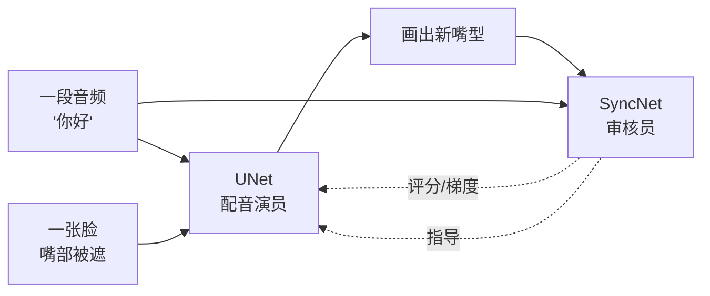

### 1.2 SyncNet 是什么？

#### 一句话定义
**SyncNet 是一个二分类网络：给定 16 帧人脸 + 16 帧对应音频，判断这俩是否"对得上嘴型"。**

#### 输入输出

| | 形状 | 含义 |
|---|---|---|
| **输入（视觉）** | `(16, 3, 256, 256)` 像素值 | 16 帧人脸下半张图（只看嘴） |
| **输入（音频）** | `(1, 80, 52)` mel 频谱 | 16 帧对应的 0.64 秒音频 |
| **输出 A** | `vision_embeds`: 2048 维向量 | 视频的"嘴型指纹" |
| **输出 B** | `audio_embeds`: 2048 维向量 | 音频的"声音指纹" |
| **最终判断** | 两个向量的余弦相似度 | 越接近 1 越同步 |

#### 它解决什么问题？
在训练 UNet 时充当"判官"——如果 UNet 画的嘴型和音频不匹配，SyncNet 会通过梯度"骂"UNet，让它必须听音频而不是偷懒看视觉。

#### 推理阶段用不用 SyncNet？
**不用。** SyncNet 是"训练阶段的老师"，不是"推理阶段的裁判"。

UNet 训好之后，唇音同步的能力已经通过 SyncNet 的梯度反向传播烧进了 UNet 权重。推理时只需要 UNet + VAE + Whisper 三件套，SyncNet 完全不加载。

```python
# api.py / gradio_app.py / predict.py 实际加载
vae     = AutoencoderKL.from_pretrained("stabilityai/sd-vae-ft-mse")
unet    = UNet3DConditionModel.from_config(...).to(device)
unet.load_state_dict(ckpt["state_dict"])
audio_encoder = Audio2Feature(model_path="checkpoints/whisper/tiny.pt")
# 就这三个，没有 SyncNet
```

代码层面验证：`scripts/inference.py`、`api.py`、`gradio_app.py`、`predict.py`、`latentsync/pipelines/lipsync_pipeline.py` 里 **0 处引用** `StableSyncNet`。`AGENTS.md:147` 也明确标注 `stable_syncnet.py # SyncNet (lip-sync confidence, training only)`。

#### 仓库里其实有两个 SyncNet，别搞混

| 名称 | 文件 | 作用 | 推理用吗 |
|---|---|---|---|
| **StableSyncNet** | `latentsync/models/stable_syncnet.py` | UNet Stage 2 训练的 `L_sync` 监督者 | ❌ 仅训练 |
| **SyncNetEval** | `eval/syncnet.py` | Joon Son Chung 原始 SyncNet（`syncnet_v2.model`） | ❌ 仅离线评估 |

SyncNetEval 用在：
- 数据预处理算 AV offset（`preprocess/sync_av.py`）
- 训练时验证生成的 val_video（`scripts/train_unet.py:489`）
- 离线评估（`eval/eval_sync_conf.sh`）

#### 能不能独立训练？
**能。** SyncNet 完全独立于 UNet，本质就是一个二分类器，论文甚至把它当通用工具贡献了出来。
- 数据：任意带人脸的视频 + 内嵌音频（必须先做音视频对齐，详见 §3）。
- 训练：`./train_syncnet.sh`，5-30 分钟看完一轮。
- 产物：`stable_syncnet.pt`，HDTF 准确率 91% → 94%。

#### 训练集格式
一行一个 mp4 绝对路径：

```
/data/voxceleb2/abc/001.mp4
/data/voxceleb2/abc/002.mp4
...
```

数据集会自动从视频里抽音频做 mel。

### 1.3 UNet 是什么？

#### 一句话定义
**UNet 是一个图像生成网络：拿到被遮住的脸 + 音频 + 参考脸，画出没被遮的完整脸。** 它就是 LatentSync 真正对外服务的"演员"。

#### 为什么叫 UNet？
因为它长得像个 U：左边一层层缩小（编码器），右边一层层放大（解码器），中间用 skip connection 连起来。这是 Stable Diffusion 的核心架构。

#### LatentSync 的 UNet 在 SD 基础上加了三个东西

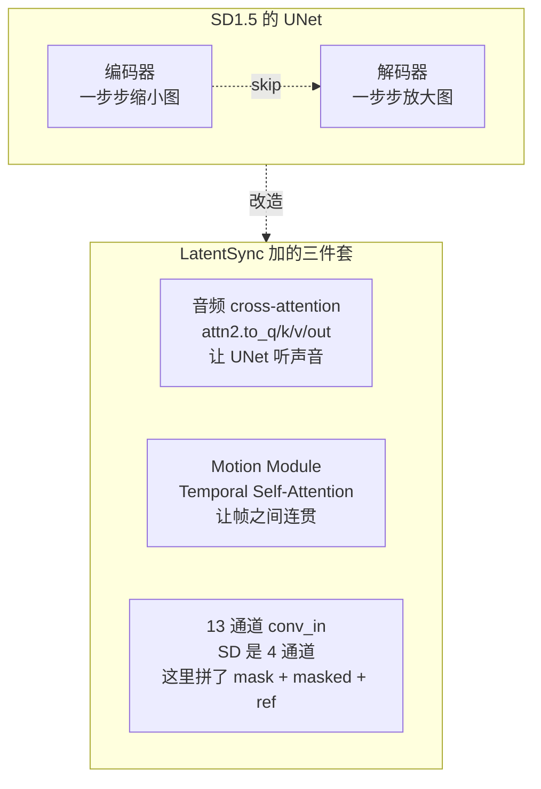

#### ⚠️ 关键澄清：SD1.5 是"起点"不是"成品"

| 组件 | SD1.5 提供 | LatentSync 是否重训 |
|---|---|---|
| **VAE 编码器/解码器** | `stabilityai/sd-vae-ft-mse` | ❌ 冻结不训 |
| **UNet 骨架结构** | SD UNet 架构 | 复用结构 |
| **UNet 初始权重** | SD1.5 unet 权重（warm start） | ✅ **全部重训** |
| **UNet conv_in（13 ch）** | SD 是 4 通道，shape 不兼容 | 🆕 随机初始化 |
| **Cross-attn（384 dim）** | SD 是 768/1280 维，shape 不兼容 | 🆕 随机初始化 |
| **Motion Module** | SD 没有 | 🆕 新增、随机初始化 |
| **Audio 注入路径** | SD 没有 | 🆕 新增 |

**论文 §3.1 原话**：
> *"At the beginning of training, the model is initialized with the parameters of SD 1.5, except for the first conv_in layer with 13 channels and cross-attention layers of dimension 384, which are randomly initialized."*

**代码层面**（`scripts/train_unet.py`）：

```python
# VAE 真的直接用 SD 的
vae = AutoencoderKL.from_pretrained("stabilityai/sd-vae-ft-mse", ...)

# UNet 加载时 ckpt_path 默认是 latentsync_unet.pt（不是 SD1.5）
unet, resume_global_step = UNet3DConditionModel.from_pretrained(
    OmegaConf.to_container(config.model),
    config.ckpt.resume_ckpt_path,  # = checkpoints/latentsync_unet.pt
    device=device,
)
```

**关键点**：
1. 首次跑 Stage 1 之前，需要先把 SD1.5 UNet 的权重塞到 `latentsync_unet.pt` 里（conv_in 和 cross-attn 因为 shape 不对会被 `strict=False` 跳过，留随机初始化）。
2. Stage 1 训全部 UNet 参数（SD1.5 的 resnet/attn 全部更新）。
3. Stage 2 冻结 SD1.5 原有 resnet/attn，只训新加的 `motion_modules.` + `attentions.`。

**为什么不直接用 SD1.5 训好的 frozen UNet？**

论文 §2 Fig.2 实验证明：直接把 SD1.5 的 UNet 接上音频 cross-attn、训唇音同步，**会严重 shortcut learning**（从眼睛/脸颊推断嘴型，不听音频）。所以必须用 SyncNet 监督强制学视听关联，并且是在唇音同步数据上完整训练一遍。

**为什么不复用 SD1.5 的 conv_in 和 cross-attn 权重？**

- **conv_in**：SD1.5 接受 4 通道 latent，LatentSync 接受 13 通道（4 noise + 1 mask + 4 masked + 4 ref）。维度对不上，必须随机初始化。
- **cross-attention**：SD1.5 用 768 维（text encoder）做 cross-attn，LatentSync 用 384 维（whisper-tiny）做 cross-attn，维度对不上，必须随机初始化。

其他 resnet、self-attn、time embedding 等模块 shape 兼容，可以从 SD1.5 权重 warm start 加速收敛。

### 1.4 嘴部 mask 怎么算？推理需要吗？

#### 一句话回答

**mask 是一张预先画好的 PNG（`latentsync/utils/mask.png`），不是实时算的。训练和推理都要用它把原图的嘴部抹黑后再喂给 UNet。**

#### mask.png 长什么样？

一张预先生成的、人脸形状的二值图（256×256）。约定：

| mask 像素值 | 含义 | masked_face 中表现 |
|---|---|---|
| **0**（黑） | 要 inpaint 的区域 | 嘴部被抹成黑色 |
| **1**（白） | 保留原图 | 眼睛/额头/背景不动 |

#### 怎么从原图得到"嘴被遮住的脸"？

**逐像素相乘**，一行代码：

```python
# latentsync/utils/image_processor.py:244
mask_to_use = self.mask_image[0:1]              # 加载好的固定 mask
masked_pixel_values = pixel_values * mask_to_use  # 逐像素相乘
```

数学上：`masked = face × mask`，mask=0 的位置 → 全 0（黑），mask=1 的位置 → 原值。

#### 训练侧（`UNetDataset`）

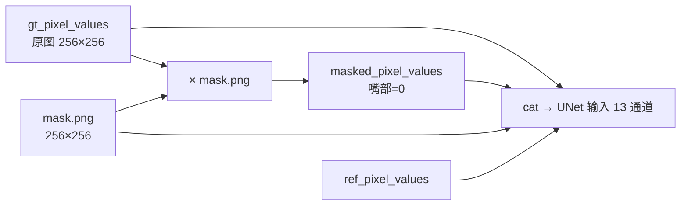

#### 推理侧（`LipsyncPipeline`）

**推理也要做相同的 mask 操作**，因为 UNet 只接受这种 13 通道格式的输入。

```python
# lipsync_pipeline.py:4194
ref_pixel_values, masked_pixel_values, masks = self.image_processor.prepare_masks_and_masked_images(
    inference_faces, affine_transform=False
)
```

#### 为什么用"整脸 mask"而不是只遮嘴？

论文 §3.1 原话：
> *"We applied a mask that covers the entire face to minimize the model's tendency to learn visual-visual shortcuts."*

**核心动机**：如果只遮嘴，眼睛/脸颊/肌肉的运动会"剧透"嘴型——UNet 会偷懒不学音频。**把整张脸都遮掉**，UNet 在 mask 内看不到任何视觉线索，就被迫只能听音频。

这正是论文 §2 Fig.2 的实验结论：**mask 越大 → sync 越好**（因为偷不了懒）。

#### 推理侧多了一个东西：动态嘴部 mask

```python
# lipsync_pipeline.py:3197 / 4141
fixed_keep_mask = self.image_processor.mask_image[0:1]  # 固定 mask（mask.png）
dynamic_region_mask = generate_dynamic_mouth_mask(
    mouth_info,
    fixed_keep_mask=fixed_keep_mask,  # ← 用固定 mask 当边界约束
)
```

- **固定 mask** = mask.png → 决定"哪些像素**可以**改"
- **动态 mask** = 每帧根据 landmark 实时算 → 决定"哪些像素**实际需要**改"
- 动态 mask 不能超出固定 mask 的边界（AGENTS.md 里强调的 clamp）

> 训练时只用固定 mask；推理时多一层动态 mask 保护，避免极端表情时生成内容扩散到脸外。

#### 训练 vs 推理 mask 流程对比

| 步骤 | 训练 (`UNetDataset`) | 推理 (`LipsyncPipeline`) |
|---|---|---|
| **加载 mask** | `__init__` 时 `load_fixed_mask` | `__init__` 时 `load_fixed_mask` |
| **应用 mask** | `prepare_masks_and_masked_images` | `prepare_masks_and_masked_images` |
| **mask 类型** | 固定 mask | 固定 mask + 动态 mask |
| **是否对齐** | ❌（preprocess 已做过） | ✅（推理时实时仿射对齐） |

#### 完整推理时的 mask 链路

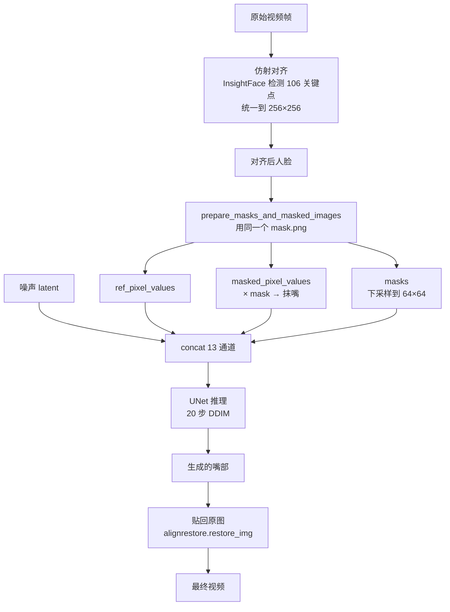

### 1.5 Mask 策略的优化空间（侧脸 & 快速变动）

> 这一节专门讨论用户提出的两个核心痛点：**侧脸 / 大角度** + **脸快速变动**。

#### 当前 mask 策略的问题诊断

**1. 固定 mask 在数学上就是个"对称刚性区域"**

`mask.png` 是一张对称的、人脸形状的二值图，问题：

| 场景 | 问题 |
|---|---|
| **正脸** | 完美对齐 mask 边界 = 人脸边界 |
| **侧脸 30°** | mask 一侧盖到背景；另一侧没盖到脸颊 |
| **仰头/低头** | mask 下半部盖到脖子；上半部漏掉额头 |
| **快速转头** | landmark 检测抖，mask 跟不上 |

**2. 侧脸的具体痛点**

`lipsync_pipeline.py:3197`：

```python
dynamic_region_mask = generate_dynamic_mouth_mask(
    mouth_info,
    fixed_keep_mask=fixed_keep_mask  # ← 动态 mask 被固定 mask 边界限制
)
```

`fixed_keep_mask` 是固定 mask 的"保留区"，**动态 mask 不能超过它**。所以侧脸时如果嘴部 landmark 跑到了固定 mask 外面，会被硬截回去。

**3. 快速变动的痛点**

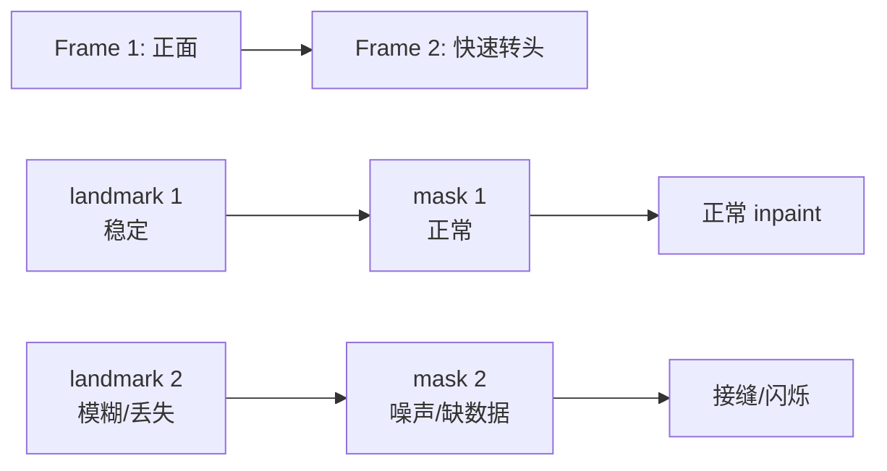

**4. 论文 Fig.2 揭示的三难 trade-off**

- mask 越大 → sync 越好（被迫听音频）
- mask 越大 → 视觉质量越差（重建压力大）
- mask 越小 → sync 越差（能偷懒）

整脸 mask 是 sync 的极端选择，但牺牲了**身份信息**、**时序一致性**、**侧脸鲁棒性**、**计算效率**（9 个无关通道）。

#### 6 个潜在优化方向

| 方向 | 改动 | sync | 视觉 | 侧脸 | 时序 | 难度 |
|---|---|---|---|---|---|---|
| **A. Pose-aware 自适应 mask** | mask 随 yaw/pitch warp | ↑ | ↑ | ✅ | 中 | 中 |
| **B. Landmark-based 全脸 mask** | 用 106 landmark 实时画 mask | ↑ | ↑ | ✅ | ⚠️ | 低 |
| **C. Learned mask** | UNet 加 mask 预测头 | ↑↑ | ↑ | ✅ | ✅ | 高 |
| **D. 分区域 mask** | 只 inpaint 嘴部 + 鼻子下方 | ↓（破坏反 shortcut） | ↑↑ | ✅ | ✅ | 低 |
| **E. 多 mask 集成** | 推理时取并集 | ↑ | ↓ | ✅ | ⚠️ | 低 |
| **F. 时序平滑** | mask 帧间 EMA | — | ↑ | — | ✅✅ | 低 |

**各方向核心代码示意**：

```python
# A. Pose-aware
def get_adaptive_mask(yaw, pitch, base_mask):
    if abs(yaw) > 15:
        mask = warp_mask(base_mask, yaw_rotation=-yaw)
        mask = dilate_along_axis(mask, axis=sign(yaw), ratio=1.2)
    return mask

# B. Landmark-based
def landmark_mask(landmarks_106, image_shape):
    face_outline = landmarks_106[0:17]
    eyebrows = landmarks_106[17:27]
    return fill_polygon(face_outline + eyebrows)

# C. Learned (需重训)
mask_logits = unet(input_4ch, t).mask_pred
predicted_mask = torch.sigmoid(mask_logits)

# F. 时序平滑
mask_ema = ema(mask_ema, dynamic_mask_t, alpha=0.3)
```

#### ⚠️ AGENTS.md 的硬约束

```markdown
> Mask & feather baseline is locked
> Baseline: ef3903f with latentsync/utils/mask.png.
> Do not toggle masks, mask width, or feather without an explicit ask.
> Previous revert cycles were explicitly rejected.
```

**意思**：
- mask 已经被反复 revert 过几次
- 维护者明确说"别动"
- 任何 mask 改动都要**用户明确要求**

**原因推测**：
- mask 改小 → sync 变差（用户最在意的指标）
- mask 改大 → 视觉质量变差（用户也关心）
- mask 改形状 → 训练数据分布变了，全链路要重训
- 加羽化 → 边界软了但 mask 覆盖率变了，相当于改 mask

#### 不破 baseline 的实际可优化点

**1. 侧脸：优化检测而不是 mask**

`AGENTS.md` 已经说：
> *"Threshold tuning alone (`yaw_skip_threshold`) is a band-aid. Real fixes require improving the underlying signals."*

即：**检测侧做得更准**（让侧脸能进得来），而不是改 mask 范围。

具体能做：
- 改进 `_estimate_yaw_degrees` 的多信号融合
- 降低 landmark 噪声（EMA 平滑已经在做，alpha=0.7）
- 用 `generate_dynamic_mouth_mask(..., fixed_keep_mask=fixed_keep_mask)` 的 clamp（已经在做）

**2. 快速变动：优化 landmark 跟踪**

- 用 InsightFace tracker 而不是每帧检测
- landmark 帧间 EMA（已做）
- motion_blur skip（已做）

**3. 边界接缝：优化合成而非 mask**

- `paste_surrounding_pixels_back`（已做）
- 颜色匹配 `_match_color_to_reference`（已做）

#### 研究项目路线（如果要真做）

如果要**研究**新 mask 策略（不是生产改）：

1. **第一阶段**：mask ablation 实验
   - Baseline: mask.png
   - 实验 1: pose-aware warp
   - 实验 2: landmark-based mask
   - 实验 3: learned mask
   - 测 sync_conf + FID，找最佳 trade-off

2. **第二阶段**：在最佳 mask 上重训 Stage 1 + Stage 2

3. **第三阶段**：跑侧脸 / 快速变动 case，看是否真的解决 badcase

**但这是研究项目，不是生产改动。先和用户对齐要不要做。**

#### 极端嘴型的额外硬伤（大嘴 / 大笑 / 唱歌 / 打哈欠）

> 用户追问：嘴特别大时不能完全遮住，是不是也不行？

**答：是的，这是当前 mask 策略的另一个硬伤。**

##### 代码层面的双重 clamp

`lipsync_pipeline.py:1663-1752` 的 `generate_dynamic_mouth_mask` 有两层限制：

```python
# 第一层：动态 mask 自身的 max 上限
max_rx_norm: float = 0.40,   # 嘴宽最大 40% 图宽
max_ry_norm: float = 0.30,   # 嘴高最大 30% 图高

rx = max(min_rx_norm, min(max_rx_norm, rx))   # 硬卡
ry = max(min_ry_norm, min(max_ry_norm, ry))   # 硬卡

# 第二层：固定 mask 的 keep 区域强制保留（line 1750）
keep_mask = torch.maximum(keep_mask, m)  # 动态不能扩展 inpaint 到 fixed keep 区
```

也就是说：256×256 图上，**动态 mask 最大只能覆盖 ~102×77 像素的椭圆区域**；超出这个范围的嘴部，**mask 覆盖不到**。

##### 大嘴 / 大笑时实际发生什么


**具体表现**：
- **嘴中央**：UNet 生成（但训练数据里几乎没见过大笑样本 → 画成"正常说话"嘴型）
- **嘴角/外翻嘴唇**：原图保留（在 mask 外）
- **牙齿**：原位没动（没跟音频对齐）
- **整体效果**：**嘴角在笑但嘴中央是中性 → 诡异的"嘴型分裂"**

##### 更深层的问题：训练数据分布缺陷

```python
# UNetDataset 训练时
gt_pixel_values = gt_frames               # 包含大笑嘴
masked_pixel_values = gt_pixel_values * mask_image  # 用固定 mask 抹掉
```

**训练时**：
- gt 里有大笑/唱歌嘴
- 但 mask 永远只覆盖固定区域 → UNet 看不到这些极端 ground truth
- UNet 学到的是"在这个固定区域内画嘴型" → 永远只生成"正常说话"的嘴

**推理时**：
- 实际嘴是大笑
- mask 也不覆盖大笑的边缘
- UNet 在 mask 内画"正常说话"的嘴 → 和原图嘴角打架

> **核心矛盾**：UNet 是"盲人画师"——只看到 mask 内的"涂黑的脸"，不知道外面嘴角是咧着的，自然画不出匹配的整体表情。

##### 修复路径对比

| 限制 | 原因 |
|---|---|
| **mask 改大** | AGENTS.md 锁定 baseline；改大后训练分布全变 |
| **max_rx/max_ry 改大** | UNet 没在更大 inpaint 区训过 → 推理画不好 |
| **landmark-based 大 mask** | 推理能扩展但 UNet 还是画不出大笑 |
| **重训 UNet 用更大 mask** | 等于全链路重训（Stage 1+2） |
| **加极端嘴型数据集** | 训练分布需要补足 |
| **mask 大小随机化** | 研究级改动 |
| **条件化 mask** | 让 UNet 知道"这次画多大" |

**根本解决方案**（研究级）：

1. **数据集增强**：训练集里加大量"大笑/唱歌/打哈欠"极端嘴型视频
2. **mask 大小随机化**：训练时 mask 在 [30%, 60%] 区间随机，让 UNet 适应不同 inpaint 范围
3. **条件化 mask**：把 mask 本身作为输入，让 UNet 知道"这次要画多大"
4. **表情感知**：先识别"这是大笑/正常说话"，再决定 mask 大小

但这些都是**研究方向**，不破 baseline 做不到。

##### 当前最佳 fallback

在 prefilters 中（`yaw_skip`、`motion_blur_skip`、`mouth_occlusion` 等）检测大嘴型：
- 触发 skip → **fallback 到原视频帧**
- 坏处：sync 失败
- 好处：避免"嘴型分裂" badcase

这是当前默认行为。生产环境**宁可不生成也不要分裂**。

#### 输入输出

| | 形状 | 含义 |
|---|---|---|
| **输入（图像侧）** | `(B, 13, 16, 64, 64)`（256 分辨率） | 4 通道 noise + 1 通道 mask + 4 通道 masked 帧 + 4 通道 ref 帧 |
| **输入（音频侧）** | `(B, 16, 50, 384)` | 16 帧各 50 个 whisper-tiny token 的 384 维特征 |
| **输入（时间步）** | `(B,)` 整数 | 0-999 的扩散步数 |
| **输出** | `(B, 4, 16, 64, 64)` | 预测的噪声 ε |

#### 它解决什么问题？
- 训练时：学会"看到 masked 脸 + 听到声音 → 还原嘴型"。
- 推理时：把遮住的嘴部补出来。

#### 能不能独立训练？
**Stage 1 可以独立训练**（只用视频 + 音频，不依赖 SyncNet）。
**Stage 2 必须依赖 SyncNet**（需要 SyncNet 算 sync_loss）。

#### 训练集格式
和 SyncNet 一样，一行一个 mp4。但 Stage 2 必须先有 Stage 1 的 checkpoint（fine-tune 模式）。

### 1.4 对比总结

| | SyncNet | UNet (LatentSync) |
|---|---|---|
| **类比** | 嘴型审核员 | 配音演员 |
| **任务** | 二分类：嘴和音对不对 | 图像生成：补全被遮的脸 |
| **输入** | 16 帧脸 + 16 帧音频 mel | 13 通道 noise+mask+masked+ref + 16 帧音频特征 |
| **输出** | 2048 维两个 embedding | 4 通道噪声预测 |
| **判别 vs 生成** | 判别式 | 生成式 |
| **能否独立训练** | ✅ 完全独立 | Stage 1 独立；Stage 2 需 SyncNet |
| **训练数据格式** | 一行一个 mp4 路径 | 一行一个 mp4 路径 |
| **产物** | `stable_syncnet.pt` | `latentsync_unet.pt` |

---

## 2. 全局训练链路（论文视角 + 代码映射）

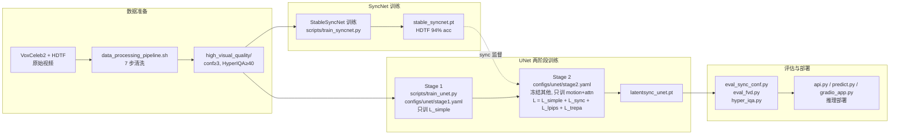

---

## 3. 数据预处理（`preprocess/`）

> **目标**：把"乱七八糟的原始视频"压成"干净的、256×256 人脸对齐、同步、高质量"的训练样本。
> **入口**：`./data_processing_pipeline.sh`

### 3.1 七步流水线

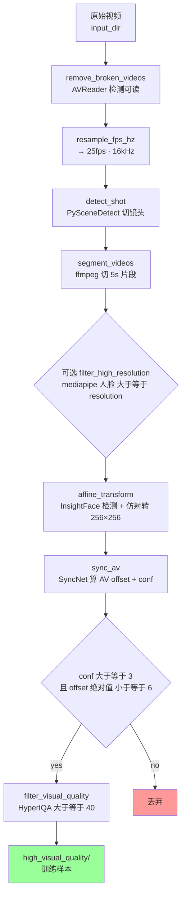

### 3.2 每步干什么

| 步骤 | 干什么 | 为什么要 |
|---|---|---|
| **1. 去损坏** | 用 AVReader 读，读不出就删 | 数据集里有损坏文件会卡死训练 |
| **2. 重采样** | 全部统一到 25 fps + 16 kHz | 网络设计死了 25 fps，音频窗口对齐才能算 |
| **3. 切镜头** | 用 PySceneDetect 找切点 | 一个长视频里可能换了人，要切 |
| **4. 5s 切片** | 每段切成 5 秒 | 训练时一次取 16 帧（0.64s），太长的视频浪费 |
| **5. 高分辨率筛选**（可选） | mediapipe 检测人脸，要求 ≥ 256 | 人脸太小训练出来没用 |
| **6. 仿射对齐** | InsightFace 检测 106 个关键点 → 把人脸"摆正"到 256×256 | 侧脸、歪脸统一变正脸，简化学习 |
| **7. 音视频对齐** | SyncNet 算 offset，把音频移动到嘴型同步的位置，丢弃 conf<3 | 没同步的样本会把 SyncNet 教傻 |
| **8. 视觉质量** | HyperIQA 评分，≥ 40 才留 | 太糊、太暗、太花的样本没用 |

### 3.3 关键：为什么"先仿射再调 AV offset"？

论文 §4 Fig.10 的实验结果：
- **不做 offset 调整**：SyncNet loss 卡在 0.69（= ln 2），永远学不会。
- **先 affine 再调 offset**：唯一能正常收敛的顺序。

原因：仿射变换去掉了大量侧脸 / 怪角度样本，让官方 SyncNet 估 AV offset 更准。

### 3.4 数据集目录结构

```
VoxCeleb2/
├── raw/                          # 原始 mp4
├── resampled/                    # 25fps 16kHz
├── shot/                         # 切镜头后
├── segmented/                    # 5s 一段
├── affine_transformed/           # 256×256 人脸对齐
├── av_synced_3/                  # AV 对齐后
└── high_visual_quality/          # ← 最终训练用
    └── abc/001.mp4
    └── abc/002.mp4
    └── ...
```

每一步生成一个新目录，万一某步挂掉可以从那一步重跑，不用从头来。

### 3.5 训练集格式

最终训练输入就是一个文本文件，每行一个 mp4 绝对路径：

```
/data/VoxCeleb2/high_visual_quality/abc/001.mp4
/data/VoxCeleb2/high_visual_quality/abc/002.mp4
/data/HDTF/high_visual_quality/xyz/001.mp4
...
```

训练时 `UNetDataset` / `SyncNetDataset` 会自动：
- 用 decord 解码视频帧
- 用 ffmpeg 抽音频
- 用 melspectrogram 转 mel
- cache 到 `audio_mel_cache_dir`（避免每次都重算）

---

## 4. SyncNet 训练详解

### 4.1 一句话目标
让 SyncNet 学会"看一眼嘴，听一声音，判断它们对不对得上"。

### 4.2 训练循环

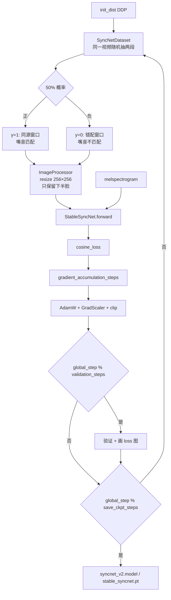

### 4.3 正负样本怎么造

```python
# 伪代码
start_idx   = 随机选一段 16 帧
wrong_idx   = 再随机选一段 16 帧（≠ start_idx）
audio       = 视频原始音频的 mel

if random.random() < 0.5:
    sample = (start_idx 帧, audio, y=1)    # 正样本：嘴音同源
else:
    sample = (wrong_idx 帧, audio, y=0)    # 负样本：嘴音错配
```

这就是自监督——**不需要任何标签**，视频本身的对齐音频就是正样本，错位的就是负样本。

### 4.4 损失函数

```python
# latentsync/utils/util.py:314 cosine_loss
# y=1: 1 - cos(v, a)        # 同源 → 鼓励对齐
# y=0: max(0, cos(v, a))    # 错配 → hinge 鼓励远离
```

### 4.5 论文五因素消融（必须记牢）

| 因素 | 论文结论 | 你的配置 |
|---|---|---|
| **Batch size** | 1024 最优，128 卡 0.69 | `data.batch_size=256`，可加大 |
| **架构** | SD U-Net encoder > Wav2Lip 原架构 | `syncnet_16_pixel_attn.yaml` |
| **Embedding dim** | 2048 最优 | `block_out_channels` 末层 2048 |
| **帧数** | 16 最优，25 卡住 | `data.num_frames=16` |
| **数据预处理** | 先 affine 再调 AV offset | pipeline 顺序固定 |

### 4.6 loss 卡 0.69 = 完蛋了吗？

论文给了数学证明：`0.693 = ln 2`，是 SyncNet 完全没学到任何东西时 loss 的下界。

**诊断方法**：训练几个 step 看 loss，如果不往下走，就卡这 5 个因素里。

---

## 5. UNet 训练详解

### 5.1 模型架构

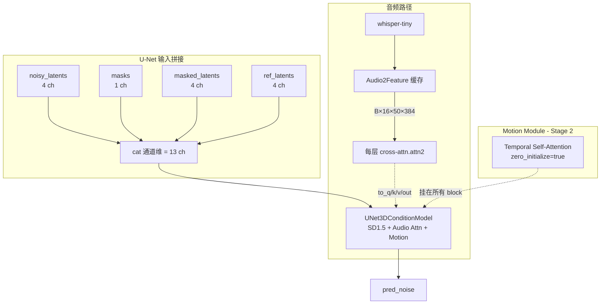

### 5.2 音频特征怎么喂

公式（论文 §3.1）：
```
A^(f) = {a^(f-m), ..., a^(f), ..., a^(f+m)}
```

**代码**：`configs/unet/stage1.yaml` → `audio_feat_length: [2, 2]`，即 `m=2`，每帧用"前 2 帧 + 自己 + 后 2 帧"共 5 帧音频特征。

> 为什么要前后各看几帧？因为嘴型有滞后性，看周围的音频能让模型更好对齐。

### 5.3 两阶段训练（论文核心）

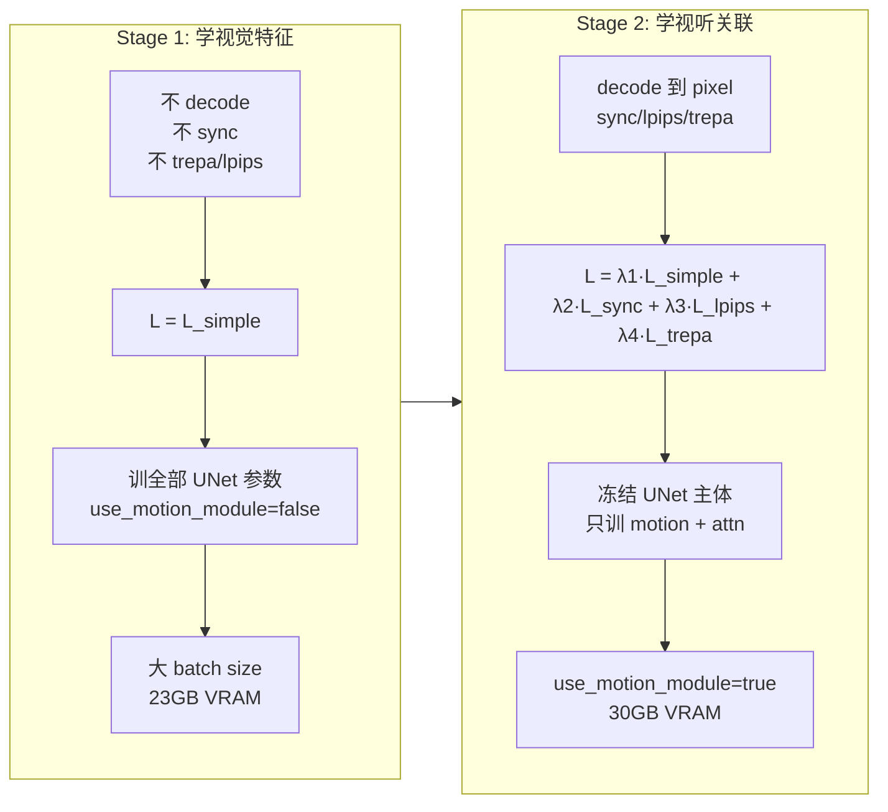

> **动机**：decoded pixel space supervision 需要保留 VAE decoder 的 activations 给反传，显存爆炸。Stage 1 先不 decode，省显存；Stage 2 再加 sync/lpips/trepa。

### 5.4 训练目标

**Stage 1**：
```
L_simple = E[||ε - ε_θ(z_t, t, τ_θ(A))||²]
```

**Stage 2**：
```
L_total = λ1·L_simple + λ2·L_sync + λ3·L_lpips + λ4·L_trepa
```

| 损失 | 作用 | 权重 |
|---|---|---|
| `L_simple` | 噪声预测主目标 | 1 |
| `L_sync` | 嘴音同步（用 SyncNet 监督） | 0.05 |
| `L_lpips` | 感知相似（只看下半脸） | 0.1 |
| `L_trepa` | 时序一致性（VideoMAE-v2 特征） | 10 |

### 5.5 数据采样（`UNetDataset`）

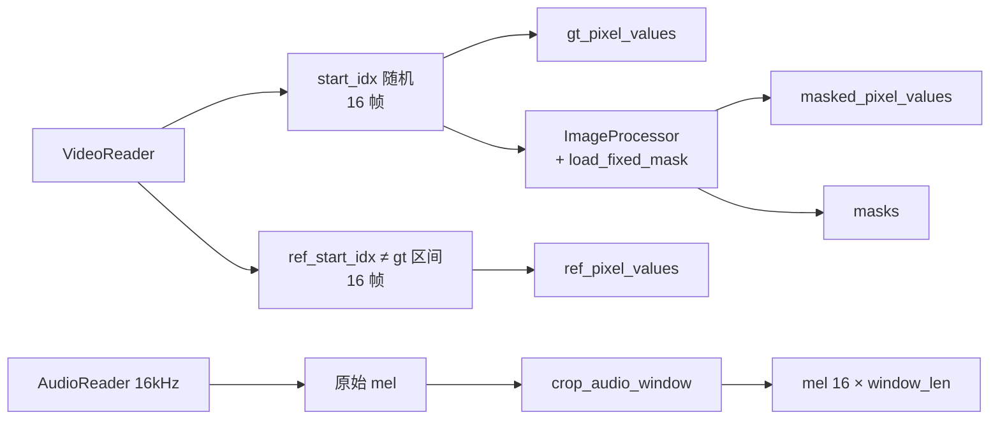

> 训练时 `affine_transform=False`（预处理已经做过），但 ImageProcessor 仍会再调一次（mask 应用 + resize）。

### 5.6 Stage 2 训练对象

**冻结**：UNet 主体（SD1.5 原有参数）
**训练**：
- `motion_modules.`（时序层）
- `attentions.`（cross-attn 之外的 self-attn）

**stage2_efficient.yaml** 进一步缩范围：
- `decoder_only: true`（Motion Module 只挂 decoder）
- 只训 `attn2.`（cross-attn）
- `trepa_loss_weight: 0`（省显存）

### 5.7 Mixed Noise 干嘛的

```python
# noise = noise_shared + noise_ind
# noise_shared = randn()[:, :, 0:1].repeat(全帧)  # 所有帧共用
# noise_ind    = randn()                            # 每帧独立
```

- **noise_shared**：所有帧共用同一噪声 → 强制 UNet 学时序一致性（相邻帧差异由去噪过程产生）。
- **noise_ind**：每帧独立噪声 → 提供帧间变化。

### 5.8 TREPA：时序对齐损失（论文核心创新）

> **一句话**：TREPA 让 UNet 学会"生成的 16 帧视频在'时间维度上的特征'要和真实的 16 帧尽量一致"。

#### 5.8.1 它解决什么问题？

假设你已经把 UNet 训得不错，单帧看着挺好。但播放出来发现：

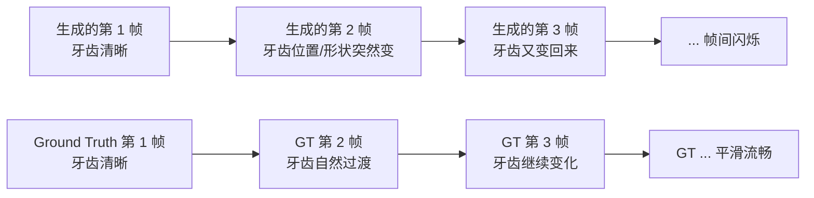

**具体表现**：
- **牙齿闪烁**：每帧牙齿的形状/位置/亮度有微抖动
- **嘴唇闪烁**：上下唇边缘在抖
- **胡须闪烁**：男士胡须区域每帧不一样
- **整体感觉**：诡异、不真实、像 PPT 翻页

#### 5.8.2 为什么 LPIPS 解决不了这个问题？

LPIPS 是个**单帧损失**——它只看"这一帧和 GT 这一帧像不像"，**完全不看帧间关系**。

```python
# LPIPS 的"视角"
for frame_i in generated_frames:
    lpips_loss += LPIPS_vgg(frame_i, gt_frame_i)  # 逐帧独立算
```

所以理论上：
- 第 1 帧 UNet 可以画"张大嘴"
- 第 2 帧 UNet 可以画"闭嘴"（即使音频是要连续说话）
- 每帧单独看都不错 → LPIPS 很低
- 但连起来看 → 闪烁

**论文原话**：
> *"Merely employing distance loss between individual images improves the content quality of single generated images but does not enhance the temporal consistency of the generated image sequence."*

#### 5.8.3 TREPA 的核心思路

既然单帧损失不行，那就让 UNet 学习**"16 帧一起"的特征**。

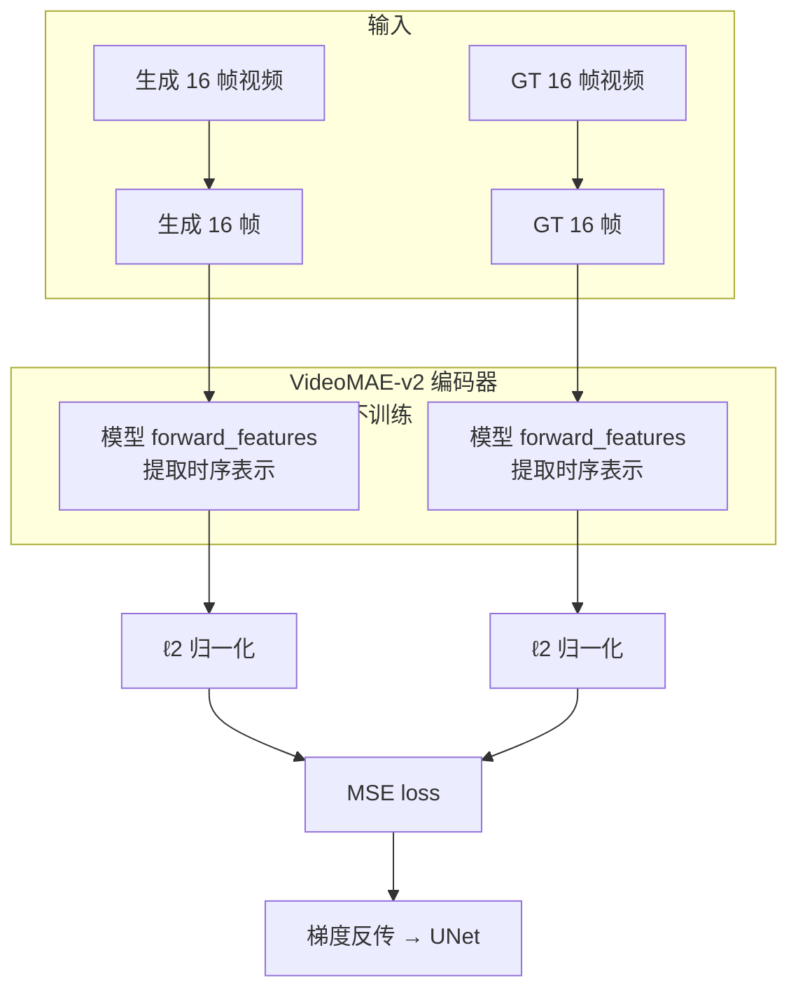

**直觉类比**：

| 单帧损失（LPIPS） | TREPA |
|---|---|
| 让 100 个学生**单独**考试都及格 | 让 100 个学生**合唱**听起来和谐 |
| 每个学生自己写自己的 | 一个指挥协调所有人 |
| 不管学生之间怎么配合 | 强制学生之间的"节奏、音调、配合"对齐 |
| 类比：每帧好看 | 类比：帧间平滑 |

#### 5.8.4 用什么模型提取"时序表示"？

论文选了 **VideoMAE-v2**（`vit_g_hybrid_pt_1200e_ssv2_ft.pth`）。

**为什么选它**：
1. **大规模自监督**：在海量无标注视频上预训练 → 不需要标签
2. **时空建模**：不是只看单帧，而是用 Transformer attention 跨帧融合信息
3. **特征丰富**：embedding 维度足够大，能捕捉细微的时空差异
4. **强泛化**：在 lip-sync 数据上没训过，但能提取通用的"视频时序特征"

**自动下载**：

```python
# latentsync/trepa/loss.py:29
def __init__(self, device="cuda",
             ckpt_path="checkpoints/auxiliary/vit_g_hybrid_pt_1200e_ssv2_ft.pth",
             with_cp=False):
    check_model_and_download(ckpt_path)  # 没就自动从 HF 下
    self.model = load_videomae_model(device, ckpt_path, with_cp).eval().to(dtype=torch.float16)
    self.model.requires_grad_(False)  # 冻结，不训练
```

#### 5.8.5 代码逐行解读

```python
# latentsync/trepa/loss.py:33
class TREPALoss:
    def __call__(self, videos_fake, videos_real):
        # 输入：UNet 生成的 16 帧 vs GT 16 帧
        # shape 都是 (B, 3, 16, 256, 256)

        # 1. 把 (B, 3, 16, H, W) 拆成 (B*16, 3, H, W) —— 把 16 帧当成独立 batch
        videos_fake = rearrange(videos_fake, "b c f h w -> (b f) c h w")
        videos_real = rearrange(videos_real, "b c f h w -> (b f) c h w")

        # 2. resize 到 224×224（VideoMAE-v2 的输入要求）
        videos_fake = F.interpolate(videos_fake, size=(224, 224), mode="bicubic")
        videos_real = F.interpolate(videos_real, size=(224, 224), mode="bicubic")

        # 3. 还原成 (B, 3, 16, 224, 224) —— 让模型看完整 16 帧序列
        videos_fake = rearrange(videos_fake, "(b f) c h w -> b c f h w", f=16)
        videos_real = rearrange(videos_real, "(b f) c h w -> b c f h w", f=16)

        # 4. 像素范围 [-1,1] → [0,1]（VideoMAE 预训练时的范围）
        videos_fake = (videos_fake / 2 + 0.5).clamp(0, 1)
        videos_real = (videos_real / 2 + 0.5).clamp(0, 1)

        # 5. 提取"时序表示"（embeddings before head projection）
        feats_fake = self.model.forward_features(videos_fake)
        feats_real = self.model.forward_features(videos_real)

        # 6. L2 归一化 —— 让特征在单位球面上，MSE 等价于余弦距离
        feats_fake = F.normalize(feats_fake, p=2, dim=1)
        feats_real = F.normalize(feats_real, p=2, dim=1)

        # 7. MSE 损失
        return F.mse_loss(feats_fake, feats_real)
```

#### 5.8.6 为什么用 `forward_features` 而不是 `forward`？

`forward()` = 提取特征 + 分类头（head projection）
`forward_features()` = **只提取特征，不分类**

我们要的就是"通用时序表示"，不需要分类。所以用 `forward_features()`，避免 head projection 把特征压成"用于分类"的特定形状。

#### 5.8.7 为什么 L2 归一化后再算 MSE？

```python
feats_fake = F.normalize(feats_fake, p=2, dim=1)
return F.mse_loss(feats_fake, feats_real)
```

**数学等价**：
- `||a_normalized - b_normalized||² = 2 - 2·cos(a, b)`
- 即 `MSE(L2_norm(a), L2_norm(b))` 与 `余弦距离` 成正比

**实际意义**：
- 不关心特征的"绝对大小"，只关心"方向"（即"语义相似度"）
- 训练更稳定（数值范围固定在 [0, 4]）
- 和 SyncNet 的 cosine_loss 哲学一致

#### 5.8.8 完整训练时的 TREPA 流程

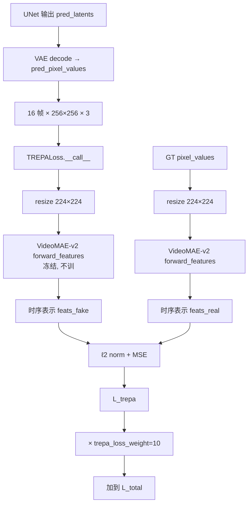

**关键代码**（`scripts/train_unet.py:381-388`）：

```python
if config.run.trepa_loss_weight != 0 and config.run.pixel_space_supervise:
    trepa_pred_pixel_values = rearrange(pred_pixel_values, "(b f) c h w -> b c f h w", f=16)
    trepa_gt_pixel_values   = rearrange(gt_pixel_values,   "(b f) c h w -> b c f h w", f=16)
    trepa_loss = trepa_loss_func(trepa_pred_pixel_values, trepa_gt_pixel_values)
else:
    trepa_loss = 0
```

**只在 Stage 2 生效**（因为 `pixel_space_supervise=True`）。

#### 5.8.9 权重为什么是 10？

看配置：
```yaml
# configs/unet/stage2.yaml
trepa_loss_weight: 10
```

**数学分析**：
- LPIPS loss ≈ 0.1-0.3 数量级
- TREPA loss（L2 normalized features 的 MSE）≈ 0.01-0.05 数量级
- 权重 10 让 TREPA 和 LPIPS 在数值上平衡
- 如果改成 1，TREPA 几乎不起作用
- 如果改成 100，TREPA 会盖过其他损失，破坏视觉质量

**经验值**，调权重时要先看 loss 曲线，不能盲调。

#### 5.8.10 TREPA 的局限性

| 场景 | TREPA 表现 |
|---|---|
| 正常说话 | ✅ 显著改善帧间一致性 |
| 大笑/唱歌/极端嘴型 | ⚠️ 改善有限（mask 本身盖不到这些区域） |
| 侧脸快速转头 | ⚠️ 改善有限（landmark 抖动传到特征） |
| 单帧质量本身很差 | ❌ TREPA 不管单帧，只管帧间 |
| 训练数据本身有闪烁 | ❌ TREPA 学不到不闪烁的表示 |

#### 5.8.11 配置与开关

| config | trepa_loss_weight | 效果 |
|---|---|---|
| `stage1.yaml` | 10 | 但因 `pixel_space_supervise=false` 实际不生效 |
| `stage2.yaml` | 10 | ✅ 标准配置 |
| `stage2_512.yaml` | 10 | ✅ 512 标准 |
| `stage2_efficient.yaml` | **0** | ❌ 关闭（省显存优先） |

**省显存策略**：
- 关闭 TREPA 可以省 ~2GB VRAM（VideoMAE-v2 模型占显存）
- 代价：帧间一致性略降
- 适合：消费级 GPU（如 RTX 3090）跑 Stage 2

#### 5.8.12 一句话总结

> **TREPA = 让 UNet 生成的 16 帧视频在 VideoMAE-v2 提取的"时序特征空间"上和 GT 尽量对齐。**
> **本质：从"让单帧好看"升级到"让 16 帧作为一个整体好看"。**
> **配合 Mixed Noise + Motion Module，是 LatentSync 解决"帧间闪烁"问题的三件套。**

### 5.8 配置全表

| config | 分辨率 | motion | decoder_only | trainable | trepa | sync | mask | VRAM |
|---|---|---|---|---|---|---|---|---|
| `stage1.yaml` | 256 | false | — | 全部 | 10 | false | `mask.png` | 23 GB |
| `stage1_512.yaml` | 512 | false | — | 全部 | 10 | false | `mask.png` | 30 GB |
| `stage2.yaml` | 256 | true | false | motion + attn | 10 | true | `mask.png` | 30 GB |
| `stage2_512.yaml` | 512 | true | false | motion + attn | 10 | true | `mask2.png` | 55 GB |
| `stage2_efficient.yaml` | 256 | true | **true** | motion + attn2 | **0** | true | `mask.png` | 20 GB |

---

## 6. 评估

### 6.1 指标

| 指标 | 含义 | 越大/越小 | 代码 |
|---|---|---|---|
| **FID** | 视觉质量 | ↓ 越好 | `eval/eval_fvd.py` |
| **SSIM** | 重建质量 | ↑ 越好 | 同上 |
| **Sync_conf** | 唇音同步 | ↑ 越好 | `eval/eval_sync_conf.py` |
| **LMD** | 嘴部 landmark 距离 | ↓ 越好 | 同上 |
| **FVD** | 时序质量 | ↓ 越好 | `eval/eval_fvd.py` |

### 6.2 论文 Table 1（HDTF 测试集）

| 方法 | FID↓ | SSIM↑ | Sync_conf↑ | LMD↓ | FVD↓ |
|---|---|---|---|---|---|
| Wav2Lip | 12.5 | 0.70 | 8.2 | 0.34 | 304.35 |
| MuseTalk | 9.35 | 0.74 | 6.8 | 0.56 | 246.75 |
| **LatentSync** | **7.22** | **0.79** | **8.9** | **0.30** | **162.74** |

---

## 7. Badcase 与对应训练策略（重点）

> 这一节是实际项目中**最常遇到的问题**和**怎么通过训练/微调解决**。

### 7.1 Badcase 一览

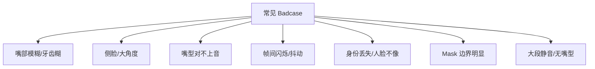

### 7.2 Badcase 1：嘴部模糊、牙齿糊

#### 现象
生成的嘴部细节丢失，看起来像糊了一层，牙齿看不清。

#### 根因
- Stage 2 没训够，LPIPS / pixel 监督不够强。
- 分辨率太低（256），细节本身就没学清楚。

#### 训练策略
1. **升分辨率训练**：256 → 512，改用 `stage1_512.yaml` + `stage2_512.yaml`，mask 换 `mask2.png`（更紧的嘴部 mask）。
2. **加大 LPIPS 权重**：把 `perceptual_loss_weight` 从 0.1 调到 0.3+。
3. **加训练步数**：Stage 2 多训几个 epoch。
4. **数据侧**：检查 `audio_mel_cache_dir` 里的 mel 是否正常（糊的可能从源头就糊）。
5. **推理后处理**：开 `codeformer_enabled=true`（见 `docs/codeformer_integration.md`）。

### 7.3 Badcase 2：侧脸 / 大角度

#### 现象
人脸偏转超过 30°，生成的嘴部要么扭曲、要么粘贴到脸上其他地方。

#### 根因
- 侧脸时人脸 landmark 检测不准，mask 区域错位。
- 模型没怎么见过大角度样本。

#### 训练策略
1. **数据侧**：让预处理阶段**保留更多侧脸样本**（不强制要求正面）。
2. **检测侧**：`_estimate_yaw_degrees` 阈值放宽（参考 `AGENTS.md` 的 multi-signal fusion 说明）。
3. **训练侧**：
   - 用更大的 mask 覆盖范围（不要只遮嘴）。
   - 加更多侧脸样本到训练集。
4. **推理侧**：调小 `yaw_skip_threshold`，让大角度也能生成（但可能质量下降）。

> ⚠️ **AGENTS.md 警告**：不要轻易改 `yaw_skip_threshold`，调阈值只是治标。要从提高检测信号质量入手。

### 7.4 Badcase 3：嘴型对不上音（sync 差）

#### 现象
生成的嘴型在动，但和音频节奏对不上。

#### 根因
- SyncNet 没训好（最常见）。
- Stage 2 的 `sync_loss_weight=0.05` 太低。

#### 训练策略
1. **重训 SyncNet**：
   - 用**更大的 batch size**（论文建议 1024+）。
   - 检查数据是否经过 `sync_av.py`（AV offset 调整过）。
   - 如果 loss 卡 0.69，按 §4.5 五因素排查。
2. **加大 sync 权重**：把 `sync_loss_weight` 从 0.05 调到 0.1+（注意不要破坏视觉质量）。
3. **数据侧**：检查训练视频的音频是否清晰、有无背景音乐干扰。

### 7.5 Badcase 4：帧间闪烁、牙齿/胡须抖

#### 现象
单帧看着还行，但连续播放帧间有"闪烁感"，特别是牙齿、胡须区域。

#### 根因
- TREPA 权重太低或没训。
- Motion Module 没训够。

#### 训练策略
1. **恢复 TREPA**：`trepa_loss_weight=10`（如果用了 efficient 改成 0，调回来）。
2. **Motion Module 训练**：
   - Stage 2 训够步数。
   - 用标准 `stage2.yaml` 而不是 efficient。
3. **数据侧**：检查训练视频是否有频繁的镜头切换（预处理阶段已切，但 5s 内的快速运动也会影响）。
4. **推理后处理**：增大 `mouth_temporal_stabilization_strength`（默认 0.15，可调到 0.25）。

### 7.6 Badcase 5：身份丢失（生成的脸不像原人物）

#### 现象
生成的视频里人脸变了，五官不像原视频。

#### 根因
- `ref_pixel_values` 没起到作用。
- 训练时 ref 窗口选得太近（论文要求 `ref_start_idx` 必须离 gt 区间足够远）。

#### 训练策略
1. **检查 ref 窗口选择**（`latentsync/data/unet_dataset.py:75-80`）：ref 必须和 gt 不重叠。
2. **数据侧**：单视频时长足够（>3×num_frames=48 帧）。
3. **推理侧**：调高 `identity_similarity` 阈值（强制更相似）。

### 7.7 Badcase 6：Mask 边界明显

#### 现象
生成的人脸上能看到 mask 边缘的"接缝"。

#### 根因
- mask 太硬（边界 0/1 跳变）。
- 训练时 mask 和推理时不一致。

#### 训练策略
1. **检查 mask 是否归一化**：`latentsync/utils/mask.png` 是否被正确读取。
2. **mask 边缘羽化**：参考 `AGENTS.md` 的 mask baseline 警告（baseline 是 `mask.png`，不要轻易换）。
3. **推理后处理**：开 `_match_color_to_reference` 做颜色平滑。

### 7.8 Badcase 7：大段静音 / 无嘴型

#### 现象
音频有大段静音，但生成的嘴型还在动，或者反过来。

#### 根因
- Stage 2 的 sync loss 让模型过度响应音频。

#### 训练策略
1. **数据侧**：训练数据里保留一些"说话停顿"的样本（自然语料都有）。
2. **推理侧**：调小 `mouth_audio_motion_min_scale`（默认 0.85，可调到 0.7）。

### 7.9 Badcase 排查流程

```mermaid
flowchart TB
    START[遇到 badcase] --> Q1{是嘴糊?<br/>单帧质量差}
    Q1 -->|是| FIX1[升分辨率训练<br/>加大 LPIPS<br/>开 CodeFormer]
    Q1 -->|否| Q2{是 sync 差?<br/>嘴和音对不上}
    Q2 -->|是| FIX2[重训 SyncNet<br/>batch≥1024<br/>加大 sync_loss_weight]
    Q2 -->|否| Q3{是闪烁?<br/>帧间不一致}
    Q3 -->|是| FIX3[恢复 TREPA=10<br/>Motion Module 训够<br/>开时序稳定]
    Q3 -->|否| Q4{是身份丢失?}
    Q4 -->|是| FIX4[检查 ref 窗口<br/>调 identity_similarity]
    Q4 -->|否| Q5{是边界接缝?}
    Q5 -->|是| FIX5[检查 mask<br/>开颜色匹配]
    Q5 -->|否| Q6[检查 [FaceMatch] 日志<br/>看是哪个 filter 在 skip]
```

> **诊断第一步永远是看 `[FaceMatch]` 日志**：它会告诉你每种 filter 跳过了多少帧（yaw_skip、face_jump_skip 等）。如果某类 skip 异常多，说明那类样本在过滤阶段就被丢了，根本没进生成。

---

## 8. 微调实战指南

### 8.1 微调场景矩阵

| 微调目标 | 推荐入口 | 关键改动 | 风险 |
|---|---|---|---|
| **新增场景/语种** | Stage 1 → Stage 2 全流程 | 换 `train_fileslist` + `audio_mel_cache_dir` | 低 |
| **256 → 512 升分辨率** | `stage1_512.yaml` → `stage2_512.yaml` | `resolution: 512`，`mask2.png` | 中（VRAM 翻倍） |
| **省显存** | `stage2_efficient.yaml` | `decoder_only: true`, `trepa=0`, 只训 motion+attn2 | 质量略降 |
| **重训 SyncNet** | `train_syncnet.sh` | 改 `train_fileslist` / `val_data_dir`；batch_size 越大越好（论文建议 1024） | 低 |
| **提升嘴部细节** | §7.2 策略组合 | 升分辨率 + 加 LPIPS | 中 |
| **提升 sync** | §7.4 策略组合 | 重训 SyncNet（batch 1024） | 中 |
| **提升时序一致性** | §7.5 策略组合 | 恢复 TREPA + Motion Module | 低 |

### 8.2 通用 checklist

#### 数据准备
- [ ] 数据走过 `data_processing_pipeline.sh` 到 `high_visual_quality/`。
- [ ] `python -m tools.write_fileslist` 生成 `train_fileslist.txt`。
- [ ] `audio_mel_cache_dir` / `audio_embeds_cache_dir` 可写。
- [ ] **新数据必须重新跑 SyncNet offset 调整**（不做 loss 卡 0.69）。

#### 配置继承
- [ ] **复制**最近的 config，不要改原文件。
- [ ] 必改：`train_fileslist`, `val_video_path`, `val_audio_path`, `train_output_dir`, `audio_embeds_cache_dir`, `audio_mel_cache_dir`。
- [ ] `cross_attention_dim=384`（whisper-tiny）或 768（whisper-small）。
- [ ] `mask_image_path`：256 用 `mask.png`，512 用 `mask2.png`。

#### 断点续训
- [ ] `ckpt.resume_ckpt_path` 指向上阶段产物。
- [ ] 从 `resume_global_step` 继续；scaler/optimizer 状态不会恢复。
- [ ] Stage 2 训练时 `trainable_modules` 必须正确列出。

#### SyncNet 监督
- [ ] Stage 2 必须有 SyncNet（`inference_ckpt_path` 必填）。
- [ ] **Batch size ≥ 256**（128 卡 0.69，1024 最优）。
- [ ] **Embedding dim 末层 = 2048**。
- [ ] **`num_frames=16`**（25 帧卡住）。
- [ ] **先 affine 再调 AV offset**。

#### 监控
- [ ] `progress_bar.step_loss`：recon 单调下降，sync 收敛到 ~0.1-0.2。
- [ ] `val_videos/*.mp4`：每 `save_ckpt_steps` 抽检。
- [ ] `sync_conf_results/*.png`：曲线应稳定上升（>7 为合格）。

#### 推理回归
- [ ] 把新 ckpt 放 `checkpoints/latentsync_unet.pt`，重启 server。
- [ ] **DDIM 20 步 + guidance=1.5** 是论文标准设置。
- [ ] 用 `eval_sync_conf.py` 跑一遍，对比论文 Table 1 基线。

### 8.3 常见坑

| 现象 | 根因 | 解决 |
|---|---|---|
| SyncNet loss 卡在 0.69 | batch 太小 / 数据没调 AV offset | 加大 batch，回 `sync_av.py` 步骤 |
| Stage 1 后 Stage 2 显存爆 | `trainable_modules` 错（全部解冻） | 严格只 train motion + attn |
| 512 训练 mask 错位 | 用了 `mask.png`（256 设计） | 改 `mask2.png` |
| Sync loss 一直在抖 | SyncNet 没训稳 | 重训 SyncNet（>=1024 batch） |
| 时序闪烁严重 | TREPA=0 或 weight 太小 | 恢复 `trepa_loss_weight=10` |
| 前端改了参数没生效 | 没加 `_override` 后缀 | 字段名必须 `guidance_scale_override` 等 |
| 训练完效果没变化 | `train_fileslist` 还是老的 | 重新生成 |
| 嘴部很糊 | 256 分辨率不够 | 升 512 + 加 LPIPS 权重 |

---

## 9. 文件 ↔ 角色 ↔ 论文章节 三向速查

| 文件 | 角色 | 论文对应章节 |
|---|---|---|
| `scripts/train_unet.py` | UNet 训练主循环 | §3.2 |
| `scripts/train_syncnet.py` | SyncNet 训练主循环 | §4 |
| `latentsync/data/unet_dataset.py` | UNet 三元组采样 | §3.1 |
| `latentsync/data/syncnet_dataset.py` | SyncNet 正/负样本 | §3.1 |
| `latentsync/models/unet.py` | UNet3DConditionModel 定义 | §3.1 |
| `latentsync/models/motion_module.py` | Temporal Self-Attention | §3.1 (引用 AnimateDiff) |
| `latentsync/models/stable_syncnet.py` | StableSyncNet 编码器 | §4 |
| `latentsync/whisper/audio2feature.py` | Whisper → 帧级特征 | §3.1 |
| `latentsync/trepa/loss.py` | TREPA 感知损失 | §3.3 |
| `latentsync/utils/util.py:267` | one_step_sampling | §3.1 Eq. 1 |
| `latentsync/utils/util.py:314` | cosine_loss | 附录 A |
| `preprocess/*.py` | 7 步数据清洗 | §5.1 + §4 |
| `eval/*.py` | 离线评估指标 | §5.2 |
| `configs/scheduler_config.json` | DDIMScheduler 配置 | 推理 |
| `configs/audio.yaml` | melspectrogram 参数 | §5.1 |
| `configs/unet/stage1.yaml` 等 | 训练超参 | §3.2 |
| `configs/syncnet/syncnet_16_pixel_attn.yaml` | StableSyncNet 配置 | §4 |

---

## 10. 关键 takeaway

1. **两个核心模型**：
   - **SyncNet** = 嘴型审核员 = 二分类网络 = 判别式
   - **UNet** = 配音演员 = 图像生成网络 = 生成式

2. **训练链路**：数据清洗 → SyncNet → UNet Stage1 → UNet Stage2 → 评估

3. **微调黄金法则**（论文实证）：
   - SyncNet batch ≥ 256，最好 1024；低于 128 一定卡 0.69。
   - 数据必须先 affine 再调 AV offset。
   - Stage 2 冻结 UNet 主体，只训 motion + attn。
   - 256 → 512 仅改 `resolution` 和 `mask_image_path`。

4. **不要碰的 baseline**：
   - `mask.png` 整脸 mask（不是嘴部 mask）—— 故意遮大是为了反 shortcut。
   - `mixed_noise_alpha=1` —— 必须用 mixed noise 才能学时序。
   - `lower_half=true` for SyncNet —— 只看嘴部。

5. **Badcase 第一步永远是查 `[FaceMatch]` 日志**，看哪个 filter 在 skip。

---

## 11. 端到端时间线（示意图）

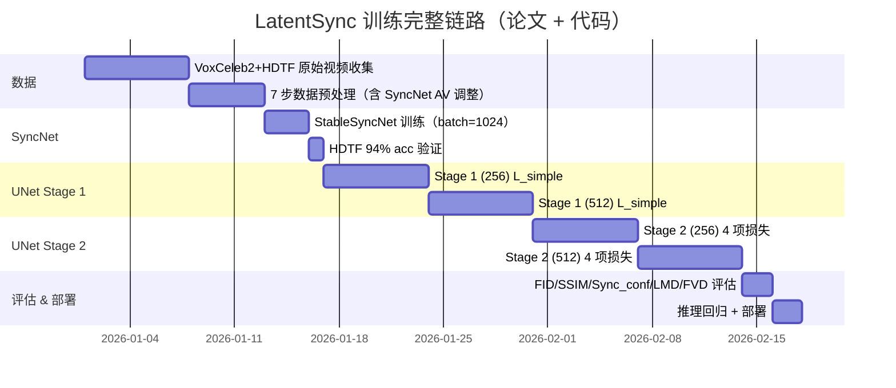

---

## 附录 A：论文数学公式对照

| 公式 | 含义 | 代码位置 |
|---|---|---|
| Eq. 1: `ẑ⁰ = (z_t - √(1-ᾱ_t)·ε_θ(z_t)) / √ᾱ_t` | one-step 估计干净 latent | `latentsync/utils/util.py:267` |
| Eq. 2: `L_simple = E[||ε - ε_θ(z_t,t,τ_θ(A))||²]` | Stage 1 噪声预测 MSE | `train_unet.py:360` |
| Eq. 3: `L_sync = E[SyncNet(D(ẑ⁰)_{f:f+16}, a_{f:f+16})]` | Stage 2 SyncNet 监督 | `train_unet.py:411` |
| Eq. 4: `L_lpips = E[||V_l(D(ẑ⁰_f)) - V_l(x_f)||²]` | LPIPS 感知损失 | `train_unet.py:375` |
| Eq. 5: `L_total = λ1·L_simple + λ2·L_sync + λ3·L_lpips + λ4·L_trepa` | Stage 2 总损失 | `train_unet.py:415-420` |
| Eq. 6: `L_trepa = E[||T(D(ẑ⁰)_{f:f+16}) - T(x_{f:f+16})||²]` | TREPA 时序对齐 | `latentsync/trepa/loss.py:33` |
| Eq. 7: `L_syncnet ≈ 0.693` | SyncNet 不学时的下界 | 诊断信号 |

## 附录 B：知乎文章要点（间接获取）

[知乎文章](https://zhuanlan.zhihu.com/p/15729709724) 因 403 无法直接抓取，通过搜索引擎摘要和同主题解读还原其核心要点：

1. **构建自监督训练方式**：训练视频只需"唇音同步"，无需额外标注，可大数据训练。
2. **StableSyncNet 关键**：基于 SD U-Net 编码器改造的 SyncNet，整个训练过程中训练/验证 loss 始终低于 Wav2Lip 原始架构。
3. **解码像素空间监督**：论文最终选择 decoded pixel space supervision 而非 latent space supervision（前者收敛更好）。
4. **两阶段训练动机**：第一阶段不解码到像素空间、不加 SyncNet loss → 省显存、可大 batch；第二阶段再上 sync/lpips/trepa 学视听关联。
5. **TREPA 引入**：用 VideoMAE-v2 自监督时序特征对齐，显著改善帧间一致性。

---

> **文档版本**：基于 arXiv:2412.09262v2 (2025-03-13) + 当前仓库 main 分支
> **最后更新**：2026-07-13